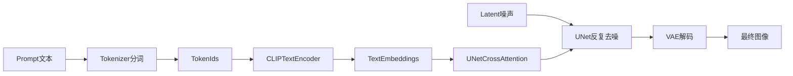

# Embeddings 与 LoRA 讲义

## 0. 这份讲义讲什么

这份讲义只讨论 `Stable Diffusion / 扩散模型` 语境下的 `Embeddings` 和 `LoRA`。

这里的 `Embeddings`，主要指社区里常说的 `Textual Inversion Embedding`，也就是“训练一个新的触发词向量”。它和大语言模型里“通用文本向量检索”的 embedding 不是一回事。

这份讲义的目标有四个：

1. 把 `Prompt -> Tokenizer -> Text Encoder -> Text Embedding -> U-Net` 这条链路讲清楚。
2. 把 `Textual Inversion` 和 `LoRA` 的原理、训练对象、适用边界讲清楚。
3. 把 `DreamBooth`、`LyCORIS`、`LCM-LoRA` 这些相关概念放回正确位置。
4. 最后映射到当前项目 `Ink-Diffusion/Live2Diff` 的实际代码入口，说明这些能力在项目里是怎么接进来的。

---

## 1. 先把底层链路讲清楚

如果不先理解文生图模型里“文字条件”是怎么进入模型的，后面 `Embedding` 和 `LoRA` 很容易混在一起。

### 1.1 一张图是怎么从 prompt 生成出来的

在 Stable Diffusion 里，可以先把过程理解成下面这条链路：

最关键的是这一句：

`prompt` 并不会直接“喂给 U-Net 作为字符串”，而是先被分词、再被编码成一串向量，这串向量才是模型真正看到的条件信息。

### 1.2 什么叫文本 embedding

`embedding` 本质上就是“把离散符号变成连续向量表示”。

例如，prompt 里的词会先被 tokenizer 切成 token，再映射成向量。这个向量不是简单的编号，而是落在一个高维连续空间里。这个空间里，模型已经在预训练阶段学会了大量“词语和图像特征之间的关系”。

所以你看到 `"cat"`、`"oil painting"`、`"red dress"` 这些词能控制生成效果，不是因为模型“认识字符串”，而是因为这些词对应的 embedding 已经在训练中和视觉概念建立了联系。

### 1.3 要区分三种完全不同的东西

这是整个主题里最容易混淆的点。

#### A. 普通文本 embedding

这是底模原本就有的词向量。比如 `cat`、`girl`、`smile` 这些 token 对应的 embedding，来自底模自带的 tokenizer 和 text encoder。

#### B. Textual Inversion Embedding

这是后来额外训练出来的“新 token 向量”。它通常绑定一个特殊触发词，例如 `<my_style>`、`<my_dog>`。社区里经常直接把这种东西叫成 `embedding`。

它本质是在说：

“我不改 U-Net，不改 VAE，也尽量不改 text encoder 的其余部分。我只想给模型增加一个新词，让这个新词代表一个特定概念或风格。”

#### C. LoRA Adapter

LoRA 不是词向量。它不是在词表里增加一个新词，而是在模型的某些层里插入一组可训练的低秩增量参数。

所以：

- `Textual Inversion` 更像“给模型教一个新词”。
- `LoRA` 更像“对模型内部某些计算层做局部改写”。

这个区别非常关键，后面所有优缺点都从这里长出来。

---

## 2. 为什么扩散模型里会需要这些轻量微调方法

最早如果你想让模型学一个新角色、新画风、新物体，最直接的办法是全量微调。

但全量微调的问题很明显：

- 参数太大
- 显存压力大
- 训练时间长
- 每次训练都要存整套模型
- 分享和复用成本很高

于是社区逐渐形成了一条很清晰的路线：

- `Textual Inversion`：改最少，只学一个新概念词。
- `LoRA`：改得比 Textual Inversion 深，但仍然远小于全量微调。
- `DreamBooth`：更像一种“个性化训练策略”，可以和全量微调或 LoRA 结合。
- `LyCORIS`：LoRA 家族的扩展，提供更丰富的低秩适配方式。
- `LCM-LoRA`：不是风格 LoRA，而是加速型 LoRA。

所以它们不是同一层级的概念，也不是简单替代关系。

---

## 3. Textual Inversion 是什么

### 3.1 一句话定义

`Textual Inversion` 是一种在冻结底模主体参数的前提下，只学习一个或少量新 token embedding 的方法。

论文标题非常形象：`An Image is Worth One Word`。它想做的事情就是：

“给一个视觉概念找一个新的词，让这个词能被模型理解并在 prompt 中使用。”

### 3.2 它到底训练了什么

它训练的不是整个模型，也不是 U-Net 主体。

最核心的训练对象只有一个：

`新 token 对应的 embedding 向量`

如果你设置的是多向量版本，那么训练对象就是一小组 embedding 向量，而不是一个。

这也是它文件非常小的根本原因。因为保存下来的不是几亿参数，而只是几个词向量。

### 3.3 它为什么被叫做 Embeddings

在 Stable Diffusion 社区里，人们常把 Textual Inversion 训练出来的结果文件直接叫作 `embedding`，因为它保存的核心内容就是“一个新词或伪词的 embedding”。

所以很多教程说“训练 Embedding”“加载 Embedding”，其实大多数时候说的就是 `Textual Inversion Embedding`。

### 3.4 它是怎么工作的

可以把它理解成下面这个过程：

1. 你准备少量图像样本，例如一个角色、一个吉祥物、一个特定画风。
2. 你定义一个新的占位词，例如 `<my_char>`。
3. 训练时冻结模型大部分参数。
4. 让模型只更新 `<my_char>` 对应的 embedding，使它在生成这些训练图时能更好匹配目标概念。
5. 训练完成后，这个新词就可以写进 prompt。

于是：

- `"a portrait of <my_char>"` 会触发这个角色概念。
- `"a castle in <my_style> style"` 会触发这个风格概念。

### 3.5 为什么说它像“教一个新词”

因为它确实是在词汇层面工作。

底模原来不认识 `<my_char>`。训练之后，它在词表里多了一个可被调用的概念入口。你以后写 prompt 时，本质上是在通过这个新词，把一个视觉概念从 embedding 空间中取出来，送进文本条件链路。

所以它擅长的是：

- 增加新概念入口
- 形成可复用触发词
- 在 prompt 中像普通词一样组合使用

而它不擅长的是：

- 深度改写模型的风格偏好
- 大幅重塑角色结构
- 系统性提升某一类画面能力

### 3.6 它适合学什么

它通常适合：

- 单个具体物体
- 单个角色的概念触发词
- 特定局部风格
- 一些易于被“命名”的视觉概念

它比较不适合：

- 复杂多元素组合风格
- 大范围画风迁移
- 对角色精确脸部一致性要求极高的任务
- 需要显著改变 U-Net 生成习惯的任务

本质原因很简单：你只是在改词向量，不是在改模型深层参数。

### 3.7 Textual Inversion 的关键参数

下面这些参数经常出现。

#### `placeholder_token`

这是占位词，也就是你之后要在 prompt 中实际输入的词。

比如：

- `<my_style>`
- `<my_cat>`
- `<ink_person>`

训练完成后，这个词就代表你的概念。

#### `initializer_token`

这是初始化用的参考词，通常选一个和目标概念语义接近的普通词。

例如：

- 训练猫，可以用 `cat`
- 训练玩偶，可以用 `toy`
- 训练油画风格，可以用 `painting`

它的意义是给新 embedding 一个合理起点，而不是从完全随机开始。

#### `num_vectors`

表示为这个新概念分配多少个向量。

直觉上可以这样理解：

- `1` 个向量：最轻量，最像“一个新词”
- 多个向量：表达能力更强，但更容易让调用和泛化变复杂

多向量不是一定更好。它提升容量，但也提高了训练和 prompt 组织的复杂度。

#### `learnable_property`

很多训练脚本会区分：

- `object`
- `style`

这是在告诉训练流程，你想学的更偏“对象”还是“风格”，从而影响样本模板和训练策略。

### 3.8 它的训练数据需要什么特点

通常不需要很多图，但要求数据尽量干净。

更具体地说：

- 样本数量可以少，但主体要清晰
- 不要让背景和主体总是强绑定
- 不要让服装、动作、构图永远固定
- 如果想学“角色身份”，就别让同一套姿势和同一背景垄断数据

因为 Textual Inversion 容量很小，如果数据偏差很强，它很容易把不该学的东西一起塞进这个词里。

### 3.9 它的优势

- 文件很小，便于分享
- 推理接入简单
- 触发词形式直观，适合 prompt 组合
- 训练代价低于大多数微调方式
- 对“给模型增加一个新概念入口”这件事很高效

### 3.10 它的局限

- 表达能力有限
- 对复杂角色一致性往往不如 LoRA
- 容易出现“学到的是词的偏移，而不是概念的稳定重建”
- 强依赖底模与文本编码器
- 跨模型兼容性并不总可靠

这里要特别强调最后一点。

很多人会误以为 embedding 文件很小，所以应该“到处都能通用”。但在实际生态里，Textual Inversion 通常仍然依赖：

- 底模版本
- tokenizer 词表与分词方式
- text encoder 权重
- 整个模型的条件分布

尤其是不同底模、不同微调模型、不同架构之间，兼容性并没有想象中那么理想。

### 3.11 负面 Embedding 是什么

社区里常见的 `EasyNegative`、`bad-hands` 之类，经常被叫做“负面 embedding”。

本质上它仍然是 Textual Inversion 类思路，只不过它被设计成在 `negative prompt` 中触发，用来压制某些常见瑕疵或不想要的模式。

但要注意：

- 它不是魔法开关
- 它不是越多越好
- 多个负面 embedding 叠加可能互相冲突
- 它会改变生成分布，不一定只压制缺陷，也可能损伤细节或风格

### 3.12 什么时候优先选 Textual Inversion

可以优先考虑它的情况：

- 你只想做一个轻量触发词
- 你想分享一个很小的概念文件
- 你要学的是较单一的对象或风格
- 你更重视 prompt 侧调用简洁性
- 你不想做较深的模型改写

---

## 4. LoRA 是什么

### 4.1 一句话定义

`LoRA` 是一种参数高效微调方法。它冻结原始大模型参数，只额外训练一组低秩增量矩阵，再把这些增量注入到目标层中。

### 4.2 LoRA 的核心思想

原论文的直觉是：

很多下游适配并不需要对一个巨大权重矩阵做“满秩”的全面修改，只需要一个低秩方向的增量，就能表达足够多的适配信息。

如果把原始权重记作 `W`，LoRA 相当于不直接训练 `W`，而是学习一个增量：

`ΔW = B × A`

其中：

- `A` 和 `B` 都比原矩阵小得多
- 中间维度 `r` 就是常说的 `rank`

于是模型实际使用的是：

`W + ΔW`

这个思路带来的好处很直接：

- 训练参数少很多
- 显存压力更低
- 训练更快
- 保存出来的文件更小

### 4.3 在扩散模型里，LoRA 通常加在哪

在 Stable Diffusion 里，LoRA 最常见的注入位置是注意力相关层，特别是：

- `to_q`
- `to_k`
- `to_v`
- `to_out`

这是因为文本条件如何影响图像生成，很大程度上就是通过 cross-attention 在 U-Net 中完成的。

所以如果你想改变“模型怎样理解和响应文本条件”，在这些位置加 LoRA 非常自然。

不过实际社区里也不只这一种做法。不同训练器和扩展方法会覆盖：

- U-Net 注意力层
- U-Net 其他线性层或卷积层
- 文本编码器

其中：

- `SD1.5` 场景里，很多 LoRA 只训 U-Net 就能有不错效果
- `SDXL` 等更复杂场景里，常见做法是连 text encoder 也一起加 LoRA

### 4.4 为什么 LoRA 通常比 Textual Inversion 更强

因为它改动的层次更深。

Textual Inversion 只是在“词向量入口”上做改动。

LoRA 则是在模型内部的条件计算层上直接加增量权重。也就是说，它不是单纯给模型塞一个新词，而是在修改模型“如何把文字条件翻译成视觉细节”的部分行为。

所以它往往更擅长：

- 角色脸部和外观一致性
- 画风迁移
- 服装、发型、配件等组合细节
- 某类构图习惯
- 某种视觉域适配

### 4.5 LoRA 的常见参数

#### `rank` 或 `r`

表示低秩矩阵的中间维度。

直觉上：

- 小 rank：参数更少，更轻，但容量更有限
- 大 rank：表达更强，但更容易过拟合，文件更大，训练更重

你可以把它理解成“LoRA 的容量旋钮”。

#### `alpha`

`alpha` 常被看作 LoRA 增量的缩放系数。

很多实现里会把它和 rank 搭配使用，用来控制训练稳定性和最终增量的有效强度。

简单理解就行：

- `rank` 更偏容量
- `alpha` 更偏缩放与稳定性

#### `target_modules`

表示把 LoRA 注入到哪些层。

这直接决定：

- 改动发生在哪里
- 模型会被怎样影响
- 文件大小和训练成本

#### 学习率

LoRA 通常会使用比全量微调更高的学习率，这也是它训练速度快的重要原因之一。

但学习率并不是越高越好。过高会导致：

- 风格炸裂
- 颜色习惯失真
- 角色过拟合
- prompt 跟随性变差

### 4.6 LoRA 训练出的到底是什么

训练结果不是完整底模，而是一份增量权重。

因此 LoRA 文件通常远小于整套 checkpoint。使用时需要：

1. 先有一个底模
2. 再把 LoRA 加载到这个底模上
3. 可以按比例融合或叠加

这就是为什么 LoRA 很适合分享和组合使用。

### 4.7 LoRA 的推理方式

推理时一般有两种理解方式：

#### 方式一：运行时加载

底模保持不变，LoRA 作为额外 adapter 动态挂上去。

好处是灵活，可以随时切换、叠加、调权重。

#### 方式二：融合到模型

把 LoRA 增量融合进底模权重。

好处是部署简单，某些情况下速度更稳定。

但融合后灵活性会下降，不如运行时 adapter 方便。

### 4.8 多 LoRA 叠加是什么意思

因为 LoRA 是增量权重，所以理论上可以多个一起用。例如：

- 一个负责角色
- 一个负责服装
- 一个负责画风

然后分别给不同倍率。

但这不代表“可以无限叠加”。多个 LoRA 之间可能会：

- 抢同一部分特征空间
- 相互污染
- 放大过拟合特征
- 让 prompt 可控性下降

所以多 LoRA 的本质不是“多多益善”，而是“做增量混合实验”。

### 4.9 LoRA 的优势

- 参数效率高
- 文件小于整模
- 对角色和风格表达能力强
- 易于和底模分离、分享、替换
- 能与 DreamBooth 等训练策略结合
- 适合工程化部署和模型组合

### 4.10 LoRA 的局限

- 仍然依赖底模
- 不同底模兼容性有限
- 容易过拟合
- 多 LoRA 混用时容易相互干扰
- 某些 LoRA 会牺牲 prompt 跟随性
- 如果是未融合 adapter，推理框架实现不同，可能有轻微额外开销

这里要补一个常见误解。

原始 LoRA 论文强调的是“相比传统 adapter，不额外增加推理路径的明显延迟”。但在扩散模型社区里，实际体验还和框架实现有关：

- 已融合的 LoRA，额外开销通常很小
- 未融合、可动态切换的 adapter，可能会有一点实现层面的额外代价

所以不要把“LoRA 一定更慢”或者“一定完全无额外成本”理解得过于绝对。

### 4.11 什么时候优先选 LoRA

更适合优先选 LoRA 的情况：

- 你想学一个角色、人物脸、特定服装或某种稳定风格
- 你希望比 Textual Inversion 更强的表达能力
- 你希望保留底模，同时单独分享增量权重
- 你要做面向某类美术域或题材域的适配
- 你后面还想做多个 adapter 组合实验

---

## 5. DreamBooth 到底和 LoRA、Embedding 是什么关系

### 5.1 DreamBooth 不是一个文件类型

很多新手会把 `DreamBooth`、`LoRA`、`Embedding` 放在同一层级上比较，这是不准确的。

更准确地说：

- `Textual Inversion` 是一种训练方法，产出是 embedding
- `LoRA` 是一种参数高效适配方法，产出是 adapter 权重
- `DreamBooth` 更像一种“个性化训练策略/任务设定”

DreamBooth 的核心目标是：

用少量样本把一个具体主体教给模型，并且尽量保持它在不同场景中的可组合性。

### 5.2 为什么会有 DreamBooth-LoRA

因为 DreamBooth 解决的是“训练目标是什么”，LoRA 解决的是“参数怎么高效更新”。

所以完全可以组合：

- 用 DreamBooth 的训练思路定义数据和 prompt
- 用 LoRA 的参数化方式去训练

这就是很多社区教程里的 `DreamBooth LoRA`。

### 5.3 DreamBooth 和 Textual Inversion 的差异

它们都可以用少量样本学概念，但层级不同：

- `Textual Inversion` 更像学一个词
- `DreamBooth` 更像学一个主体身份及其组合能力

通常如果你追求角色一致性、主体保真和更强重建能力，DreamBooth 或 DreamBooth-LoRA 往往比单纯 Textual Inversion 更靠谱。

---

## 6. Embeddings 与 LoRA 的正面对比

### 6.1 一句话对比

- `Textual Inversion`：概念词注入
- `LoRA`：模型局部改写

### 6.2 对比表

| 维度 | Textual Inversion / Embedding | LoRA |
| --- | --- | --- |
| 改动位置 | 新 token 的 embedding | 模型内部若干层的低秩增量 |
| 改动深度 | 很浅，偏词汇入口 | 更深，偏条件建模内部 |
| 文件大小 | 通常更小 | 通常小于整模，但大于 embedding |
| 表达能力 | 中等偏弱 | 通常更强 |
| 适合对象 | 单概念、触发词、轻量风格 | 角色、画风、服装、域适配 |
| 训练成本 | 较低 | 低于全量微调，但通常高于 embedding |
| 可组合性 | 通过 prompt 触发词组合 | 通过 adapter 叠加与权重组合 |
| 底模依赖 | 有，而且常被低估 | 很明显，底模匹配很重要 |
| 常见问题 | 概念表达不稳、泛化有限 | 过拟合、混用冲突、权重不兼容 |

### 6.3 应该怎么选

如果你的目标是：

- “我就想做一个轻量触发词”
- “我只想塞一个概念到 prompt 里”

那么优先试 `Textual Inversion`。

如果你的目标是：

- “我要更像”
- “我要更稳的人物一致性”
- “我要更强的风格迁移”

那么优先试 `LoRA`。

### 6.4 为什么很多人最后都转向 LoRA

因为 LoRA 在“效果/成本/灵活性”三者之间取得了很实用的平衡。

它没有全量微调那么重，又通常比 Textual Inversion 更能打，所以在实际生产与社区分享里非常流行。

但这不代表 Textual Inversion 没价值。

如果你特别在意：

- 文件极小
- 触发词式使用
- 轻量概念注入

它依然有自己的位置。

---

## 7. 周边生态：不要把概念混成一团

### 7.1 Hypernetwork

Hypernetwork 也是早期社区常见的轻量适配方案。它会额外引入一个网络去调制主模型行为。

历史上它很重要，但在今天的主流扩散生态里，LoRA 的普及度通常更高，工具链也更成熟。

### 7.2 LyCORIS

`LyCORIS` 可以理解成 LoRA 家族的扩展集合。它的名字本身就说明了这一点：它试图提供 “超出传统 LoRA 的其他低秩适配实现”。

常见成员包括：

- `LoCon`
- `LoHa`
- `LoKr`

可以把它们理解成：

“同样都是参数高效适配，但矩阵分解和注入方式有所不同，因此在表达能力、文件大小、训练速度、过拟合倾向上会出现差异。”

### 7.3 LoCon、LoHa、LoKr 分别是什么

不需要一开始就死记公式，先抓大意：

- `LoCon`：通常可看作更贴近卷积层适配的 LoRA 变体
- `LoHa`：基于 Hadamard 结构的变体，常被认为在多概念学习上有一定优势
- `LoKr`：基于 Kronecker 结构的变体，强调不同的容量和表达方式

它们都属于“LoRA 思想的衍生和扩展”，而不是与 LoRA 完全无关的新大陆。

### 7.4 LCM-LoRA 是什么

`LCM-LoRA` 特别容易被误解成“又一个风格 LoRA”，其实它的定位完全不同。

它更接近：

`加速模块`

它来自 Latent Consistency Models 路线，目标是把原本需要较多步数的扩散推理压缩到很少步数，同时尽量保持质量。

所以它回答的问题不是：

- “怎么学一个新角色？”
- “怎么学一种新画风？”

而是：

- “怎么更快地生成？”

这点在项目里尤其重要，因为当前仓库就直接接入了 `LCM-LoRA` 来做 few-step 加速。

---

## 8. 训练与推理的实战视角

这一节不写成“参数大全”，而是从决策角度讲。

### 8.1 先决定你到底要学什么

这个问题比“我用哪种训练器”更重要。

你要学的可能是：

- 一个对象
- 一个角色身份
- 一种画风
- 一类服装
- 一套构图习惯
- 一个加速能力

不同目标天然对应不同方法：

- 单概念触发词：优先考虑 Textual Inversion
- 角色或强风格：优先考虑 LoRA
- 强个性化主体：考虑 DreamBooth 或 DreamBooth-LoRA
- 推理加速：看 LCM 或 LCM-LoRA

### 8.2 底模选择比很多人想象中更重要

无论是 Embedding 还是 LoRA，都不是脱离底模独立存在的。

底模决定了：

- 原有词汇和视觉先验
- 人体、二次元、写实等基础能力
- 文本编码器分布
- 风格空间和可塑性

同一个 LoRA 在不同底模上的效果差异，往往远比新手预想的大。

### 8.3 数据集要避免“伪学习”

所谓伪学习，就是模型看起来学会了，实际上只是记住了背景、构图、衣服、光线或某个固定姿势。

常见坏现象：

- 一训练角色，就把背景也学进去
- 一训练风格，就把固定配色和固定布局一并锁死
- 一训练物体，就只能在类似角度下生成

所以好的数据通常需要：

- 主体清楚
- 变化足够
- 干扰项尽量少
- 训练目标明确

### 8.4 过拟合在 Embedding 和 LoRA 里长得不一样

Textual Inversion 过拟合时，常见现象是：

- 触发词一用就很僵
- 生成图越来越像训练集复读
- 组合 prompt 的泛化能力差

LoRA 过拟合时，常见现象是：

- prompt 跟随性下降
- 某些固定脸、固定配色反复出现
- 一加权重就压掉底模正常表现

### 8.5 触发词设计不是小事

尤其是 Textual Inversion 和 DreamBooth 系场景，触发词如果设计得太普通，容易和底模已有语义混在一起。

经验上通常会倾向：

- 用较独特的占位词
- 保证后续 prompt 好调用
- 不与已有热门概念强冲突

### 8.6 LoRA 权重要当成调音台，而不是开关

很多人把 LoRA 当作“开/关二值项”，其实更好的理解是“增量强度旋钮”。

权重太小，表现不出来。

权重太大，则可能：

- 画面过度偏移
- 失去 prompt 控制
- 细节变脏
- 和其他 LoRA 打架

所以 LoRA 最常见的实战动作不是“要不要上”，而是“倍率怎么调”。

### 8.7 Textual Inversion 的实战角色

它更像：

- 概念词补丁
- prompt 词典增强
- 轻量定制模块

而不是“万能微调手段”。

如果你把它当作“超小体积版 LoRA”，通常会失望。因为它们从原理上就不是同一层级的改动。

---

## 9. 常见误区

### 9.1 误区一：Embedding 和 LoRA 只是大小不同

不是。

它们不只是“一个小一点，一个大一点”的区别，而是训练位置不同、改动层级不同、能力边界也不同。

### 9.2 误区二：Embedding 一定跨模型通用

不一定。

它往往比很多人想象中更依赖：

- tokenizer
- text encoder
- 底模版本
- 微调分布

### 9.3 误区三：LoRA 一定通用到底模家族内所有模型

也不对。

同属 `SD1.5` 家族也不等于完全无差异，更别说跨 `SD1.5 / SDXL / Flux` 这种架构代差。

### 9.4 误区四：DreamBooth、LoRA、Textual Inversion 是并列文件类型

不对。

更准确的理解是：

- DreamBooth：训练任务/策略
- LoRA：参数化适配方式
- Textual Inversion：词向量学习方法

### 9.5 误区五：LCM-LoRA 就是普通风格 LoRA

不对。

它的核心定位是加速，而不是画风学习。

### 9.6 误区六：文件越小越“高级”

文件小只说明它参数少，不说明它一定更强。

Textual Inversion 文件小，是因为它只学词向量；LoRA 文件比它大，往往正是因为它改动更深、表达更强。

---

## 10. 与当前项目相关的实践映射

这一节不是教你在本仓库里训练新的 LoRA 或 Embedding，而是说明当前项目已经在哪些地方接入了这些能力。

先给结论：

`Ink-Diffusion/Live2Diff` 当前更偏实时视频扩散推理工程，而不是训练仓库。

它和 `Embeddings / LoRA` 的关系，主要体现在：

- 加载第三方风格或角色资源
- 在推理链路中融合 LoRA
- 在 few-step 推理中接入 `LCM-LoRA`
- 配合 DreamBooth 资源和 prompt template 完成风格化视频转换

### 10.1 项目的底座是什么

在 `Live2Diff/configs/base_config.yaml` 中，底模直接指向：

- `./models/Model/stable-diffusion-v1-5`

这说明项目的基础条件链路仍然是标准 `SD1.5` 风格的：

- `tokenizer`
- `text_encoder`
- `vae`
- `unet`

只是在此基础上又加入了视频流处理、深度先验、时序 attention、warmup 与 streaming 两套 U-Net 等工程结构。

### 10.2 Prompt 是怎么变成文本 embedding 的

在 `Live2Diff/live2diff/animatediff/pipeline/pipeline_animatediff_depth.py` 里，`_encode_prompt()` 做了这件事：

1. 用 `CLIPTokenizer` 对 prompt 分词
2. 送进 `CLIPTextModel`
3. 得到 `text_embeddings`
4. 再把它送进后续 U-Net 去做条件去噪

这里还支持：

- `negative_prompt`
- `clip_skip`

这说明项目的文本条件机制，和标准 Stable Diffusion 生态是同源的，因此 `Textual Inversion` 和 `LoRA` 才能自然接进来。

### 10.3 项目已经支持 Textual Inversion Embedding 的加载

在 `Live2Diff/live2diff/animatediff/converter/convert.py` 里，`third_party_dict` 支持：

- `text_embedding_dict`

然后会调用：

- `pipeline.load_textual_inversion(embedding_path, token)`

这件事很重要，因为它说明项目并不是只支持 DreamBooth 和 LoRA，它连 `Textual Inversion` 这种“新词向量”方案也已经预留了入口。

你可以把这里理解成：

“配置文件里声明一个 token 和 embedding 文件，pipeline 构建时就把这个新词注册进去，后面 prompt 里就能直接使用。”

### 10.4 项目里的 DreamBooth 是怎么接的

同一个 `convert.py` 里，`third_party_dict` 还支持：

- `dreambooth`
- `vae`
- `lora_list`

其中 `dreambooth` 会把 safetensors 或 ckpt 中的权重拆开后分别加载到：

- `pipeline.unet`
- `pipeline.vae`
- `pipeline.text_encoder`

也就是说，这里的 DreamBooth 更像是：

`第三方完整风格/主体权重资源`

项目通过转换和拆分，把它并入当前 pipeline。

### 10.5 项目里的 LoRA 有两条线

第一条线是配置级 LoRA。

`convert.py` 里的 `lora_list` 会在 pipeline 构建阶段被读取，然后把 LoRA 权重转成 diffusers 兼容形式，加载进：

- `pipeline.unet`
- `pipeline.text_encoder`

第二条线是运行时 LoRA。

在 `Live2Diff/live2diff/utils/wrapper.py` 中，构建完 `stream` 之后，还会继续做：

- `stream.load_lora(...)`
- `stream.fuse_lora(...)`

并且支持用户通过 `lora_dict` 在运行时传入多个 LoRA 及其权重。

所以项目里的 LoRA 不是死写死绑，而是支持“推理时再附加和调倍率”的。

### 10.6 为什么项目要单独处理 warmup UNet 的 LoRA

这是这个仓库里很有价值的一个工程点。

在 `Live2Diff/live2diff/animatediff/pipeline/loader.py` 中，项目没有只对主 `unet` 调 `load_lora_weights`，而是自定义了 `LoraLoaderWithWarmup`。

它会把 LoRA 同时加载到：

- streaming 用的 U-Net
- warmup 用的 U-Net

原因并不神秘：

这个项目不是普通单帧图像 pipeline，而是有一套“预热阶段”和一套“流式阶段”的 U-Net。如果只给其中一个挂 LoRA，就会导致风格或主体控制前后不一致。

所以这里实际上是在保证：

`风格适配在 warmup 和 streaming 两段推理里保持统一`

### 10.7 项目里为什么会出现 LCM-LoRA

在 `Live2Diff/live2diff/utils/wrapper.py` 里，如果 few-step 模式选择的是 `LCM`，项目会优先查找本地：

- `models/lora/lcm-lora-sdv1-5`

如果本地没有，再退回到：

- `latent-consistency/lcm-lora-sdv1-5`

随后执行：

- `stream.load_lora(few_step_lora)`
- `stream.fuse_lora()`

这意味着项目把 `LCM-LoRA` 当作 few-step 推理加速模块接进来了。

这里一定要和风格 LoRA 区分开：

- 风格 LoRA：主要改变视觉表现
- `LCM-LoRA`：主要让推理步数可以更少、速度更快

项目后面又允许额外加载用户 LoRA，所以可以理解成：

`先上一个加速 LoRA，再按需要叠加风格 LoRA`

### 10.8 配置文件怎样参与风格控制

以 `Live2Diff/configs/disneyPixar.yaml` 为例，它包含：

- `prompt_template`
- `third_party_dict.dreambooth`
- `clip_skip`
- `num_inference_steps`
- `t_index_list`

这透露出一个很清晰的使用思路：

1. 先选一个基础视频风格配置
2. 用 `dreambooth` 或 LoRA 指向特定风格资源
3. 用 `prompt_template` 规范 prompt 结构
4. 用 few-step 与时序参数控制速度和稳定性

所以项目当前对 Embedding/LoRA 的使用，更偏：

`将外部风格资源接入实时视频翻译管线`

而不是在仓库内部重新训练这些资源。

### 10.9 CLI 入口怎么暴露这些能力

在 `Live2Diff/test.py` 中，命令行入口支持：

- `dreambooth_path`
- `lora_dict`
- `prompt_template`
- `few_step_model_type`

这意味着用户可以在推理时：

- 指定 DreamBooth 权重
- 追加多个 LoRA 及倍率
- 调整 prompt 模板
- 选择 `LCM` 等 few-step 方案

如果未来要做“项目相关实践”，最自然的方向不是“在仓库里训练 LoRA”，而是：

- 比较不同 LoRA 权重对视频风格的影响
- 比较 `LCM-LoRA + 风格 LoRA` 的叠加效果
- 加入 `Textual Inversion Embedding` 后比较 prompt 触发能力
- 观察 warmup/streaming 双 U-Net 下的风格一致性

---

## 11. 一个实用的决策框架

如果你以后面对实际任务，可以按下面的方法判断。

### 11.1 我只想给模型加一个可复用的触发词

优先考虑：

- `Textual Inversion`

### 11.2 我想更稳地学一个角色、人物脸或明显画风

优先考虑：

- `LoRA`
- 或 `DreamBooth-LoRA`

### 11.3 我想让当前生成更快

优先考虑：

- `LCM`
- `LCM-LoRA`

### 11.4 我想在项目里做实时视频风格切换

优先从项目现有入口入手：

- `dreambooth_path`
- `lora_dict`
- `third_party_dict`
- `text_embedding_dict`

也就是说，先学会“加载与组合”，再考虑“重新训练”。

---

## 12. 结语

把这份讲义压缩成一句话，就是：

`Textual Inversion` 主要是在文本入口增加一个新概念词，`LoRA` 主要是在模型内部增加一个低秩适配器，两者都属于轻量微调，但能力边界并不相同。

再压缩一点：

- 要“加一个词”，想 `Embedding`
- 要“改模型局部行为”，想 `LoRA`
- 要“学具体主体”，想 `DreamBooth`
- 要“加速”，想 `LCM-LoRA`

而在当前 `Ink-Diffusion/Live2Diff` 项目里，这些能力的主要价值并不在训练侧，而在：

`如何把这些外部资源稳定地接入实时视频扩散推理流程`

---

## 13. 参考资料

### 13.1 官方论文与项目

1. Textual Inversion 论文：`An Image is Worth One Word: Personalizing Text-to-Image Generation using Textual Inversion`
   `https://arxiv.org/abs/2208.01618`
2. Textual Inversion 项目页：
   `https://textual-inversion.github.io/`
3. LoRA 原始论文：`LoRA: Low-Rank Adaptation of Large Language Models`
   `https://arxiv.org/abs/2106.09685`
4. LCM-LoRA 论文：`LCM-LoRA: A Universal Stable-Diffusion Acceleration Module`
   `https://arxiv.org/abs/2311.05556`
5. LyCORIS 官方仓库：
   `https://github.com/KohakuBlueleaf/LyCORIS`

### 13.2 Diffusers 官方文档

1. Textual Inversion 训练文档：
   `https://huggingface.co/docs/diffusers/main/en/training/text_inversion`
2. LoRA 训练文档：
   `https://huggingface.co/docs/diffusers/main/training/lora`
3. LoRA for Diffusion 博客：
   `https://huggingface.co/blog/lora`

### 13.3 当前项目相关入口

1. `md/README.md`
2. `Live2Diff/configs/base_config.yaml`
3. `Live2Diff/configs/disneyPixar.yaml`
4. `Live2Diff/live2diff/animatediff/converter/convert.py`
5. `Live2Diff/live2diff/animatediff/pipeline/loader.py`
6. `Live2Diff/live2diff/animatediff/pipeline/pipeline_animatediff_depth.py`
7. `Live2Diff/live2diff/pipeline_stream_animation_depth.py`
8. `Live2Diff/live2diff/utils/wrapper.py`
9. `Live2Diff/test.py`
