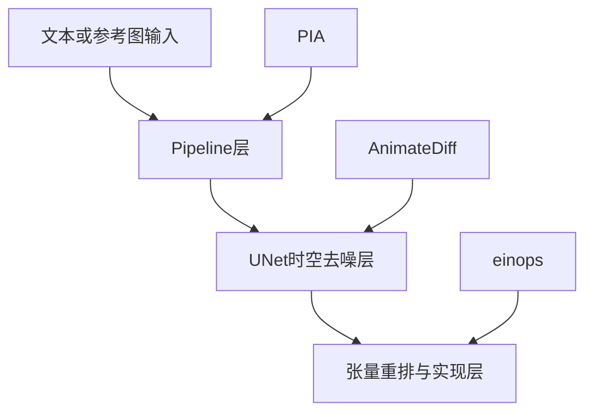

## 总览

如果你在读 `Live2Diff` 或视频扩散代码时，第一次同时看到 `AnimateDiff`、`PIA`、`einops` 这三个名字，通常会有一种很别扭的感觉：

1. `AnimateDiff` 看起来像一个模型。
2. `PIA` 看起来也像一个模型。
3. `einops` 又明显不是模型，只是个 Python 库。

为什么它们会在同一个语境里一起出现？

最短答案是：

- `AnimateDiff` 主要提供的是一套“怎么把图像扩散模型改造成视频扩散骨架”的时序建模思路。
- `PIA` 主要提供的是一套“怎么把参考图、文本条件、视频去噪流程组织成 image-to-video pipeline”的组装思路。
- `einops` 主要提供的是一套“怎么把高维张量写清楚、搬清楚”的表达方式。

所以，这三者根本不在同一层：

- `AnimateDiff` 更接近“时序模块设计”。
- `PIA` 更接近“推理管线设计”。
- `einops` 更接近“实现这些设计时的张量语法工具”。

但在 `Live2Diff` 这类工程里，它们又确实会在同一条链路上同时出现。原因很简单：视频扩散不是凭空多出来一个全新世界，而是在原来的 `Stable Diffusion` 图像扩散骨架上，逐层加上时间维、条件分支、缓存机制和张量重排之后拼出来的。

这一篇就专门把这三个技术拆开讲清楚，再把它们重新放回 `Live2Diff` 的 `UNet` 语境里。

## 一、先给出最短答案

如果你现在只想先记住结论，可以先记下面八句话：

1. `AnimateDiff` 的核心不是“重新训练一整个视频扩散模型”，而是给图像扩散模型外挂一个可插拔的 motion module，让原本只会画单帧的 `UNet` 学会跨帧建模。
2. 这个 motion module 的主角通常就是 temporal transformer，也就是“沿时间维做 attention 的模块”。
3. `AnimateDiff` 最重要的价值，是把“画得像”尽量留给原来的 `Stable Diffusion`，把“动得连贯”交给新增的时序模块。
4. `PIA` 更偏向 image-to-video，也就是“给我一张参考图，再结合文本，把它动起来”。
5. `PIA` 不只是“又一个 motion module”，它更强调 pipeline 怎么拼、条件图怎么送进去、外观信息怎么保住。
6. `einops` 不负责学会运动，也不负责设计 pipeline；它只负责把像 `[B, C, F, H, W]` 这种张量变换写得更清楚、更不容易出错。
7. `Live2Diff` 里说“参考了 `AnimateDiff`”，通常是在说时序模块和 temporal attention 的范式。
8. `Live2Diff` 里说“参考了 `PIA` pipeline”，通常是在说 image-to-video 风格的 pipeline 胶水代码和条件扩散组装方式，而不是说它直接等于 `PIA`。

## 二、先把三者放到同一张地图上

很多人第一次学这三个技术时，最大的问题不是“看不懂某个公式”，而是“不知道它们分别在系统的哪一层”。

可以先看下面这张非常粗糙但很有用的地图：




这张图想表达的意思是：

- `PIA` 主要管的是“系统怎么接输入、怎么组织条件、怎么走完整个视频生成流程”。
- `AnimateDiff` 主要管的是“`UNet` 里面怎么多一条时间维，怎么让帧与帧之间发生关系”。
- `einops` 主要管的是“你在代码里怎么把这些 4 维、5 维、6 维张量变来变去还不把自己绕晕”。

如果你先把这个层次关系记住，后面很多细节都会顺很多。

## 三、AnimateDiff 到底是什么

### 1. 它想解决什么问题

先从问题出发。

原始的 `Stable Diffusion` 很强，但它天生是图像模型。也就是说，它擅长：

- 根据文本生成一张图。
- 根据图像条件或其他条件编辑一张图。

但它不擅长：

- 同时生成一串前后连贯的视频帧。
- 保证角色、笔触、构图、局部纹理在相邻帧之间不要乱跳。

如果最粗暴地做视频生成，一种办法是：

`把同一个 prompt 对每一帧各跑一遍 Stable Diffusion`

这样几乎一定会出问题。因为模型并不知道：

- 这一帧和上一帧其实属于同一段视频。
- 前后两帧应该共享同一个物体身份。
- 运动应该是连续的，而不是每帧重新抽一张风格相近但内容漂移的图。

这就是 `AnimateDiff` 要解决的核心矛盾：

`如何在尽量不破坏原有图像生成能力的前提下，让模型学会跨帧运动一致性。`

### 2. 它的核心想法是什么

`AnimateDiff` 最重要的想法不是“把所有东西都改成 3D 卷积”，而是：

`保留原来的图像 UNet 主体，再额外挂一个专门处理时间关系的模块。`

这个新增模块通常就叫：

- `motion module`
- 或者更具体一点，`temporal transformer`

你可以把它理解成：

- 原来的 `UNet` 仍然很擅长处理每一帧内部的空间结构。
- 新加的 temporal transformer 负责让“同一位置、同一对象、同一段动作”在不同帧之间发生信息交换。

所以 `AnimateDiff` 的精神其实很像分工：

- 空间细节，主要交给原来的 `Stable Diffusion UNet`。
- 时间一致性，主要交给新加的时序模块。

这也是为什么 `AnimateDiff` 在工程上非常有吸引力。因为它不要求你把整个图像模型推翻重来，而是尽量把“会画图”和“会运动”拆开处理。

### 3. motion module 在 UNet 里大概插在哪里

如果只看概念图，可以把它想成：

```text
原始图像UNet
= 空间卷积/残差块/attention

AnimateDiff式视频UNet
= 原始图像UNet
+ 时间维F
+ temporal transformer / motion module
```

更准确一点说，它通常不是替代整个 `UNet`，而是在若干 `down block`、`mid block`、`up block` 的特征流里，额外插入处理时间维的模块。

这些模块处理的输入，不再只是图像特征：

`[B, C, H, W]`

而是视频特征：

`[B, C, F, H, W]`

这里最关键的新维度就是：

- `F`，也就是帧维

原来图像版 `UNet` 只需要关心空间上的 `H`、`W`。

一旦进入视频版，它就必须开始关心：

`这一位置在上一帧、当前帧、下一帧之间是什么关系`

这就是 temporal transformer 的用武之地。

### 4. temporal transformer 到底在做什么

很多人一看到 transformer 就容易抽象过度。其实在这里，它做的事情很直白：

`让不同帧的特征彼此看见。`

如果没有 temporal attention，那么模型处理第 3 帧时，几乎只知道第 3 帧自己的噪声特征和文本条件。

有了 temporal attention 之后，它可以在某一层特征上知道：

- 第 2 帧这个位置是什么样。
- 第 4 帧相邻区域是什么样。
- 当前这一帧和整段视频的运动趋势是否一致。

换句话说，temporal transformer 的工作不是“重新决定画什么”，而更像是：

`在去噪过程中给每一帧加上跨帧上下文。`

这也是为什么大家常说 motion module 学的是“运动先验”。它学到的不是某一只具体的猫或某一种具体的水墨笔触，而是更一般的“视频里怎么动才像连续变化”。

### 5. 为什么说它是可插拔的

`AnimateDiff` 的一个标志性表述是：

`animate your personalized text-to-image diffusion models without specific tuning`

这句话的重点在 `without specific tuning`。

它想强调的是：

- 你已经有一个很会画图的 `Stable Diffusion` 底座。
- 你可能已经给它加了 `DreamBooth`、`LoRA`、风格权重。
- 你不想为了每一种画风都重新训练一整套视频模型。

于是更合理的办法是：

- 原有图像能力尽量保留。
- 运动能力通过一个通用 motion module 补上。

这就是“可插拔”的真正含义。不是说它像乐高那样随便一按就行，而是说它在设计理念上尽量把“时序能力”做成可复用的外挂件。

### 6. 它为什么适合拿来做 Live2Diff 的前身范式

`Live2Diff` 本质上不是离线长视频生成，而是在线流式视频翻译。两者目标不完全一样，但它们共享一个很重要的前提：

`都要在 UNet 里显式处理时间维。`

所以 `Live2Diff` 借鉴 `AnimateDiff` 很自然。借鉴的不是“生成一段完整视频”的产品设定，而是以下几个更底层的东西：

1. 视频版 `UNet` 仍然建立在 `SD1.5` 的图像版骨架之上。
2. 时序关系主要通过 temporal module/temporal attention 来建模。
3. 图像模型的空间能力和视频模型的时序能力可以拆开看。

在你这个仓库里，这个继承关系写得很直接：

- `live2diff/animatediff/models/motion_module.py` 顶部写着改自 `AnimateDiff`
- `live2diff/animatediff/models/attention.py` 顶部也写着改自 `AnimateDiff`

而且配置里也明确开了 motion module：

```yaml
unet_additional_kwargs:
  use_motion_module: true
  unet_use_temporal_attention: true
  motion_module_type: Streaming
```

这里最值得注意的词不是 `motion_module`，而是：

- `Streaming`

这说明项目并不是照搬原版 `AnimateDiff`，而是在它的基础上继续改造成适合在线流式处理的版本。

### 7. Live2Diff 又是怎么继续改造它的

这一步非常关键。

原版 `AnimateDiff` 更适合：

- 固定长度视频
- 离线整段生成
- 可以一次性看到整段帧序列

但 `Live2Diff` 想做的是：

- 摄像头或视频流逐帧进入
- 实时或近实时输出
- 当前时刻不可能看到未来帧

于是，原版 temporal attention 里很多“整段视频一起算”的假设就不成立了。

你可以把这个差别理解成：

- 原版 `AnimateDiff` 像“把一整段短片放在剪辑台上，一次性通看全片”。
- `Live2Diff` 像“正在直播，只能看已经播出的内容”。

因此，`Live2Diff` 要做的改造包括：

1. attention 不能无条件依赖未来帧。
2. 过去帧的信息不能每次都从头重算。
3. 需要缓存历史 `key/value`，降低实时推理成本。

这就是为什么你会在代码里看到：

- `stream_motion_module.py`
- `kv_cache`
- `window_size`
- `sink_size`
- `temporal_attention_mask`

这些词一起出现。

它们在做的事情可以浓缩成一句话：

`把原本偏离线的时间注意力，改造成只看过去窗口、能复用缓存的流式时间注意力。`

### 8. 代码里可以怎样直观理解这件事

`stream_motion_module.py` 里有一段非常重要的注释，意思是：

- temporal self-attention 在流式版本里会维护一段有限窗口。
- 这段窗口里存的是历史 `key/value`。
- 当前新帧进来时，只在这个缓存窗口上做注意力，而不是重新遍历整段历史。

如果你只记一句工程层面的解释，可以记：

`AnimateDiff 负责把时间维引入 UNet，Live2Diff 负责把这条时间维变成可实时运行的时间维。`

### 9. AnimateDiff 的局限也要知道

如果只把 `AnimateDiff` 说成“万能视频插件”，那就太神化了。

它的局限至少包括：

1. 它更擅长让短视频看起来连贯，不等于天然适合无限长流。
2. 它能带来运动一致性，但不自动保证严格的身份一致性、物理一致性、几何一致性。
3. 它沿用了图像扩散底座的很多假设，所以对底座结构和生态有依赖。
4. 它解决的是“怎么动”，不直接解决“必须像某一张指定参考图”的问题。

最后这一点，就正好引出 `PIA`。

## 四、PIA 到底是什么

### 1. 先说它在干什么

`PIA` 的全称是：

`Personalized Image Animator`

从名字你就能看出它的重心：不是泛化地谈“视频扩散”，而是更具体地谈：

`怎么把一张给定的图，按文本要求动起来。`

这和 `AnimateDiff` 的重心不完全一样。

- `AnimateDiff` 更像是在回答：怎样给一个图像扩散模型加上视频运动能力。
- `PIA` 更像是在回答：怎样让一个已经会画图的模型，围绕一张指定参考图去做可控动画。

所以 `PIA` 更偏：

- image-to-video
- 个性化图像动画
- 参考图外观保持
- 文本驱动动作变化

### 2. 为什么它不是“另一个 AnimateDiff”

`PIA` 和 `AnimateDiff` 的确有亲缘关系，因为它们都建立在 `Stable Diffusion` 类的底座之上，也都要在 `UNet` 里引入时间维。

但它们的强调点并不一样。

你可以用一句很粗糙但很好记的话来区分：

- `AnimateDiff` 更强调“让模型学会动”。
- `PIA` 更强调“让它在保持参考图外观的前提下按要求动起来”。

也就是说，`PIA` 不是只在说 motion module，而是在说：

1. 整条 image-to-video pipeline 怎么搭。
2. 条件图信息怎么注入。
3. 为什么输出视频还要尽量像输入参考图。

### 3. PIA 的关键矛盾是什么

假设你有一张人物图像，现在你想让它生成一段视频。

这时模型要同时满足两件事：

1. 它要有动作变化。
2. 它又不能把人物长相、衣服、配色、画风改得面目全非。

这两个目标其实经常冲突。

因为一旦你让模型“自由地生成视频”，它很容易：

- 动起来了，但人设跑了。
- 风格还在，但动作太弱。
- 文本对齐了，但参考图的细节丢了。

`PIA` 就是在解决这个问题：

`既要动，又要像原图。`

### 4. 它的工程直觉是什么

如果用直觉来讲，`PIA` 干的事很像：

`给视频扩散过程再加一条“别忘了原图长什么样”的提醒通道。`

这个提醒不是一句抽象口号，而是要体现在 pipeline 和条件注入方式上。

公开资料里常提到它会做这些事情：

- 以参考图作为条件帧输入。
- 在潜空间里传递外观信息。
- 借助专门的条件模块，让模型在逐帧生成时更容易保住参考图的身份和风格。

所以 `PIA` 的亮点不只是“生成视频”，而是：

`把参考图条件、文本条件、时序生成这三件事更系统地拼在一起。`

### 4.1 它比 AnimateDiff 多强调了什么

如果再往工程细节里多走一步，`PIA` 和 `AnimateDiff` 的差别可以讲得更具体一些。

公开实现和 `Diffusers` 文档里都反复强调两点：

1. `PIA` 可以配合 `MotionAdapter` 这类时序模块工作，也就是它并不排斥 `AnimateDiff` 式的 motion module。
2. 但它在此之外，还会更强调条件图的注入方式，例如首层输入通道的改造，以及 condition module 对参考图外观信息的传递。

你可以把这个区别理解成：

- `AnimateDiff` 更像在问：怎么给视频加上“会动”的能力。
- `PIA` 更像在问：怎么在“会动”的同时，尽量别把参考图长相弄丢。

所以 `PIA` 往往会把问题拆成两部分：

- motion module 继续负责跨帧连贯。
- condition module 负责把参考图的外观信息稳定带进逐帧生成。

这种拆法很像一句很朴素的话：

`动作归动作，长相归长相。`

### 4.2 为什么文档里会提到 9 通道输入

这也是 `PIA` 很容易被忽略的一个工程细节。

在 `Diffusers` 的 `PIAPipeline` 文档里，明确提到它除了使用 motion modules 之外，还把 `SD1.5 UNet` 的首层输入卷积改成了 9 通道版本。

如果你第一次看到这个设定，先不用急着记具体数字，而是先理解它背后的意思：

`模型不再只接收“待去噪的视频 latent”，而是要把更多和参考图相关的条件信息一起送进网络。`

也就是说，`PIA` 的重点并不只是“中间层多了时间注意力”，还包括：

- 输入端怎么把参考图条件接进来。
- 中间层怎么把外观信息和运动信息分工处理。

这也进一步说明：

`PIA` 不是单纯在 UNet 里加了个 temporal block 就结束了，而是从输入到中间条件传递都做了面向 I2V 的设计。`

### 5. 为什么说它更像 pipeline 组装思路

你在 `Live2Diff` 代码里能看到一句非常关键的话：

`live2diff/animatediff/pipeline/pipeline_animatediff_depth.py` 顶部直接写着它改自 `PIA` 的 `i2v_pipeline.py`。

这句话透露的信息很大。

它至少说明：

1. 这个项目在 pipeline 层面借鉴了 `PIA`。
2. 借鉴的重点是 `i2v_pipeline`，也就是 image-to-video 生成流程的搭建方式。
3. 这不等于整个项目就是 `PIA`，而更像是把 `PIA` 的某些 pipeline 结构，和 `AnimateDiff` 的时序建模方式、`Live2Diff` 的 streaming 机制组合在了一起。

这一点特别容易误解。

很多人看到“改自 `PIA`”就会以为：

`那这个项目是不是本质上就是在跑 PIA？`

更准确的说法应该是：

`它参考了 PIA 的 image-to-video pipeline 组织方式，但模型主体又叠加了自己的 depth 条件和 streaming 时序机制。`

### 6. 那么 PIA 的 pipeline 在讲什么

如果把一个扩散 pipeline 想成“把各个模块串起来的总装配图”，那么 `PIA` 这类 pipeline 关心的问题包括：

1. 输入是一张图还是多张图。
2. 参考图先怎么编码成 latent。
3. 文本怎么编码成 cross-attention 条件。
4. 视频 latent 的形状是什么。
5. 条件图信息从哪一层、以什么方式进入 `UNet`。
6. scheduler 怎么在多步去噪中驱动整段视频生成。
7. 最后怎样把视频 latent 解码回帧序列。

注意，这些问题和“motion module 的细节”不是一回事。

motion module 解决的是：

`UNet内部怎么做时序建模`

而 pipeline 解决的是：

`整条系统链路怎么把输入、条件、UNet、scheduler、VAE 串起来`

这也是为什么 `PIA` 很值得学。因为很多工程里真正难写、最容易写乱的地方，不是某一层 attention，而是整条 pipeline 的胶水层。

### 7. PIA 和 AnimateDiff 的关系怎么记

最简单的记忆法是：

- `AnimateDiff` 偏 `how to move`
- `PIA` 偏 `how to animate this image into a video`

换成中文就是：

- `AnimateDiff` 更偏“怎么让扩散模型具备时序运动能力”。
- `PIA` 更偏“怎么围绕一张参考图搭出一条好用的图生视频生成链路”。

当然，这不是严格学术定义，而是帮助你快速建立直觉的教学说法。

### 8. 对 Live2Diff 来说，PIA 的价值是什么

对 `Live2Diff` 这种工程来说，`PIA` 的价值主要不在于“它比谁更会动”，而在于：

1. 它提供了成熟的 image-to-video pipeline 参考。
2. 它说明了条件图、文本、`UNet`、scheduler、VAE 可以怎样被组装成一套完整的视频生成流程。
3. 它的代码结构对改造自己的条件视频 pipeline 很有借鉴意义。

所以如果你在讲义里看到一句：

`PIA pipeline：深度视频条件扩散 pipeline 的组装思路参考自它`

这句话真正该怎么理解？

答案不是：

`PIA 就是本项目的唯一算法来源`

而是：

`在 pipeline 层面，本项目参考了 PIA 这类 image-to-video 框架怎么组织输入、条件和去噪主循环。`

## 五、einops 到底是什么

### 1. 它为什么会和前两个名字一起出现

到这里你可能会问：

前两个都是视频扩散相关方法，`einops` 为什么也会被专门点名？

原因是，视频扩散工程里最容易把人写晕的地方之一，就是张量形状。

比如你会反复遇到：

- `[B, C, H, W]`
- `[B, C, F, H, W]`
- `[(B*F), C, H, W]`
- `[(B*HW), F, C]`
- `[B, F, HW, C]`

这些变换如果只靠 `view`、`reshape`、`permute`、`transpose` 去硬写，很快就会变成一团。

`einops` 的价值就在这里：

`它把张量变换写成“输入轴是什么，输出轴是什么”的显式模式。`

这也是 `einops` 官网最强调的一点：

`它关注的不是“底层怎么计算”，而是“输入和输出各自代表什么”。`

这句话在视频扩散里非常重要，因为视频张量最怕的不是算不出来，而是：

`明明算出来了，但你已经分不清当前这一维到底是 batch、frame 还是 token。`

### 2. 它最核心的三个操作

`einops` 最核心的三个操作是：

- `rearrange`
- `reduce`
- `repeat`

可以把它们先粗糙理解成：

- `rearrange`：重新排布维度
- `reduce`：沿某些维度做聚合
- `repeat`：沿某些维度做复制

最常见的是 `rearrange`。

比如：

```python
rearrange(x, "b c f h w -> (b f) c h w")
```

这句代码的意思不是“神秘变换”，而是：

`把 batch 维和 frame 维先并起来，这样后面就能把每一帧当成普通图片那样送进 2D 模块处理。`

### 3. 为什么它在视频扩散里特别重要

视频扩散里经常会出现一种“伪 3D”设计：

- 表面上看，模型在处理 5 维视频张量。
- 但很多具体算子，尤其是原来从图像模型继承来的算子，本质上还是 2D 的。

那怎么办？

最常见的办法就是：

1. 先把帧维折叠进 batch。
2. 用原来的 2D 卷积、归一化、线性层去处理。
3. 再把帧维还原回来。

这套操作如果只用数字写，既难读也难查错。

但如果用 `einops`，就会变得非常直观：

```python
x = rearrange(x, "b c f h w -> (b f) c h w")
x = conv2d(x)
x = rearrange(x, "(b f) c h w -> b c f h w", f=video_length)
```

这就是为什么 `einops` 虽然不是模型，却成了这类工程里不可缺的一层语言。

### 4. 你仓库里最典型的例子是什么

在 `Live2Diff` 里，`einops` 的角色非常明确。

最经典的例子之一就在 `resnet.py` 里的 `InflatedConv3d`：

```python
class InflatedConv3d(nn.Conv2d):
    def forward(self, x):
        video_length = x.shape[2]
        x = rearrange(x, "b c f h w -> (b f) c h w")
        x = super().forward(x)
        x = rearrange(x, "(b f) c h w -> b c f h w", f=video_length)
        return x
```

这段代码特别值得反复看，因为它把很多“视频模型的 3D 化”讲得很透。

它说明：

- 这里并不是直接换成一个真正意义上的 `Conv3d(kernel_t, kernel_h, kernel_w)`。
- 而是把视频特征拆成一堆帧，再复用图像模型里的 `Conv2d`。

所以你可以把它理解成：

`先在张量组织方式上变成视频，再在局部算子实现上尽量复用原有图像模块。`

而这件事能成立，`einops` 功不可没。

### 5. temporal attention 里为什么也离不开它

不仅卷积里离不开 `einops`，temporal attention 里更离不开。

因为 attention 往往要把张量改写成“序列”的形式。

例如，某一层特征可能本来是：

`[B, C, F, H, W]`

如果你想对时间维做 attention，常常需要把它变成类似：

`[(B*HW), F, C]`

这句话的含义是：

- 对于每一个空间位置 `(h, w)`，
- 在时间维 `F` 上看它跨帧的变化，
- 把它当作一条长度为 `F` 的序列来做 self-attention。

在 `Live2Diff` 里，你能反复看到这样的写法：

```python
hidden_states = rearrange(hidden_states, "(b f) d c -> (b d) f c", f=video_length)
```

这类写法刚开始很容易看晕，但一旦你习惯了，就会发现它比手写一连串 `view + permute` 更像“把思路写进代码”。

### 6. 用一句话讲清 rearrange

如果你想把 `rearrange` 教给初学者，最好的说法不是“它是张量变形函数”，而是：

`rearrange 是一种把维度语义写出来的 reshape。`

它比普通 `reshape` 更适合教学的地方在于：

1. 你能直接看到输入各轴是什么意思。
2. 你能直接看到输出各轴是什么意思。
3. 你不容易把 `batch` 和 `frame` 写混。

这在视频扩散里尤其重要，因为一旦 `B` 和 `F` 弄混，很多 bug 看起来不会立刻报错，但结果会很奇怪。

### 7. reduce 和 repeat 在这里有什么用

虽然 `Live2Diff` 里最常见的是 `rearrange`，但 `reduce` 和 `repeat` 也值得知道。

它们分别可以理解成：

- `reduce`：把某些维度聚合掉，比如平均池化、求和、求最大值。
- `repeat`：把某些内容沿着新轴或旧轴复制开。

在视频模型里，`repeat` 常出现在：

- 复制条件
- 复制位置编码
- 复制 batch 内的 prompt embedding

而 `reduce` 常用于：

- pooling
- 聚合时序或空间统计

所以 `einops` 不是只有一个 `rearrange`，而是一整套“把高维张量操作写得更像语义表达”的思路。

## 六、为什么这三者会在 Live2Diff 里同时出现

现在可以回到你在 `0.6` 那篇里看到的那三行了。

它们放在一起并不是偶然，而是在描述同一条视频扩散链路上的三个层次：

### 1. 第一层：时序建模范式来自 AnimateDiff

这回答的是：

`UNet 为什么会从图像版变成带时间维的视频版。`

也就是：

- motion module 从哪里来的
- temporal transformer 为什么会出现在 `UNet` 里
- 为什么会有 streaming 版的 temporal attention

### 2. 第二层：pipeline 组装思路参考 PIA

这回答的是：

`整条 image-to-video / condition-to-video 生成链怎么拼起来。`

也就是：

- VAE、text encoder、UNet、scheduler 怎么注册进 pipeline
- 条件图或深度图怎样编码后喂给 `UNet`
- 视频去噪主循环怎样组织

### 3. 第三层：实现语言大量依赖 einops

这回答的是：

`这些 5 维张量、时序注意力和伪3D模块，在代码里到底怎么写。`

也就是：

- `[B, C, F, H, W]` 怎么和 `(B*F, C, H, W)` 来回切换
- temporal attention 里怎么把空间位置整理成序列
- 为什么伪 3D 的实现其实经常是“2D算子 + reshape”

所以你可以把这三者记成一条链：

`AnimateDiff 给方法范式，PIA 给管线范式，einops 给实现语法。`

## 七、再用一个具体例子把三者串起来

假设现在系统要处理一段输入视频帧，并输出水墨风格视频。

你可以粗略把整条链想成这样：

1. 输入帧先被编码成 latent。
2. 深度图也被提取并编码成条件 latent。
3. pipeline 把文本条件、视频 latent、深度条件、scheduler 一起组织好。
4. 视频版 `UNet` 在去噪时同时考虑空间信息和时间信息。
5. temporal module 负责跨帧一致性。
6. 若要实时运行，则用 streaming attention 和 `kv_cache` 只看过去窗口。
7. 中间大量张量格式转换依赖 `einops`。
8. 最后解码回视频帧。

如果把三者嵌进去看，就是：

- 第 3 步里，`PIA` 式 pipeline 思路最重要。
- 第 4 到第 6 步里，`AnimateDiff` 式 temporal module 思路最重要。
- 第 4 到第 7 步的代码实现里，`einops` 最常见。

## 八、一个很容易混淆但必须分清的点

讲到这里，最需要提醒的一件事是：

`不要把“方法”“管线”“工具”混成同一个概念层。`

这三个名字容易让人误会，恰恰是因为它们都经常在同一份工程代码中出现。

但你必须主动分清：

- `AnimateDiff` 不是一个普通 Python 工具库，它是一条视频扩散建模路线。
- `PIA` 不只是一个 attention 小模块，它更像一套 image-to-video 方案与 pipeline 实现。
- `einops` 不是视频扩散算法，它只是把张量操作表达得更清楚。

如果你把这三者混在一起，就会出现三种典型误解：

1. 以为 `PIA` 和 `AnimateDiff` 是完全等价的两个名字。
2. 以为 `einops` 参与了“学会运动”本身。
3. 以为 `Live2Diff` 只是简单把它们三者拼一拼就结束了。

更准确的理解应该是：

`Live2Diff` 把图像扩散底座、AnimateDiff 式时序模块、PIA 式 pipeline 参考、深度条件、流式缓存机制和工程加速链组合成了一个可实时运行的视频翻译系统。`

## 九、最后做一张总表


| 名称            | 它本质上是什么                            | 主要解决什么问题           | 在 Live2Diff 里的意义                              |
| ------------- | ---------------------------------- | ------------------ | --------------------------------------------- |
| `AnimateDiff` | 视频扩散时序建模范式                         | 如何让图像扩散模型学会跨帧一致性   | 提供 motion module / temporal transformer 的核心思路 |
| `PIA`         | image-to-video 条件扩散方案与 pipeline 参考 | 如何围绕参考图和文本搭建视频生成链路 | 提供 pipeline 组装与条件视频生成的工程参考                    |
| `einops`      | 张量操作表达工具                           | 如何把复杂维度变换写清楚、写可靠   | 支撑伪 3D 模块、temporal attention 和大量 reshape      |


## 十、如果你只想带走一句话

可以把这一篇最后压成一句话：

`AnimateDiff` 教会 `UNet` “怎么跨帧看”，`PIA` 教会 pipeline “怎么把参考图和视频生成流程拼起来”，`einops` 则让这一切在代码里“能被人看懂地写出来”。

如果再往 `Live2Diff` 身上落一句，就是：

`Live2Diff` 不是简单照搬 AnimateDiff 或 PIA，而是在继承它们思路的基础上，把时间建模改成了 streaming 版本，并用 einops 把整条视频张量链真正实现出来。`

## 参考资料

1. AnimateDiff 论文：[https://arxiv.org/abs/2307.04725](https://arxiv.org/abs/2307.04725)
2. AnimateDiff 项目页：[https://animatediff.github.io/](https://animatediff.github.io/)
3. AnimateDiff 官方仓库：[https://github.com/guoyww/AnimateDiff](https://github.com/guoyww/AnimateDiff)
4. PIA 论文：[https://arxiv.org/abs/2312.13964](https://arxiv.org/abs/2312.13964)
5. PIA CVPR 2024 页面：[https://openaccess.thecvf.com/content/CVPR2024/html/Zhang_PIA_Your_Personalized_Image_Animator_via_Plug-and-Play_Modules_in_Text-to-Image_CVPR_2024_paper.html](https://openaccess.thecvf.com/content/CVPR2024/html/Zhang_PIA_Your_Personalized_Image_Animator_via_Plug-and-Play_Modules_in_Text-to-Image_CVPR_2024_paper.html)
6. PIA 官方仓库：[https://github.com/open-mmlab/PIA](https://github.com/open-mmlab/PIA)
7. Hugging Face Diffusers 的 PIA 文档：[https://huggingface.co/docs/diffusers/main/api/pipelines/pia](https://huggingface.co/docs/diffusers/main/api/pipelines/pia)
8. einops 官网：[https://einops.rocks/](https://einops.rocks/)
9. einops 论文页面：[https://openreview.net/forum?id=oapKSVM2bcj](https://openreview.net/forum?id=oapKSVM2bcj)

