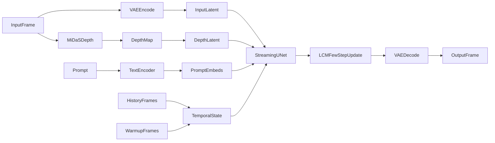

# 0.3 Live2Diff 基础知识补充

这篇文档是 `0.3_Live2Diff架构分析.md` 的配套先修材料。

目标不是把扩散模型的所有数学细节一次讲完，而是让你先具备足够的“读图能力”和“读代码能力”，能看懂下面这些说法到底是什么意思：

- 什么是单向时序注意力
- 什么是 KV-cache
- 什么是 TensorRT
- 什么是 LCM 和 LCM-LoRA
- 为什么这个项目能把视频扩散做成接近实时
- 为什么 `Depth`、`warmup`、`denoising batch`、`TinyVAE` 都是同一套系统里的必要部件

如果你还没看过总览，建议先打开 `md/0.3_Live2Diff架构分析.md`，然后配合这篇一起看。

## 先给一张总地图

先不要急着记术语，先记整条链路在干什么。

Live2Diff 做的不是“每一帧都单独跑一遍普通 Stable Diffusion”，而是：

1. 输入一帧视频
2. 把它压到 latent 空间
3. 再额外估计一个深度图，作为结构先验
4. 让 streaming UNet 在“历史帧上下文”里处理当前帧
5. 用 LCM 的少步更新快速得到结果
6. 再把 latent 解码回图像

可以先把它当成下面这条流水线：

你要先接受一个核心事实：

`Live2Diff` 的“实时”不是来自某一个神奇技巧，而是三层叠加：

- 算法层：用 `LCM` 把每帧推理步数压到很少
- 时序层：用流式时序注意力和 `KV-cache` 复用历史
- 工程层：用 `TensorRT`、`TinyVAE`、批处理来继续降时延

后面所有术语，都可以塞回这三层框架里。

## 1. 先补最小扩散基础

### 1.1 什么是扩散模型

你可以先把扩散模型理解成一个“反向修复器”。

训练时，模型看的是：

- 一张正常图片
- 往上面不断加噪声
- 学会在不同噪声程度下，应该怎么把图往“更干净、更像目标”的方向拉回去

推理时，模型做的就是反过来：

- 从一个带噪的表示开始
- 一步一步预测该怎么去噪
- 最后得到目标图像

所以扩散模型的本质不是“一次直接画完”，而是“多次逐步修正”。

这就是为什么普通 Stable Diffusion 常常要跑很多步。

### 1.2 什么是 latent space，为什么不是直接在像素上做

`Stable Diffusion` 一般不直接在原始像素空间里去噪，而是在 `latent space` 里做。

直觉上可以这样理解：

- `pixel space` 是真正的图片像素，分辨率高，计算重
- `latent space` 是图片的压缩表示，尺寸更小，语义更浓

这就像先把一张大图压成一张“语义草图”，然后主要在草图上改，最后再还原回图片。

这样做的好处是：

- 更省算力
- 更省显存
- 更适合多步迭代

### 1.3 什么是 VAE

这里的 `VAE` 先别管完整概率建模定义，你只需要知道它在这个项目里承担两个工程动作：

- `encode`：把图像压缩成 latent
- `decode`：把 latent 还原回图像

所以你在项目里看到的 `VAE`，本质上就是视频帧和 latent 世界之间的门。

在 Live2Diff 里：

- 输入帧先经过 `VAE encoder`
- 输出结果最后经过 `VAE decoder`
- 连深度图也会被编码成 `depth_latent`

也就是说，这个项目的大部分核心推理都发生在 latent 空间里，不是在 RGB 像素上。

### 1.4 UNet 在扩散里到底做什么

很多初学者一看到 `UNet` 就会迷糊，以为它是一个“图像生成器”。更准确地说：

`UNet` 在扩散里的工作是：给定当前 noisy latent、时间步、文本条件等信息，预测当前应该往哪一个去噪方向走。

你可以把它理解成：

- 当前 latent 像一张“被噪声污染的草图”
- `UNet` 负责判断“噪声大概在哪、结构该往哪修”
- `scheduler` 再根据这个预测，决定下一步怎么更新 latent

所以在阅读代码时，你可以把 `UNet` 看成“每一步的方向判断器”。

### 1.5 scheduler 是什么

`scheduler` 不是神经网络，而是一套更新规则。

它负责回答：

- 现在处于第几个噪声阶段
- 这一步该按什么比例用模型预测结果更新 latent
- 下一步的噪声强度该是多少

所以：

- `UNet` 负责预测
- `scheduler` 负责执行更新

这也是为什么 Live2Diff 里 `LCMScheduler` 很关键。它不是另一个模型，而是少步推理所依赖的更新规则。

### 1.6 timestep、num_inference_steps、t_index_list 是什么

这几个词经常一起出现。

可以这样理解：

- `num_inference_steps`：先定义一条完整的“去噪时间轴”有多少步
- `timestep`：时间轴上的某一个位置
- `t_index_list`：真正选出来要跑的几个关键位置

举个直觉例子：

- 完整时间轴本来有 50 个站点
- 但你最后只停靠第 30、36、42 站
- 这就是 few-step

所以 few-step 不是“假装 50 步变成 3 步”，而是“先有完整噪声时间轴，再从里面挑出极少的关键步来近似更新”。

### 1.7 Prompt、Text Encoder、Prompt Embeds 是什么

这一组比较简单：

- `Prompt`：你输入的文字描述
- `Text Encoder`：把文字变成向量
- `Prompt Embeds`：编码后的向量结果

然后这些向量会作为条件输入给 `UNet`，告诉它这帧图像应该朝什么风格、什么内容方向变化。

## 2. 这个项目为什么不是“普通 SD 逐帧处理”

如果你把普通 Stable Diffusion 直接拿来做视频逐帧重绘，最容易出两个问题：

- 太慢
- 帧与帧之间容易风格漂、细节漂、结构漂

Live2Diff 就是在解决这两个问题。

它的核心思路是：

- 不再把每一帧当成互相无关的独立图像
- 而是显式保留视频历史信息
- 再用适合流式输入的方法增量更新

所以它本质上是“视频扩散系统”，不是“图像扩散系统循环调用很多次”。

## 3. 什么是时序注意力

### 3.1 先理解普通注意力在干什么

注意力机制的最直观理解是：

- 当前这个位置在更新自己时
- 它会去看其他位置
- 决定“我该更重视谁”

在文本里，这叫“某个 token 看其他 token”。
在图像或视频里，这可以变成：

- 看同一帧里的其他空间位置
- 看其他帧里的对应区域

### 3.2 什么是时序注意力

时序注意力就是把“我能看谁”这件事，从单帧空间范围，扩展到时间维度。

也就是：

- 当前帧的某些特征
- 可以去参考前面帧的特征
- 于是模型知道“这个东西不是突然冒出来的，它在前几帧就已经在那里了”

这就是视频一致性的来源之一。

### 3.3 什么是单向时序注意力

“单向”这三个字最重要。

它表示当前帧只能看：

- 自己
- 历史帧

但不能看未来帧。

这本质上就是一种因果约束，和语言模型里的 `causal attention` 很像。

为什么一定要单向？

因为 Live2Diff 是流式系统。真实运行时，未来帧根本还没到。

如果一个模型依赖未来帧才能生成当前帧，那它就更像离线视频模型，而不是实时系统。

所以“单向时序注意力”的本质就是：

- 保持时间因果性
- 允许在线逐帧处理
- 避免信息泄漏到未来

### 3.4 什么是滑动窗口

即便只看过去，如果你让当前帧看所有历史帧，计算量也会越来越大。

所以工程上常见做法是滑动窗口：

- 只保留最近的一段历史
- 当前帧只和这段历史交互

这就把计算成本从“越跑越大”压成了“窗口固定大小”。

在这个项目里，配置文件 `Live2Diff/configs/base_config.yaml` 里能看到：

- `window_size: 16`
- `sink_size: 8`

可以先粗略理解为：

- 最多只维护一个长度为 16 的时序窗口
- 其中前 8 个位置更像“保留的重要上下文位”

后面讲 `KV-cache` 时你会发现，这和缓存策略是绑在一起的。

### 3.5 warmup 是什么，为什么一定要先来 8 帧

`warmup` 在这里不是单纯“让 GPU 热起来”，而是：

- 先喂前 8 帧真实视频
- 让模型把最初的时序上下文建立起来
- 再开始进入真正的逐帧流式阶段

如果没有 warmup，会出现一个很实际的问题：

- 第一帧之后，模型的历史记忆基本是空的
- 它的时序状态、缓存状态、窗口状态都还没形成
- 后续一致性就会变差

所以 `warmup` 更接近“先填上下文”，不是“先空跑几次”。

## 4. 什么是 KV-cache

### 4.1 K 和 V 是什么

在注意力机制里，每个位置通常会映射出三种向量：

- `Q`：我现在想查什么
- `K`：我这里有什么特征可以被查询
- `V`：如果你关注我，真正拿走什么信息

当前查询位置会拿自己的 `Q` 去和历史位置的 `K` 做匹配，然后把对应 `V` 加权汇总回来。

### 4.2 KV-cache 缓存的是什么

`KV-cache` 就是把已经算过的历史 `K` 和 `V` 留下来。

这样当前新帧来了以后：

- 不用重新把整段历史都过一遍
- 只需要算当前新内容的 Q/K/V
- 然后把新的 K/V 填进缓存
- 再和历史缓存一起做注意力

这就是“复用历史”的本质。

### 4.3 为什么它能加速

因为如果没有 cache，每来一帧你都可能要：

- 把窗口里全部历史帧再算一遍 K/V
- 再做整段时序注意力

有了 cache 以后，历史部分不必反复重算。

所以 `KV-cache` 的价值不是“改变模型含义”，而是“避免重复劳动”。

### 4.4 为什么它和单向时序注意力是同一套东西

很多人会把这两个概念分开记，其实它们在运行时是绑在一起的：

- 单向时序注意力决定“当前帧允许看哪些历史位置”
- `KV-cache` 负责把这些历史位置的特征提前存好

前者决定访问规则，后者决定复用方式。

在 Live2Diff 里，你可以把它理解成：

- 时序 mask 决定“哪些窗口槽位可见”
- `pe_idx`、`update_idx` 决定“哪个槽位被更新”
- `kv_cache` 里真正存放“那些槽位已经算好的 K/V”

三者共同组成了流式时序记忆机制。

### 4.5 为什么这里还有 sink_size

如果你看过 Hugging Face 的 cache 文档，会见到 `sink token` 或 `sink cache` 之类的概念。

直觉上，它的作用是：

- 窗口里保留一小部分“非常重要的早期上下文”
- 剩下的位置再做滑动更新

在 Live2Diff 的配置里：

- `window_size = 16`
- `sink_size = 8`

所以你可以先把它想成：

- 前 8 个位置更像固定保留的重要初始上下文
- 后面的槽位则更像逐帧滚动更新的缓存区

这也是为什么文档里会同时出现 `warmup 8 帧` 和 `sink_size 8`。

## 5. 什么是 LCM，为什么它能 few-step

### 5.1 先理解普通扩散为什么慢

普通扩散推理常常慢，不是因为单次网络特别慢，而是因为它通常要反复迭代很多次。

也就是：

- 每一步都调用一次 `UNet`
- 一步一步慢慢从噪声走向图像

如果每帧视频都要跑很多步，那实时性几乎不可能成立。

### 5.2 LCM 的直觉是什么

`LCM` 是 `Latent Consistency Models`。

你可以先用一个不那么数学化的理解：

- 普通扩散像“走很多个很小的台阶”
- `LCM` 想做的是“学会更大步但仍然走对方向”

也就是说，它希望模型在很少的步数下，也能直接跳到比较合理的位置。

所以 `LCM` 的关键不是“强行砍步数”，而是：

- 重新设计少步推理的训练/蒸馏思路
- 让模型在少量关键步上依旧保持可用质量

### 5.3 为什么它不是简单少跑几步

这是最容易误解的地方。

如果你拿普通 Stable Diffusion，什么都不改，只把 50 步改成 3 步，通常质量会掉得很厉害。

`LCM` 的核心是：

- 模型和调度规则本身就是围绕“少步仍能收敛”去设计或适配的

所以在这个项目里，few-step 成立的前提不是“配置里把步数调小了”，而是：

- 用了 `LCMScheduler`
- 挂了 `LCM-LoRA`

### 5.4 LCMScheduler、c_skip、c_out 是什么

你不用死记公式，只需要知道这几个量是：

- `LCM` 更新规则的一部分
- 用来把当前 noisy latent 和模型预测结果按合适比例混合

可以把它理解成：

- `c_skip` 更像保留当前状态的一部分
- `c_out` 更像加入模型估计修正的一部分

所以文档里说 `c_skip`、`c_out` 是 LCM 的 boundary condition scaling，这句话的意思不是“又来了两个新模型”，而是：

- 在 LCM 的更新公式里
- 当前 latent 和预测结果不是随便相加
- 而是有一套特定缩放规则

### 5.5 什么是 LCM-LoRA

`LCM-LoRA` 很容易和普通风格 `LoRA` 混在一起。

这里一定要分开：

- 普通 `LoRA`：主要改变风格、角色、细节分布
- `LCM-LoRA`：主要让原本的 SD 底模具备 few-step 推理能力

所以在这个项目里：

- `LCM-LoRA` 改的是“采样行为”
- 风格 `LoRA` 改的是“视觉分布”

这两者都叫 LoRA，但职责完全不同。

### 5.6 为什么项目里 few-step 几乎等于 LCM 路线

因为这个仓库当前支持的 few-step 方案，本质上就是：

- `LCMScheduler`
- `LCM-LoRA`
- `t_index_list` 选择少量步

也就是说，Live2Diff 现在不是一个“各种 few-step 算法随便切换”的平台，而是明确走 LCM 路线。

## 6. LoRA、DreamBooth、风格控制到底怎么区分

### 6.1 LoRA 是什么

`LoRA` 的核心直觉是：

- 不去重训整个大模型
- 而是给某些权重矩阵叠加一个低秩增量
- 用更小的代价改变模型行为

所以 LoRA 的优点通常是：

- 更轻
- 更容易切换
- 更适合叠加多个风格适配器

### 6.2 DreamBooth 是什么

`DreamBooth` 更像一种“把某个主体或风格深度写进底模”的微调方式。

在这个项目里，你可以把它先粗略理解成：

- DreamBooth 更接近“换一个已经微调过的基础模型”
- LoRA 更接近“在现有基础模型上再叠一个轻量适配层”

所以文档里说：

- `DreamBooth` 决定大风格基底
- `LoRA` 再叠加局部风格

这个理解方向是对的。

### 6.3 为什么这里要区分三种 LoRA/微调资源

在 Live2Diff 里，一般会同时存在三类东西：

- 底模：比如 `SD1.5`
- DreamBooth 风格底模：决定大的视觉分布
- 普通风格 LoRA：做局部风格调节
- LCM-LoRA：让模型具备少步推理能力

所以看到 `LoRA` 两个字时，一定先问自己：

- 这个 LoRA 是在改风格
- 还是在改采样行为

## 7. 什么是 Depth prior，为什么它能稳结构

### 7.1 为什么视频重绘容易结构漂

如果一个模型只看：

- 当前帧图像
- prompt

那它很容易更关注风格变化，而忽略几何结构。

结果就是：

- 人脸比例忽然变
- 身体姿态漂
- 场景线条忽然扭曲

这在 few-step 场景下尤其明显，因为你每帧只跑很少步，修正余地更小。

### 7.2 Depth 是什么

`Depth` 就是深度信息。

它不是精确三维重建，而是一种“这个地方更远还是更近”的结构线索。

你可以把深度图理解成：

- 不是告诉模型这里该画什么纹理
- 而是告诉模型这个场景的大致几何关系

所以它更像结构约束，而不是风格控制。

### 7.3 MiDaS 是什么

`MiDaS` 是一个单目深度估计模型。

输入一张普通 RGB 图片，它会输出一个深度图。

也就是说，Live2Diff 不需要真实的深度相机，只用单帧 RGB 就能估计出一个深度先验。

### 7.4 为什么这里不是重型 ControlNet

这个项目里虽然有一些 `ControlNet` 风格接口痕迹，但主链路不是“完整独立 ControlNet 分支”。

更准确地说，它做的是：

- 先用 `MiDaS` 得到深度图
- 再编码成 `depth_latent`
- 然后直接加进 `streaming UNet` 的主干输入特征里

这样做更轻，更适合实时。

所以这里的 `Depth` 应该理解成：

- 一个结构约束器
- 一个轻量注入的几何先验
- 而不是一个额外的大控制分支

## 8. 什么是 denoising batch，为什么它会带来固定延迟

### 8.1 它在做什么

假设当前每帧要跑 3 个关键时间步。

朴素做法是：

- 第 1 步跑一次 UNet
- 第 2 步再跑一次
- 第 3 步再跑一次

`denoising batch` 的想法是：

- 把这些不同时间步需要处理的 latent 拼成一个 batch
- 尽量一次大前向处理掉

这样可以减少：

- Python 层循环
- kernel launch 开销
- 小 batch 前向的低利用率问题

### 8.2 为什么它会产生流水线延迟

因为你不是“每来一帧立刻完整吐出一帧”，而是把不同去噪阶段拼进流水线。

于是输出会有一个固定滞后量。

这就是为什么测试代码里要用：

- `skip_frames = stream.batch_size - 1`

它不是随便丢帧，而是在做时间对齐。

### 8.3 这和实时是不是矛盾

不矛盾。

这里的“实时”更接近：

- 吞吐量足够高
- 系统能持续稳定地跟上输入帧流

即使它内部存在一个固定的流水线延迟，也仍然可以是实时流式系统。

## 9. 什么是 TensorRT

### 9.1 最通俗的理解

`TensorRT` 不是一种新的生成模型，也不是一种训练方法。

它更像一个：

- 推理优化器
- 部署编译器
- 运行时引擎

它会把现有模型转换成更适合在 NVIDIA GPU 上部署执行的形式。

### 9.2 为什么它能更快

官方文档里经常强调两阶段：

- build phase：先构建优化后的 engine
- inference phase：实际拿 engine 跑推理

它能加速的原因通常包括：

- 图优化
- 更合适的 kernel 选择
- 混合精度支持
- 更适合固定输入形状和部署场景的执行计划

所以 TensorRT 的定位是：

- 优化“怎么跑”
- 不是改变“模型学到了什么”

### 9.3 在这个项目里它加速了谁

Live2Diff 里，TensorRT 不是只拿来加速 UNet。

文档和代码都表明它会尝试编译：

- `UNet`
- `MiDaS`
- `VAE encoder`
- `VAE decoder`

这很重要，因为实时系统的瓶颈不一定只在主干网络。

如果图像编码、解码、深度估计也很慢，整体帧率一样上不去。

### 9.4 为什么它属于工程层，不是算法层

因为就算没有 TensorRT，这套系统的核心算法逻辑仍然成立：

- streaming UNet
- 单向时序注意力
- KV-cache
- LCM few-step
- Depth prior

TensorRT 是在这些算法已经成立后，再继续压榨推理时延。

所以它是“部署加速器”，不是“生成原理本身”。

## 10. 什么是 TinyVAE

`TinyVAE` 可以直接理解成更小、更快的 VAE。

它带来的主要好处是：

- 编码更快
- 解码更快
- 更省显存

代价通常是：

- 压缩质量可能不如完整 VAE
- 细节恢复可能会有取舍

但在实时系统里，这是很常见的工程交换：

- 略微牺牲一些重建质量
- 换取更高的吞吐和更低的延迟

所以 `TinyVAE` 的角色也很清楚：

- 它不负责让视频更连贯
- 不负责让 few-step 成立
- 它只负责让编解码这一步更轻

## 11. 这些概念在 Live2Diff 代码里分别在哪里

这一节不是让你背文件，而是帮你建立“看哪里”的地图。

### 11.1 流式推理主逻辑

看 `Live2Diff/live2diff/pipeline_stream_animation_depth.py`。

这个文件里主要能看到：

- `prepare()`：前 8 帧 warmup
- `prepare_cache()`：建时序 cache
- `initialize_attn_bias_pe_and_update_idx()`：初始化时序 mask、位置索引和更新位置
- `update_attn_bias()`：逐帧滚动更新窗口
- `scheduler_step_batch()`：LCM 的批量更新规则
- `encode_depth()`：把深度图转成 `depth_latent`
- `predict_x0_batch()`：denoising batch 的核心逻辑

如果你只能读一个文件，先读这个。

### 11.2 时序注意力和 KV-cache 的细节

看 `Live2Diff/live2diff/animatediff/models/stream_motion_module.py`。

这个文件里最值得理解的是：

- `StreamTemporalAttention`
- `set_cache()`
- `prepare_pe_buffer()`
- `prepare_qkv_full_and_cache()`

它会非常具体地告诉你：

- cache 的形状是什么
- 历史 K/V 怎么写进去
- 位置编码怎么和 cache 一起配合

### 11.3 streaming UNet 怎么接收深度和时序状态

看 `Live2Diff/live2diff/animatediff/models/unet_depth_streaming.py`。

你会看到：

- 主输入先经过 `conv_in`
- 深度输入经过 `flow_conv_in`
- 然后两者在前面直接相加

同时你还会看到：

- `temporal_attention_mask`
- `kv_cache`
- `pe_idx`
- `update_idx`

这些量如何一路传进各个 block。

### 11.4 工程组装和加速开关

看 `Live2Diff/live2diff/utils/wrapper.py`。

这个文件负责把几层东西装在一起：

- 构建基础 pipeline
- 加载 `LCM-LoRA`
- 融合用户 LoRA
- 切 `TinyVAE`
- 编译 `TensorRT engine`

如果你想知道“为什么 README 里写的功能最后都能在运行时拼起来”，就看这个文件。

### 11.5 基础配置

看 `Live2Diff/configs/base_config.yaml`。

这里能直接看到：

- `motion_module_type: Streaming`
- `window_size: 16`
- `sink_size: 8`

这几个参数其实已经把“流式滑动窗口时序注意力”的大方向写死了。

## 12. 你应该怎么回读原来的总览

现在你可以用下面这个顺序回读 `md/0.3_Live2Diff架构分析.md`：

1. 先只看“项目是怎么跑起来的”
2. 再看“为什么它能做到实时”
3. 然后重点回看四个词：`warmup`、`KV-cache`、`LCM`、`TensorRT`
4. 最后再看 `LoRA`、`DreamBooth`、`Depth` 这些控制和适配模块

回读时，请始终问自己四个问题：

- 这是算法层、时序层，还是工程层
- 它解决的是速度问题还是一致性问题
- 它改变的是模型能力，还是推理方式
- 它在代码里是在哪一层被接进去的

只要这四个问题能回答出来，整篇总览基本就不会再“只认字，不懂意思”。

## 13. 术语速查表

下面这张表专门给你在阅读总览时回查。

### 13.1 概念到文件速查

如果你已经大概懂概念，但还不知道代码该去哪里看，先看这张表。

| 概念 | 先看哪个文件 | 重点看什么 |
| --- | --- | --- |
| warmup | `Live2Diff/live2diff/pipeline_stream_animation_depth.py` | `prepare()` |
| 单向时序注意力 | `Live2Diff/live2diff/pipeline_stream_animation_depth.py` | `initialize_attn_bias_pe_and_update_idx()`、`update_attn_bias()` |
| 时序注意力实现 | `Live2Diff/live2diff/animatediff/models/stream_motion_module.py` | `StreamTemporalAttention` |
| KV-cache | `Live2Diff/live2diff/animatediff/models/stream_motion_module.py` | `set_cache()`、`prepare_qkv_full_and_cache()` |
| depth prior | `Live2Diff/live2diff/pipeline_stream_animation_depth.py` | `encode_depth()` |
| depth 注入 UNet | `Live2Diff/live2diff/animatediff/models/unet_depth_streaming.py` | `flow_conv_in` 与主干相加 |
| LCM 更新 | `Live2Diff/live2diff/pipeline_stream_animation_depth.py` | `scheduler_step_batch()` |
| denoising batch | `Live2Diff/live2diff/pipeline_stream_animation_depth.py` | `predict_x0_batch()` |
| LCM-LoRA、TinyVAE、TensorRT | `Live2Diff/live2diff/utils/wrapper.py` | `_load_model()` 的组装顺序 |
| 窗口与 sink 配置 | `Live2Diff/configs/base_config.yaml` | `window_size`、`sink_size` |

| 术语 | 一句话理解 | 在项目里怎么用 |
| --- | --- | --- |
| Stable Diffusion / SD1.5 | 基础图像扩散底模 | 作为 Live2Diff 的底座 |
| latent | 图像的压缩语义表示 | 主要在 latent 空间做去噪 |
| VAE | 图像与 latent 之间的编码器/解码器 | 输入帧和输出帧都经过它 |
| TinyVAE | 更轻更快的 VAE | 用来降低编码解码开销 |
| AutoencoderTiny | TinyVAE 的具体实现类名 | 在 `wrapper.py` 里替换默认 VAE |
| UNet | 每一步预测去噪方向的核心网络 | streaming UNet 是主干 |
| scheduler | 负责按规则更新 latent | 项目里用 `LCMScheduler` |
| timestep | 噪声时间轴上的位置 | 决定当前去噪阶段 |
| num_inference_steps | 完整时间轴的步数设置 | 比如 50 |
| t_index_list | 实际挑出来执行的少量关键步 | 实现 few-step |
| few-step | 只跑极少几个关键时间步 | 依赖 `LCM` 路线成立 |
| LCM | 让扩散模型支持少步推理的方法 | 是实时性的关键之一 |
| LCMScheduler | LCM 的更新规则实现 | 控制少步时怎么更新 latent |
| c_skip / c_out | LCM 更新里的缩放系数 | 混合当前 latent 和预测结果 |
| LoRA | 低秩适配器 | 既可做风格适配，也可做 LCM 适配 |
| LCM-LoRA | 让底模具备 few-step 行为的 LoRA | 改的是采样行为，不是风格 |
| 风格 LoRA | 调画风和角色细节的 LoRA | 改的是视觉分布 |
| DreamBooth | 更接近整模风格微调 | 在项目里更像换风格底模 |
| Prompt | 文字描述 | 决定想要的内容和风格 |
| Text Encoder | 把文字转成向量 | 输出 `prompt_embeds` |
| prompt embeds | 文本编码后的条件向量 | 输入给 UNet |
| 视频扩散 | 面向视频而不是单张图像的扩散系统 | Live2Diff 的整体方向 |
| 时序注意力 | 当前帧可参考其他帧的特征 | 用来保持时序一致性 |
| 单向时序注意力 | 当前帧只能看过去，不能看未来 | 适合实时流式推理 |
| causal attention | 因果注意力 | 单向注意力的通用背景概念 |
| warmup | 先用前几帧建立历史上下文 | 这里默认前 8 帧 |
| WARMUP_FRAMES | warmup 帧数常量 | 代码里固定为 8 |
| window_size | 时序窗口最大长度 | 配置里是 16 |
| WINDOW_SIZE | 时序窗口长度常量 | 流式推理里和窗口配置对应 |
| sink_size | 窗口里保留的重要上下文槽位数 | 配置里是 8 |
| KV-cache | 缓存历史 K/V，避免重算 | 实现流式增量推理 |
| TemporalKVCache | 文档图里的写法 | 指时序注意力使用的 KV 缓存 |
| prepare_cache | 推理前初始化缓存的步骤 | 后续每帧都在这个缓存上增量更新 |
| pe_idx | 位置编码索引 | 跟窗口滚动和 cache 配合 |
| update_idx | 当前该写入哪个缓存槽位 | 控制窗口更新 |
| attn_bias / temporal mask | 决定哪些时序位置可见 | 实现单向窗口注意力 |
| Depth prior | 深度结构先验 | 帮助稳住视频几何结构 |
| MiDaS | 单目深度估计模型 | 从输入帧估计深度图 |
| depth_latent | 深度图编码后的 latent | 注入 streaming UNet 主干 |
| ControlNet | 独立控制分支范式 | 本项目主链路不是重型 ControlNet |
| denoising batch | 把多个去噪子步拼成一次大前向 | 提升吞吐 |
| batch_size | 这里常和去噪步数绑定 | 影响流水线延迟 |
| skip_frames | 为了对齐流水线输出而跳过前几帧 | 不是随意丢帧 |
| TensorRT | NVIDIA 的推理优化与部署引擎 | 编译 UNet、MiDaS、VAE |
| engine | TensorRT 编译后的执行引擎 | 用来实际高效推理 |
| streaming UNet | 面向流式视频输入的 UNet 变体 | Live2Diff 的核心主干 |
| StreamAnimateDiffusionDepthWrapper | 对外统一封装入口 | `test.py` 和 demo 都通过它启动整条链路 |
| motion module | 负责引入时序建模能力的模块 | 配置里是 `Streaming` 类型 |

## 14. 最后给你一个最短记忆版

如果你只想先记一段最核心的话，就记这个：

`Live2Diff = SD 底模 + 视频时序模块 + 深度结构约束 + LCM 少步采样 + KV-cache 历史复用 + TensorRT/TinyVAE 工程加速`

再展开一点就是：

- `LCM` 负责让每帧只用很少步
- 单向时序注意力和 `KV-cache` 负责让当前帧复用历史
- `warmup` 负责先把最初上下文填起来
- `Depth` 负责让结构别乱漂
- `TensorRT` 和 `TinyVAE` 负责让整个系统真正跑得动

只要这五件事你都能对应上，`0.3_Live2Diff架构分析.md` 基本就能读懂了。

## 15. 外部参考

为了写清这些概念，我对照了几类公开资料：

- NVIDIA TensorRT 官方文档
- Hugging Face 关于 `KV cache` 的文档
- `Latent Consistency Models` 论文摘要与 Diffusers 说明
- `MiDaS` 官方项目说明

如果你后面想继续深挖，我建议优先深挖两个主题：

1. 为什么 `LCM-LoRA` 能让 SD1.5 变成 few-step 模型
2. `StreamTemporalAttention` 里的 `pe_idx`、`update_idx`、`kv_cache` 是如何一起滚动更新的
