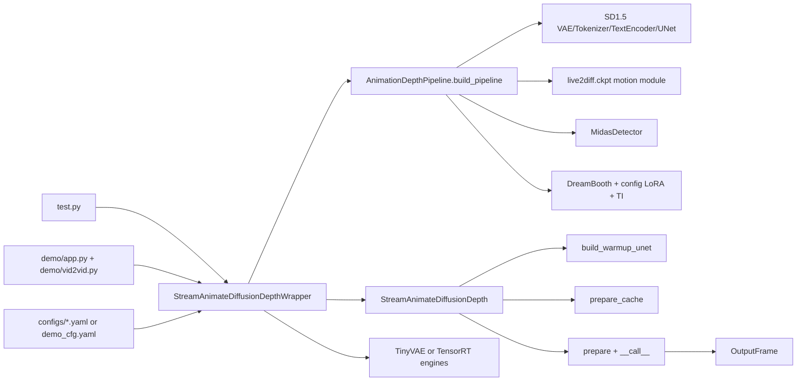

## *总览*

## *一、先把整个仓库的边界看清*

*如果从“哪些目录真的参与主流程”看，这个仓库可以分成四层：*

- *主工程层：*`Live2Diff/`
- *内嵌第三方层：*`Live2Diff/live2diff/MiDaS/`
- *演示壳层：*`Live2Diff/demo/`

*真正决定推理行为的是第二层，也就是* `Live2Diff/`*。*

### *2.* `Live2Diff/` *才是运行主体*

*如果继续往下拆，*`Live2Diff/` *里最关键的部分可以概括为：*

- `test.py`*：离线视频到视频入口*
- `demo/vid2vid.py`*、*`demo/app.py`*：在线实时 demo 入口*
- `live2diff/utils/wrapper.py`*：工程装配壳*
- `live2diff/pipeline_stream_animation_depth.py`*：流式推理主控*
- `live2diff/animatediff/pipeline/pipeline_animatediff_depth.py`*：基础 pipeline 构建器*
- `live2diff/animatediff/converter/convert.py`*：DreamBooth / LoRA / VAE / TI 权重装载*
- `live2diff/animatediff/pipeline/loader.py`*：LoRA 同步注入 warmup UNet 的补丁层*
- `live2diff/acceleration/tensorrt/`*：TensorRT 导出与 engine 包装*

### *3.* `MiDaS/` *是内嵌第三方，不是项目自己重训的深度主干*

*Depth 先验来自* `MiDaS`*，*`Live2Diff` *并没有自己训练一个全新的深度网络，而是把* `MiDaS` *当作结构先验模块嵌到主链里。这一点很重要，因为它决定了 depth 在本项目里是“增强结构稳定性的外部几何条件”，而不是另一条与主扩散模型同级的生成分支。*

### *4.* `demo/frontend/public` *不是推理主链*

*前端文件对 demo 展示很重要，但从模型系统角度看，真正影响推理链的是：*

- `demo/vid2vid.py`
- `demo/app.py`
- `demo/connection_manager.py`

*换句话说，前端是 transport 壳，推理仍然发生在* `StreamAnimateDiffusionDepthWrapper` *这一层。*

## *二、官方定位与本地代码的关系*

*为了避免“看论文以为如此，代码里其实不是这样”，先把公开叙述和本地实现对齐一下。*

### *1. 官方说法强调的是四个卖点*

*从项目主页与论文摘要看，*`Live2Diff` *的核心叙事是：*

1. *把双向视频注意力改成单向流式注意力*
2. *用 warmup 帧和 KV-cache 保持时间一致性*
3. *用 depth prior 抑制结构漂移*
4. *用高效去噪与工程优化把吞吐量推到交互式范围*

### *2. 本地代码把这四个卖点拆成了明确模块*

*在代码里，对应关系大致是：*

- *单向时序建模：*`Streaming` *motion module + temporal attention mask*
- *warmup：*`WARMUP_FRAMES = 8` *+* `build_warmup_unet()` *+* `prepare()`
- *KV-cache：*`prepare_cache()`*、*`kv_cache_list`*、*`pe_idx`*、*`update_idx`
- *depth prior：*`MidasDetector` *+* `encode_depth()` *+* `flow_conv_in`
- *few-step：*`LCMScheduler` *+* `LCM-LoRA`
- *工程加速：*`AutoencoderTiny`*、TensorRT engines*

### *3. 这份分析以当前源码行为为准*

*这一点很关键。比如旧文档里有些细节已经和当前仓库略有出入：*

- *当前* `encode_depth()` *已经改成“按样本做 min-max 归一化”，并在送进 VAE 前转回* `[0, 1]`
- *demo 现在不止有* `/api/ws`*、*`/api/stream`*、*`/api/settings`*，还新增了* `/api/debug`*、*`/api/depth`*、*`/api/preview/input`
- *wrapper 层新增了* `get_debug_info()` *和* `get_last_depth_image()`

*所以后面整篇都会以当前代码现状为准，而不是机械复述旧分析。*

## *三、项目真正有哪些入口*

*从“程序怎么启动”看，项目主要有三类入口。*

### *1. 离线入口：*`Live2Diff/test.py`

*这是整套系统最标准、最短、也最适合读源码的入口。它会：*

1. *读取输入视频或帧目录*
2. *合并 YAML 配置和命令行参数*
3. *构造* `StreamAnimateDiffusionDepthWrapper`
4. *对前 8 帧做* `prepare()`
5. *对后续帧逐帧调用* `stream(...)`
6. *根据固定流水线延迟对齐输出并保存视频*

```153:196:/home/lmy_2004/文档/Ink-Diffusion/Live2Diff/test.py
# handle timesteps
num_inference_steps = num_inference_steps or cfg.get("num_inference_steps", None)
strength = strength or cfg.get("strength", None)
t_index_list = t_index_list or cfg.get("t_index_list", None)

stream = StreamAnimateDiffusionDepthWrapper(
    few_step_model_type=few_step_model_type,
    config_path=config_path,
    cfg_type="none",
    dreambooth_path=dreambooth_path,
    lora_dict=lora_dict,
    strength=strength,
    num_inference_steps=num_inference_steps,
    t_index_list=t_index_list,
    ...
)
warmup_frames = video[:8].permute(0, 3, 1, 2)
warmup_results = stream.prepare(
    warmup_frames=warmup_frames,
    prompt=prompt,
    guidance_scale=1,
)
...
skip_frames = stream.batch_size - 1
for i in tqdm(range(8, video.shape[0])):
    output_image = stream(video[i].permute(2, 0, 1))
    if i - 8 >= skip_frames:
        video_result[i - skip_frames] = output_image.permute(1, 2, 0)
video_result = video_result[:-skip_frames]
```

*如果你只想抓住“最小稳定调用链”，就看* `test.py`*。*

### *2. 在线入口：*`demo/main.py` *->* `demo/app.py` *->* `demo/vid2vid.py`

*在线 demo 并不自己实现推理，而是启动一个 FastAPI 服务，再把请求转交给* `Pipeline.predict()`*。本质上它和* `test.py` *使用的是同一套 wrapper，只是把“本地视频文件喂帧”换成了“WebSocket + MJPEG”。*

### *3. 包级入口：*`live2diff/__init__.py`

*包层面导出的核心类是* `StreamAnimateDiffusionDepth`*。但从工程使用角度，这个导出并不等于“最佳使用入口”。真实开发里，最稳的切入点其实是* `StreamAnimateDiffusionDepthWrapper`*，因为它把：*

- *配置解析*
- *DreamBooth / LoRA 装载*
- *warmup UNet*
- *TinyVAE*
- *TensorRT*
- *cache 初始化*

*都包进去了。*

## *四、整体调用链：从入口到输出怎么串起来*

*可以先把完整链路压缩成一张图：*




*把这条链展开后，实际可以拆成五层。*

### *1. 入口层：收输入、读配置、创建 wrapper*

*离线入口里，参数来源是：*

- ***CLI 显式参数**：CLI 是 Command Line Interface（命令行界面）的缩写，指在终端里运行程序时写在命令后面的那些选项，例如* `python test.py --config_path configs/foo.yaml --prompt "..."`*。本仓库的离线入口* `test.py` *用* `fire.Fire(main)` *把这类字符串解析成* `main()` *的函数参数。*
- *YAML 里的默认值*
- *某些参数之间的推导关系，比如* `strength` *和* `t_index_list`

*在线入口里，参数来源会再加上：*

- `argparse`
- *WebSocket 传入的 JSON*

*但两者最终都会落到同一个对象：*`StreamAnimateDiffusionDepthWrapper`*。*

### *2. 组装层：*`wrapper.py` *把所有模块拼起来*

`StreamAnimateDiffusionDepthWrapper` *是整个项目最重要的工程壳。它做的不是“推理算法本身”，而是：*

- *构造基础* `AnimationDepthPipeline`
- *构造* `StreamAnimateDiffusionDepth`
- *构造 warmup UNet*
- *融合* `LCM-LoRA`
- *融合额外用户 LoRA*
- *初始化 KV-cache*
- *可选替换 TinyVAE*
- *可选编译/加载 TensorRT engines*

```434:513:/home/lmy_2004/文档/Ink-Diffusion/Live2Diff/live2diff/utils/wrapper.py
from live2diff.animatediff.pipeline import AnimationDepthPipeline

pipe = AnimationDepthPipeline.build_pipeline(
    config_path,
).to(device=self.device, dtype=self.dtype)
...
stream = stream_pipeline_cls(
    pipe=pipe,
    num_inference_steps=num_inference_steps,
    t_index_list=t_index_list,
    strength=strength,
    ...
)

stream.load_warmup_unet(config_path)
stream.load_lora(few_step_lora)
stream.fuse_lora()

denoising_steps_num = len(stream.t_list)
stream.prepare_cache(
    height=height,
    width=width,
    denoising_steps_num=denoising_steps_num,
)

if lora_dict is not None:
    for lora_name, lora_scale in lora_dict.items():
        stream.load_lora(lora_name)
        stream.fuse_lora(lora_scale=lora_scale)

if use_tiny_vae:
    stream.vae = AutoencoderTiny.from_pretrained(...).to(...)
```

*从工程角度看，这几步几乎就是项目的“真实启动顺序”。*

### *3. 推理层：*`StreamAnimateDiffusionDepth`

`StreamAnimateDiffusionDepth` *负责的事情包括：*

- *把 scheduler 切到* `LCMScheduler`
- *确定* `t_list`*、*`sub_timesteps`
- *管理 warmup 缓冲区*
- *管理 temporal attention mask / positional index / update index*
- *执行 VAE encode、depth encode、UNet 去噪、VAE decode*
- *维护 KV-cache 和 denoising batch 的状态推进*

### *4. 加速层：TinyVAE 与 TensorRT*

*这里要特别注意：加速不是先天地写死在 pipeline 里，而是在 wrapper 组装完成后才进行“模块替换”。*

- *TinyVAE：直接替换* `stream.vae`
- *TensorRT：把* `stream.unet`*、*`stream.depth_detector`*、*`stream.vae` *替换成 engine 包装对象*

*也就是说，高层推理逻辑几乎不改，只是低层执行后端换了。*

### *5. 服务层：FastAPI + WebSocket + MJPEG*

*在线 demo 再在最外层包上一层传输壳：*

- *WebSocket：负责送入控制消息、参数和输入帧*
- *HTTP MJPEG：负责不断吐出输出帧*
- *额外 HTTP 接口：负责 settings、debug、depth、source preview*

*所以 demo 层本质上不是另一个模型系统，而是现有推理链的服务封装。*

## *五、配置系统是如何控制整条链路的*

*整个项目的配置入口非常集中，核心只有一个函数：*`load_config()`*。*

```10:17:/home/lmy_2004/文档/Ink-Diffusion/Live2Diff/live2diff/utils/config.py
def load_config(config: str) -> OmegaConf:
    config = OmegaConf.load(config)
    base_config = config.pop("base", None)

    if base_config:
        config = OmegaConf.merge(OmegaConf.load(base_config), config)

    return config
```

*这意味着它的配置系统有三个特征：*

- *支持* `base` *继承*
- *子配置覆盖基配置*
- *所有模块最终都只看到 merge 后的结果*

### *1.* `base_config.yaml` *定义系统骨架*

```1:37:/home/lmy_2004/文档/Ink-Diffusion/Live2Diff/configs/base_config.yaml
pretrained_model_path: "./models/Model/stable-diffusion-v1-5"

motion_module_path: './models/live2diff.ckpt'
depth_model_path: './models/dpt_hybrid_384.pt'

unet_additional_kwargs:
  ...
  motion_module_type: Streaming
  motion_module_kwargs:
    ...
    attention_kwargs:
      window_size: 16
      sink_size: 8

noise_scheduler_kwargs:
  num_train_timesteps: 1000
  ...
```

*这里定义的是：*

- *SD1.5 路径*
- *motion module 路径*
- *depth 模型路径*
- *Streaming attention 的结构参数*
- *基础 scheduler 配置*

### *2. 具体配置文件定义风格和运行场景*

*例如 demo 默认配置：*

```43:58:/home/lmy_2004/文档/Ink-Diffusion/Live2Diff/demo/demo_cfg.yaml
third_party_dict:
  dreambooth: "../models/Model/guohua.ckpt"
  
  lora_list:
    - lora: '../models/LoRA/MoXinV1.safetensors'
      lora_alpha: 1
  clip_skip: 2

num_inference_steps: 50
t_index_list: [30, 40]
prompt: "shuimobysim,minimalist composition,..."
```

*这一层控制的是：*

- *DreamBooth 风格底座*
- *配置内 LoRA*
- `clip_skip`
- *默认 prompt*
- *默认 few-step 路径*

### *3. CLI / 运行时参数再覆盖局部行为*

*最后，*`test.py` *或* `demo/vid2vid.py` *还会用显式传参覆盖 YAML 的一部分设置，尤其是：*

- `prompt`
- `num_inference_steps`
- `strength`
- `t_index_list`
- `dreambooth_path`
- `lora_dict`
- `acceleration`

*所以整个配置优先级可以概括成：*

`base_config` *-> 场景配置 -> CLI / 运行时输入*

## *六、模型与权重到底是怎么装起来的*

*这一部分是整套系统最关键的地方。最好的理解方式不是“看有哪些权重文件”，而是“看它分几阶段装配”。*

### *第一阶段：加载 SD1.5 的基础组件*

`AnimationDepthPipeline.build_pipeline()` *会先从* `pretrained_model_path` *里取出 SD1.5 的基础件：*

```250:305:/home/lmy_2004/文档/Ink-Diffusion/Live2Diff/live2diff/animatediff/pipeline/pipeline_animatediff_depth.py
cfg = load_config(config_path)
pretrained_model_path = cfg.pretrained_model_path
...
vae = AutoencoderKL.from_pretrained(pretrained_model_path, subfolder="vae")
tokenizer = CLIPTokenizer.from_pretrained(pretrained_model_path, subfolder="tokenizer")
text_encoder = CLIPTextModel.from_pretrained(pretrained_model_path, subfolder="text_encoder")

unet = UNet3DConditionStreamingModel.from_pretrained_2d(
    pretrained_model_path,
    subfolder="unet",
    ...
)
```

***Tokenizer 是什么（本项目里是* `CLIPTokenizer`*）**：广义上，Tokenizer（分词器）把 **prompt 字符串** 变成 **token ID 序列**（整数），因为神经网络不能直接处理原始文本。在 SD1.5 所用的 **CLIP 文本分支**里，*`CLIPTokenizer` *通常基于 **字节级 BPE（Byte Pair Encoding）** 做子词切分：把词拆成子词单元、查词表得到 ID，并加上 **起始/结束、填充** 等特殊 token；序列会 **padding** 到固定长度，超出* `model_max_length`*（SD1.5 常见为 **77**）的部分会被 **截断**。这些 ID 再交给* `CLIPTextModel` *查嵌入表，输出 **文本特征**，供 UNet 的 cross-attention 使用——没有 Tokenizer，prompt 就无法进入这条条件通路。更系统的说明见 [Hugging Face：*`CLIPTokenizer](https://huggingface.co/docs/transformers/model_doc/clip#transformers.CLIPTokenizer)` *与 [DeepWiki：CLIP 文本分词](https://deepwiki.com/openai/CLIP/3.2-text-tokenization)。*

*也就是说，基础装配不是直接读取一个“成品 Live2Diff pipeline”，而是先拿：*

- *VAE*
- *Tokenizer（把 prompt 编成 token ID，供 Text Encoder 使用）*
- *Text Encoder*
- *从 2D UNet 扩展出来的 Streaming 3D UNet*

### *第二阶段：把* `live2diff.ckpt` *的 motion module 写进 UNet*

*同一个函数里，会把* `motion_module_path` *指向的 checkpoint 再加载进 streaming UNet：*

```279:289:/home/lmy_2004/文档/Ink-Diffusion/Live2Diff/live2diff/animatediff/pipeline/pipeline_animatediff_depth.py
motion_module_path = cfg.motion_module_path
mm_checkpoint = torch.load(motion_module_path, map_location="cuda")
...
state_dict = {k.replace("module.", ""): v for k, v in state_dict.items() if "grid" not in k}

m, u = unet.load_state_dict(state_dict, strict=False)
assert len(u) == 0, f"Find unexpected keys ({len(u)}): {u}"
```

*所以* `live2diff.ckpt` *的职责不是“替换整个底模”，而是给 UNet 注入视频时序能力。*

### *第三阶段：加载 MiDaS 深度模型*

```292:304:/home/lmy_2004/文档/Ink-Diffusion/Live2Diff/live2diff/animatediff/pipeline/pipeline_animatediff_depth.py
unet = unet.to(dtype=torch.float16)
depth_model = MidasDetector(cfg.depth_model_path).to(device="cuda", dtype=torch.float16)

pipeline = cls(
    unet=unet,
    vae=vae,
    tokenizer=tokenizer,
    text_encoder=text_encoder,
    depth_model=depth_model,
    scheduler=noise_scheduler,
)
pipeline = load_third_party_checkpoints(pipeline, third_party_dict, dreambooth)
```

*到这一步，才得到一个“基础可用的 AnimationDepthPipeline”。*

### *第四阶段：装入第三方风格资源*

`convert.py` *里统一处理四类资源：*

- *DreamBooth*
- *独立 VAE*
- *配置内* `lora_list`
- *Textual Inversion*

```11:96:/home/lmy_2004/文档/Ink-Diffusion/Live2Diff/live2diff/animatediff/converter/convert.py
vae = third_party_dict.get("vae", None)
lora_list = third_party_dict.get("lora_list", [])

dreambooth = dreambooth_path or third_party_dict.get("dreambooth", None)

text_embedding_dict = third_party_dict.get("text_embedding_dict", {})
...
if dreambooth is not None:
    ...
    pipeline.unet.load_state_dict(converted_unet_checkpoint, strict=False)
    pipeline.vae.load_state_dict(converted_vae_checkpoint, strict=True)
    ...
if lora_list:
    for lora_dict in lora_list:
        ...
        pipeline.unet, pipeline.text_encoder = convert_lora_model_level(...)
...
for token, embedding_path in text_embedding_dict.items():
    pipeline.load_textual_inversion(embedding_path, token)
```

*这里要特别区分三种不同性质的“风格/适配资源”：*

- *DreamBooth：更像换底模*
- *配置内 LoRA：直接改模型权重*
- *Textual Inversion：往文本侧加 token embedding*

### *第五阶段：单独构建 warmup UNet*

*项目没有把 warmup 和稳态流式推理完全交给同一个 UNet，而是额外构建了一套 warmup UNet：*

```307:339:/home/lmy_2004/文档/Ink-Diffusion/Live2Diff/live2diff/animatediff/pipeline/pipeline_animatediff_depth.py
@classmethod
def build_warmup_unet(cls, config_path: str, dreambooth: Optional[str] = None):
    ...
    unet = UNet3DConditionWarmupModel.from_pretrained_2d(
        pretrained_model_path,
        subfolder="unet",
        ...
    )
    ...
    unet = load_third_party_unet(unet, third_party_dict, dreambooth)
    return unet
```

*这说明作者明确把：*

- *前 8 帧 warmup*
- *后续单帧流式推理*

*拆成了两条不同但相关的 UNet 路线。*

### *第六阶段：把* `LCM-LoRA` *融到系统里*

*wrapper 会优先找本地* `models/lora/lcm-lora-sdv1-5`*，找不到再回退到 Hugging Face 的* `latent-consistency/lcm-lora-sdv1-5`*。*

*这一步的意义不是“加一种画风”，而是把 SD1.5 / AnimateDiff 主干改造成适合 few-step 推理的系统。*

### *第七阶段：保证 LoRA 同时作用在 warmup UNet 和 streaming UNet*

*这是项目里一个很容易被忽略、但非常关键的设计点。作者专门写了* `LoraLoaderWithWarmup`*，确保 LoRA 不只作用在 streaming UNet，也会同步打进 warmup UNet。*

```9:50:/home/lmy_2004/文档/Ink-Diffusion/Live2Diff/live2diff/animatediff/pipeline/loader.py
class LoraLoaderWithWarmup(LoraLoaderMixin):
    unet_warmup_name = "unet_warmup"

    def load_lora_weights(
        self,
        pretrained_model_name_or_path_or_dict,
        adapter_name=None,
        **kwargs,
    ):
        super().load_lora_weights(pretrained_model_name_or_path_or_dict, adapter_name=adapter_name, **kwargs)
        ...
        self.load_lora_into_unet(
            state_dict,
            network_alphas=network_alphas,
            unet=getattr(self, self.unet_warmup_name) if not hasattr(self, "unet_warmup") else self.unet_warmup,
            ...
        )
```

*如果没有这一层，前 8 帧和后续单帧可能会出现风格漂移。*

### *第八阶段：追加运行时 LoRA*

*除了配置文件里的* `lora_list`*，wrapper 还支持通过* `lora_dict` *在运行时追加 LoRA：*

```501:505:/home/lmy_2004/文档/Ink-Diffusion/Live2Diff/live2diff/utils/wrapper.py
if lora_dict is not None:
    for lora_name, lora_scale in lora_dict.items():
        stream.load_lora(lora_name)
        stream.fuse_lora(lora_scale=lora_scale)
        print(f"Use LoRA: {lora_name} in weights {lora_scale}")
```

*所以项目里实际上有三类“LoRA相关对象”：*

- `LCM-LoRA`*：few-step 适配器*
- *配置内* `lora_list`*：权重级直接合并*
- *运行时* `lora_dict`*：Diffusers adapter + fuse*

*如果把这三类混为一谈，后面对可逆性、导出行为和组合效果会判断失真。*

### *第九阶段：可选替换 TinyVAE*

*如果启用了* `use_tiny_vae`*，主 VAE 会被替换为* `AutoencoderTiny`*：*

```507:512:/home/lmy_2004/文档/Ink-Diffusion/Live2Diff/live2diff/utils/wrapper.py
if use_tiny_vae:
    vae_path = self._get_local_tiny_vae_path(vae_id)
    print(f"TinyVAE path: {vae_path}")
    stream.vae = AutoencoderTiny.from_pretrained(vae_path, local_files_only=True).to(
        device=pipe.device, dtype=pipe.dtype
    )
```

*它不是辅助模块，而是直接替换 VAE 主体。*

### *第十阶段：可选切换 TensorRT*

*如果* `acceleration == "tensorrt"`*，wrapper 会尝试编译或加载：*

- *UNet engine*
- *depth engine*
- *VAE encoder engine*
- *VAE decoder engine*

*随后把 PyTorch 模块替换成 engine 包装对象。*

```520:681:/home/lmy_2004/文档/Ink-Diffusion/Live2Diff/live2diff/utils/wrapper.py
if acceleration == "tensorrt":
    ...
    stream.unet = UNet2DConditionModelDepthEngine(unet_path, cuda_stream, use_cuda_graph=False)
    stream.depth_detector = MidasEngine(midas_path, cuda_stream, use_cuda_graph=False)
    ...
    stream.vae = AutoencoderKLEngine(
        vae_encoder_path,
        vae_decoder_path,
        cuda_stream,
        stream.pipe.vae_scale_factor,
        use_cuda_graph=False,
    )
    ...
    stream.prepare_cache(
        height=height,
        width=width,
        denoising_steps_num=denoising_steps_num,
    )
    stream.is_tensorrt = True
```

*这里的关键不是“另起一套 TensorRT 推理逻辑”，而是“保持上层接口不变，替换底层执行体”。*

## *七、为什么它能做到实时*

*如果只回答“它为什么快”，最容易说成“因为用了 TensorRT”。但真正的答案是下面六件事叠加。*

### *1. 单向时序注意力把视频问题改写成流式问题*

`base_config.yaml` *已经把关键结构写出来了：*

```14:28:/home/lmy_2004/文档/Ink-Diffusion/Live2Diff/configs/base_config.yaml
motion_module_type: Streaming
motion_module_kwargs:
  ...
  attention_class_name               : 'stream'

  attention_kwargs:
    window_size: 16
    sink_size: 8
```

*这说明项目并不是在做“全局视频 attention”，而是在做“只看历史和 warmup 锚点的流式 attention”。*

### *2. warmup 让系统从一开始就带上下文*

`WARMUP_FRAMES = 8` *和 warmup UNet 的存在说明，项目不是“从第一帧开始裸推理”，而是先用前 8 帧建立时序上下文，再进入稳态。*

*warmup 的价值在于：*

- *稳定时序注意力初态*
- *预填充 KV-cache*
- *让后续单帧推理立刻拥有历史语境*

### *3. KV-cache 避免每帧重算整段历史*

*缓存逻辑的核心在于：*

- `prepare_cache()` *先初始化 temporal attention 所需 cache*
- `unet_step()` *每次读写* `kv_cache_list`
- `update_attn_bias()` */* `update_idx` *控制“当前该覆盖哪一格”*

*因此它不是“每来一帧重跑整段视频”，而是增量更新。*

### *4. few-step 不是粗暴减步，而是 LCM 化的 few-step*

`StreamAnimateDiffusionDepth` *初始化时就把 scheduler 换成* `LCMScheduler`*：*

```54:75:/home/lmy_2004/文档/Ink-Diffusion/Live2Diff/live2diff/pipeline_stream_animation_depth.py
self.scheduler = LCMScheduler.from_config(self.pipe.scheduler.config)
self.scheduler.set_timesteps(num_inference_steps, self.device)
if strength is not None:
    t_index_list, timesteps = self.get_timesteps(num_inference_steps, strength, self.device)
    ...
else:
    ...
    self.timesteps = self.scheduler.timesteps.to(self.device)
...
assert cfg_type == "none", f'cfg_type must be "none" for now, but got {cfg_type}.'
```

*而* `scheduler_step_batch()` *用的是 LCM 的 boundary condition scaling：*

```388:400:/home/lmy_2004/文档/Ink-Diffusion/Live2Diff/live2diff/pipeline_stream_animation_depth.py
def scheduler_step_batch(
    self,
    model_pred_batch: torch.Tensor,
    x_t_latent_batch: torch.Tensor,
    idx: Optional[int] = None,
) -> torch.Tensor:
    if idx is None:
        F_theta = (x_t_latent_batch - self.beta_prod_t_sqrt * model_pred_batch) / self.alpha_prod_t_sqrt
        denoised_batch = self.c_out * F_theta + self.c_skip * x_t_latent_batch
    else:
        F_theta = (x_t_latent_batch - self.beta_prod_t_sqrt[idx] * model_pred_batch) / self.alpha_prod_t_sqrt[idx]
        denoised_batch = self.c_out[idx] * F_theta + self.c_skip[idx] * x_t_latent_batch
```

*所以它的 few-step 是“LCM 路线下的少步推理”，不是生硬地把扩散步数裁短。*

### *5. denoising batch 把多个子步合并成一次更大的前向*

`predict_x0_batch()` *的关键思想不是“多张图 batch 推理”，而是把：*

- *当前帧的第一个时间步状态*
- *历史缓冲区里不同时间步的状态*

*拼成一个去噪批次，再一次送入* `unet_step()`*。这样可以减少 Python 循环与 kernel launch 开销。*

```578:606:/home/lmy_2004/文档/Ink-Diffusion/Live2Diff/live2diff/pipeline_stream_animation_depth.py
def predict_x0_batch(self, x_t_latent: torch.Tensor, depth_latent: torch.Tensor) -> torch.Tensor:
    prev_latent_batch = self.x_t_latent_buffer
    prev_depth_latent_batch = self.depth_latent_buffer

    if self.use_denoising_batch:
        t_list = self.sub_timesteps_tensor
        if self.denoising_steps_num > 1:
            x_t_latent = torch.cat((x_t_latent, prev_latent_batch), dim=0)
            depth_latent = torch.cat((depth_latent, prev_depth_latent_batch), dim=0)
        x_0_pred_batch, model_pred = self.unet_step(x_t_latent, depth_latent, t_list)
        ...
        self.x_t_latent_buffer = ...
        self.depth_latent_buffer = depth_latent[:-1]
```

*代价就是固定流水线延迟，这也是* `test.py` *需要* `skip_frames = stream.batch_size - 1` *的原因。*

### *6. TensorRT / TinyVAE 是最后一层工程提速*

*所以正确的因果顺序应该是：*

1. *单向时序注意力把问题改造成流式*
2. *warmup + KV-cache 让历史可复用*
3. *LCM few-step 把每帧步数压低*
4. *denoising batch 进一步提高吞吐*
5. *depth 维持结构稳定性，避免“快但漂”*
6. *TensorRT / TinyVAE 再压一层时延*

*也就是说，**实时性首先来自算法和调度设计，其次才来自底层加速**。*

## *八、每一帧到底是怎么跑的*

*前面讲的是“模块怎么装”，下面看“装好以后每帧怎么走”。*

### *1. 初始化时先确定时间轴*

`StreamAnimateDiffusionDepth.__init__()` *会根据：*

- `num_inference_steps`
- `strength`
- `t_index_list`

*确定真实执行的离散时间步，并由此得到：*

- `self.timesteps`
- `self.t_list`
- `self.sub_timesteps_tensor`
- `self.denoising_steps_num`

*所以真正决定 few-step 路径的不是某一个参数，而是三者合起来。*

### *2.* `prepare()` *不是简单缓存 prompt，而是完整 warmup 过程*

`prepare()` *主要做了这些事：*

1. *初始化 latent buffer*
2. *初始化 attention mask /* `pe_idx` */* `update_idx`
3. *编码 prompt*
4. *根据* `t_list` *生成* `sub_timesteps`
5. *预计算* `c_skip` */* `c_out`
6. *预计算* `alpha_prod_t_sqrt` */* `beta_prod_t_sqrt`
7. *编码 warmup 图像 latent 和 depth latent*
8. *用 warmup UNet 跑完整个 warmup 去噪*
9. *解码 warmup 结果*
10. *如果使用 TensorRT，则顺带 warmup engine*

*换句话说，warmup 本身就是正式推理的一部分，不是“存一下前几帧”那么简单。*

### *3. warmup 时 depth 就已经参与主链*

```303:345:/home/lmy_2004/文档/Ink-Diffusion/Live2Diff/live2diff/pipeline_stream_animation_depth.py
warmup_x = torch.cat(warmup_x_list, dim=0)
warmup_x_t = self.encode_image(warmup_x)
x_t_latent = rearrange(warmup_x_t, "f c h w -> c f h w")[None, ...]
depth_latent = self.encode_depth(warmup_x)
depth_latent = rearrange(depth_latent, "f c h w -> c f h w")[None, ...]
...
output_t = self.unet_warmup(
    x_t_latent,
    t,
    temporal_attention_mask=None,
    depth_sample=depth_latent,
    encoder_hidden_states=warmup_prompt,
    kv_cache=[cache[idx] for cache in self.kv_cache_list],
    return_dict=True,
)
```

*这里能看出三点：*

- *warmup 帧会先过 VAE*
- *depth 在 warmup 阶段就已经参与*
- *KV-cache 在 warmup 阶段就开始被填充*

### *4. 稳态单帧推理路径*

*真正的单帧流式推理发生在* `__call__()`*：*

```630:665:/home/lmy_2004/文档/Ink-Diffusion/Live2Diff/live2diff/pipeline_stream_animation_depth.py
def __call__(self, x):
    ...
    x = self.image_processor.preprocess(x, self.height, self.width).to(device=self.device, dtype=self.dtype)
    ...
    x_t_latent = self.encode_image(x)
    ...
    depth_latent = self.encode_depth(x)
    ...
    x_t_latent = x_t_latent.unsqueeze(2)
    depth_latent = depth_latent.unsqueeze(2)
    x_0_pred_out = self.predict_x0_batch(x_t_latent, depth_latent)
    x_0_pred_out = rearrange(x_0_pred_out, "b c f h w -> (b f) c h w")
    x_output = self.decode_image(x_0_pred_out).detach().clone()
```

*这条路径可以压缩成六步：*

1. *预处理输入帧*
2. *VAE encode 得到 image latent*
3. *MiDaS + VAE encode 得到 depth latent*
4. `predict_x0_batch()` *执行 few-step 去噪*
5. *VAE decode 回 RGB*
6. *更新时间统计和缓存状态*

### *5.* `unet_step()` *才是算法核心接口*

```442:471:/home/lmy_2004/文档/Ink-Diffusion/Live2Diff/live2diff/pipeline_stream_animation_depth.py
def unet_step(
    self,
    x_t_latent: torch.Tensor,
    depth_latent: torch.Tensor,
    t_list,
    idx: Optional[int] = None,
):
    ...
    output = self.unet(
        x_t_latent_plus_uc,
        t_list,
        depth_sample=depth_latent,
        encoder_hidden_states=self.prompt_embeds,
        temporal_attention_mask=self.attn_bias,
        kv_cache=self.kv_cache_list,
        pe_idx=self.pe_idx,
        update_idx=self.update_idx,
        return_dict=True,
    )
```

*这说明 streaming UNet 的输入除了 latent 外，还显式依赖：*

- `depth_sample`
- `prompt_embeds`
- `temporal_attention_mask`
- `kv_cache`
- `pe_idx`
- `update_idx`

*这也是它和普通 SD* `img2img` *本质不同的地方。*

## *九、Depth 在主链上到底怎么注入*

*这一点是整套系统里最容易被误解的地方：它不是外接了一条独立 ControlNet 深度分支，而是把 depth latent 直接并进了 UNet 主干。*

### *1.* `encode_depth()` *的真实路径*

*当前代码中的 depth 编码流程是：*

1. *把输入帧缩放到* `384x384`
2. *用* `MiDaS` *预测 depth map*
3. *对每个样本分别做 min-max 归一化*
4. *扩成 3 通道并映射到* `[-1, 1]`
5. *保存* `last_depth_map` *供 demo 调试可视化*
6. *再把深度图映射回* `[0, 1]` *后送入 VAE*
7. *编成* `depth_latent`

```561:575:/home/lmy_2004/文档/Ink-Diffusion/Live2Diff/live2diff/pipeline_stream_animation_depth.py
h, w = image_tensors.shape[2], image_tensors.shape[3]
images_input = F.interpolate(image_tensors, (384, 384), mode="bilinear", align_corners=False)
depth_map = self.depth_detector(images_input)
depth_min = depth_map.amin(dim=(-2, -1), keepdim=True)
depth_max = depth_map.amax(dim=(-2, -1), keepdim=True)
depth_map_norm = (depth_map - depth_min) / (depth_max - depth_min).clamp_min(1e-6)
depth_map_norm = depth_map_norm[:, None].repeat(1, 3, 1, 1) * 2 - 1
depth_map_norm = F.interpolate(depth_map_norm, (h, w), mode="bilinear", align_corners=False)
self.last_depth_map = depth_map_norm.detach().float().cpu()
depth_for_vae = (depth_map_norm + 1.0) * 0.5
depth_latent = retrieve_latents(self.vae.encode(depth_for_vae.to(dtype=self.vae.dtype)), self.generator)
depth_latent = depth_latent * self.vae.config.scaling_factor
```

*这和旧文档相比有一个重要更新：当前实现已经不再直接把* `[-1, 1]` *深度图送入 VAE，而是先转换到* `[0, 1]`*。*

### *2. 进入 UNet 的方式是主干相加，不是独立 ControlNet*

```522:526:/home/lmy_2004/文档/Ink-Diffusion/Live2Diff/live2diff/animatediff/models/unet_depth_streaming.py
sample = self.conv_in(sample)
if depth_sample is not None:
    depth_sample = self.flow_conv_in(depth_sample)
    sample = depth_sample + sample
```

*因此更准确的说法是：*

***depth latent 在 UNet 输入早期经* `flow_conv_in` *映射后，直接加到主特征上。***

*这也是它更轻、更适合实时的原因之一。*

### *3. Depth 的角色是结构约束，不是风格控制*

*DreamBooth / LoRA 负责“画什么风格”，而 depth 负责“别把结构画漂”。尤其在 few-step 场景下，结构漂移通常比单帧文生图更严重，所以 depth 在这里更像一个几何稳定器。*