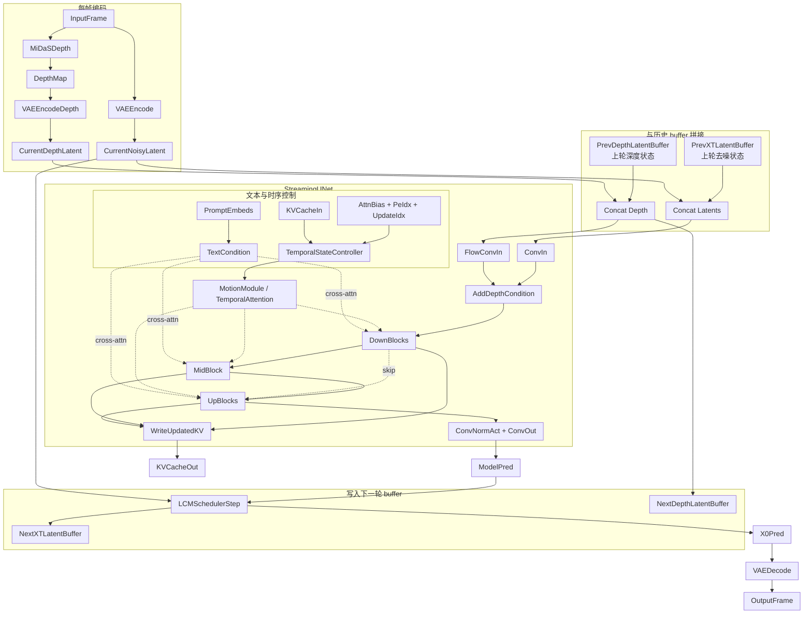

## *总览*

*如果说* `0.5` *那一篇更像是“把工程入口、配置、模块装配顺序全部摊开”，那么这一篇* `0.6` *要回答的是另一组更核心的问题：*

1. `UNet` *在这个项目里到底是什么，而不是在扩散模型课本里是什么。*
2. *它每处理一帧时，究竟拿到了哪些输入，又吐出了什么结果。*
3. `ControlNet` *和这个项目里的深度条件到底是不是一回事。*
4. `Live2Diff`*、*`LCM`*、*`KV-cache` *分别在解决什么问题。*
5. *这个系统为什么能在“实时”与“相对稳定”之间取得一个可用的平衡。*
x
*这一篇会把* `UNet` *放在正中央看问题。因为在* `Live2Diff` *里，真正把“文本条件、当前帧 latent、深度先验、历史时序状态、少步采样调度”捏合到一起的地方，不是* `wrapper`*，不是* `demo`*，也不是* `TensorRT`*，而就是* `UNet` *本身。*

## *一、先给出最短答案*

*如果你只想先拿到结论，可以先记住下面六句话：*

1. *这个项目里的* `UNet` *不是普通的图像* `UNet`*，而是* `SD1.5` *的 2D* `UNet` *被改造成了* `UNet3DConditionStreamingModel`*，里面挂了 motion module 和 streaming temporal attention。*
2. `Live2Diff` *不是单独一个“神秘模型”，而是一整套在线流式视频扩散推理机制。*
3. *项目主路径里真正进入* `UNet` *的“控制信号”是* `depth latent`*，不是独立跑出来的* `ControlNet` *分支。*
4. `LCM` *主要解决的是“每帧如何少走几步、把延迟压下去”，它主要负责快，不主要负责稳。*
5. `KV-cache` *主要解决的是“时序注意力不必每帧重算整段历史”，它把过去帧的 temporal attention 状态缓存下来复用。*
6. *时序稳定性来自多种机制叠加：*`warmup`*、滑动窗口时序注意力、*`KV-cache`*、位置索引滚动、深度结构先验；而* `TensorRT`*、*`TinyVAE`*、批量去噪更多是在提速。*

## *二、项目里的 UNet 究竟是什么*

### *0. 读这一节前，先补几个准备知识*

*如果下面这些词没先对齐，第二节会越看越晕：什么叫“带帧维的张量”？什么叫 2D 卷积？卷积权重到底是什么？为什么* `UNet` *里老是在说* `down/up/mid block`*？这里先用最朴素的方式把它们讲清楚。下面这段整理主要参考了* `PyTorch` *对* `Conv2d` *和* `GroupNorm` *的官方定义，以及* `diffusers` */* `Stable Diffusion U-Net` *公开文档里的常见写法。*

*先记一个最基本的观念：神经网络里几乎所有“数据”本质上都是张量。你可以先把张量粗糙理解成“带标签的多维数组”。比如：*

- *标量是 0 维张量，比如一个数字。*
- *向量是 1 维张量，比如一个长度为 768 的文本 embedding。*
- *矩阵是 2 维张量，比如* `[token, dim]` *的词向量表。*
- *图像常写成 4 维张量：* `[B, C, H, W]`*。*
- *视频常写成 5 维张量：* `[B, C, F, H, W]`*。*

*这里每个字母都不是随便写的，而是大家约定俗成的维度名：*

- `B` *是* `Batch`*，也就是一次并行送进网络的样本数。*
- `C` *是* `Channel`*，也就是通道数。RGB 图像常见是 3 通道；Stable Diffusion 的 latent 常见是 4 通道。*
- `F` *是* `Frame`*，也就是视频有多少帧。*
- `H` *是* `Height`*，高度。*
- `W` *是* `Width`*，宽度。*

*所以：*

- `[B, C, H, W]` *表示“一批图片”。*
- `[B, C, F, H, W]` *表示“一批视频”。*

*举个最直观的例子。假设现在有 2 段短视频，每段 8 帧，每帧分辨率是* `64x64`*，每帧不是 RGB，而是* `SD VAE` *编码后的 4 通道 latent，那么这个张量形状就会是：*

`[2, 4, 8, 64, 64]`

*这就是“带帧维的张量”的意思。相比图像张量* `[B, C, H, W]`*，它只是多了一维* `F`*，用来明确告诉网络：这些不是互不相关的 8 张图，而是同一段视频里的 8 帧。*

*接下来解释“2D 卷积权重”到底是什么。*

*卷积层可以先把它想成一组“会学习的小窗口模板”。在* `PyTorch` *的* `Conv2d` *里，输入通常是* `[B, C, H, W]`*，而卷积权重本身大致可以理解成一个形状为：*

`[out_channels, in_channels, kernel_h, kernel_w]`

*的参数张量。*

*这是什么意思？假设：*

- *输入有 4 个通道。*
- *输出想变成 320 个通道。*
- *卷积核大小是* `3x3`*。*

*那么这个卷积层就会学习 320 组小滤波器；每一组滤波器都会同时看输入的 4 个通道，并在空间上看一个* `3x3` *局部窗口。于是每个输出通道都相当于在回答一个问题：*

`这个位置附近的局部模式，像不像我这组权重想找的模式？`

*更具体一点说，2D 卷积原来是这样工作的：*

1. *在图像的某个位置取一个局部 patch，比如每个输入通道各取一个* `3x3` *小块。*
2. *把这个 patch 和卷积权重逐元素相乘再求和。*
3. *得到当前这个位置的一个输出值。*
4. *窗口在整张图上滑动，重复这个过程。*
5. *对每个输出通道都做一遍，就得到新的特征图。*

*所以，“卷积权重”不是某种抽象的超参数，它就是模型真正在学习的参数本体。它们学到的并不是“猫”或者“树”这些完整概念，而往往是从低层到高层逐渐抽象出来的模式：边缘、纹理、笔触方向、局部结构，再到更复杂的语义组合。*

*然后解释你问的“主干卷积、归一化、上下采样层又是什么”。这几个词本质上是在描述* `UNet` *主路径里最常见的几类操作。*

*`主干卷积`：就是网络最核心路径上的卷积层。它负责两件事：*

- *在空间上提取局部模式。*
- *在通道上重新组织特征，比如把 4 通道 latent 变成 320 通道 hidden states。*

*`归一化`：常见是* `GroupNorm` *或* `LayerNorm`*。它的直觉作用不是“提取新特征”，而是“把特征分布整理得更稳定一些”，让后面的层更容易训练，也让数值范围不要乱飞。可以粗糙理解成：先把一组通道的激活拉回到比较稳定的尺度，再继续做非线性变换。*

*`下采样`：就是把空间分辨率变小，比如* `64x64 -> 32x32`*。这样做的好处是感受野变大、计算量下降、特征更偏全局语义。代价是细节会变少。*

*`上采样`：就是把空间分辨率再放大，比如* `32x32 -> 64x64`*。这样做是为了把低分辨率下学到的高层语义重新还原回高分辨率输出。*

*所以你可以把* `UNet` *主干非常粗糙地想成一条这样的路径：*

`输入特征 -> 卷积/归一化/残差块 -> 不断下采样 -> 中间瓶颈 -> 不断上采样 -> 输出特征`

*这就自然引出了* `down/up/mid block` *的含义。*

*`down block`：就是* `UNet` *左半边的“往下走”部分。它会一边处理特征，一边逐步降低空间分辨率。这里得到的特征通常越来越抽象、越来越偏全局。*

*`mid block`：就是* `UNet` *最中间的瓶颈部分。它的分辨率最低，但语义最浓缩，最适合做全局交互，比如 attention、跨模态条件融合、时序建模。*

*`up block`：就是* `UNet` *右半边的“往上走”部分。它会逐步恢复分辨率，并把左半边对应层保存下来的细节特征通过 skip connection 接回来。*

*这里的* `skip connection` *也很重要。它的直觉可以理解成：左半边在高分辨率阶段看到过很多细节，不能在下采样过程中全丢了，所以等右半边上采样回来时，再把这些早期细节接回来一起用。这样模型才能既保留大结构，又保留局部纹理。*

*如果你只想先抓住最短的图像版心智模型，可以把一个标准* `UNet` *想成三段：*

- *前半段* `down blocks` *负责“压缩并理解”。*
- *中间段* `mid block` *负责“在最低分辨率上做最核心的全局计算”。*
- *后半段* `up blocks` *负责“把理解到的语义重新展开成高分辨率输出”。*

### *这里最容易混的三个词：`latent`、`hidden states`、`blocks`*

*这三个词说的不是同一个层级的东西。最简单的区分方法是：*

- `latent`*：是一种“表示空间”里的张量，主要强调它处在 VAE 压缩后的隐空间，而不是像素空间。*
- `hidden states`*：是网络内部正在流动、正在被一层层加工的中间特征张量。*
- `blocks`*：是处理这些张量的一组网络模块，属于“算子容器”而不是“数据本身”。*

*如果只记一句话，可以记成：**latent 和 hidden states 都是张量，block 不是张量，block 是用来处理张量的模块。***

### *1.* `latent` *究竟是什么*

*在 Stable Diffusion / Live2Diff 里，真正被扩散加噪、去噪的对象，不是原始像素图，而是 VAE 编码后的 latent。比如一张* `512x512x3` *图像，会先被压到一个更小的隐空间表示，再交给* `UNet` *去做噪声预测。*

*所以当代码里出现* `x_t_latent` *时，它通常表示：*

- *`x`：当前这张图。*
- *`t`：当前扩散时间步。*
- `latent`*：这张图已经不在像素空间，而在 VAE 隐空间。*

*它是整个扩散过程真正被“加噪/去噪”的主对象。*

### *2.* `hidden states` *又是什么*

***`hidden states` *不是另一个独立于 latent 的世界，而是：**latent 进入 UNet 以后，被投影、变换、重编码之后，在主干内部流动的中间特征。***

*最直接的入口就是* `conv_in`*：*

```522:526:/home/lmy_2004/文档/Ink-Diffusion/Live2Diff/live2diff/animatediff/models/unet_depth_streaming.py
sample = self.conv_in(sample)
if depth_sample is not None:
    depth_sample = self.flow_conv_in(depth_sample)
    sample = depth_sample + sample
```

*这里传进来的* `sample` *本质上还是 noisy latent；但一过* `conv_in`*，它就从“4 通道 latent 输入”变成了“更高通道的主干特征”。从语义上讲，这时它已经更适合叫* `hidden states` *了。*

*所以你可以把它理解成一个连续变化的过程：*

`noisy latent -> conv_in 投影 -> UNet 内部 hidden states -> conv_out 投影回 latent 形状`

*这也是为什么很多代码里同一条张量流会在外层叫* `sample`*，进 block 参数时却叫* `hidden_states`*：它们经常是同一条主干数据流在不同代码上下文里的不同名字*。**

### *3. 那么 `latent` 和 `hidden states` 是不是“同一个东西”*

*不完全是，但它们强相关。更准确地说：*

- *从“它们是不是同一条数据流”看：是，同属 UNet 正在处理的那条主干张量流。*
- *从“它们是不是同一个表示阶段”看：不是。latent 更强调输入/输出所处的 VAE 隐空间；hidden states 更强调 UNet 内部中间层特征。*

*你可以把二者关系理解成：*

- `latent` *更像“原料”和“成品”的表示格式。*
- `hidden states` *更像“加工过程中的半成品”。*

*因此，扩散加噪/去噪严格说是发生在 latent 空间里的；而 UNet 真正进行语义提取、条件融合、时序修正时，直接操作的是内部的 hidden states。*

### *4. 去噪对象到底是谁*

*这个问题非常关键。*

*从算法层面说，被 scheduler 定义为* `x_t -> x_0` *那条去噪链路的对象，是* `latent`*。UNet 接收 noisy latent，输出噪声预测或等价的去噪中间量，scheduler 再用它把 latent 往更干净的方向推一步。*

*但从网络实现层面说，UNet 并不是直接拿着原始 latent 不停做加减，而是：*

1. *先把 latent 映射成 hidden states。*
2. *在 hidden states 上做卷积、attention、motion module、条件融合。*
3. *最后再把处理后的 hidden states 投影回输出 latent 形状。*

*源码里的这段前向非常典型：*

```523:627:/home/lmy_2004/文档/Ink-Diffusion/Live2Diff/live2diff/animatediff/models/unet_depth_streaming.py
sample = self.conv_in(sample)
...
for downsample_block in self.down_blocks:
    sample, res_samples = downsample_block(hidden_states=sample, ...)
...
sample = self.mid_block(sample, ...)
...
for upsample_block in self.up_blocks:
    sample = upsample_block(hidden_states=sample, ...)
...
sample = self.conv_norm_out(sample)
sample = self.conv_act(sample)
sample = self.conv_out(sample)
...
return UNet3DConditionStreamingOutput(sample=sample, kv_cache=kv_cache)
```

*这里的名字虽然一直叫* `sample`*，但中间那一大段其实都可以按“hidden states 在 block 之间流动”来理解。最后* `conv_out` *才把它重新投影成 UNet 输出的 latent 形状。*

### *5.* `blocks` *又是什么，和 hidden states 是不是一个东西*

*不是。*

*`down block`、`mid block`、`up block` 都是网络结构单元，属于“处理器”；* `hidden states` *是被这些处理器加工的数据。二者的关系就像：*

- *block 像流水线上的一个车间。*
- *hidden states 像车间里正在被加工的半成品。*

*比如在 UNet 里，外层主干会把当前那份特征依次送进各个 block：*

```528:623:/home/lmy_2004/文档/Ink-Diffusion/Live2Diff/live2diff/animatediff/models/unet_depth_streaming.py
for downsample_block in self.down_blocks:
    sample, res_samples = downsample_block(hidden_states=sample, ...)
...
sample = self.mid_block(sample, ...)
...
for upsample_block in self.up_blocks:
    sample = upsample_block(hidden_states=sample, ...)
```

*这段代码已经把关系写得很清楚了：*

- *`self.down_blocks / self.mid_block / self.up_blocks` 是模块。*
- *传进去的* `hidden_states=sample` *才是数据。*
- *block 做完以后，再把更新后的张量返回给主干继续往下传。*

### *6. 为什么 block 里经常看到 `hidden_states` 这个名字*

*因为对一个 block 来说，它不太关心“你在全局流程里是不是 latent 输入/输出”；它只关心“我当前收到的是一份待处理的中间特征”。所以 block 的接口往往统一叫* `hidden_states` *更自然。*

*例如：UNet 外层 forward 里变量名常写成* `sample`*，但调用 block 时会写：*

`downsample_block(hidden_states=sample, ...)`

*这正说明：同一条张量流，在 UNet 整体视角下可叫* `sample`*，在 block 局部视角下更像* `hidden_states`*。*

### *7. 一个统一的心智模型*

*如果把这三个概念压成一条最清楚的链，可以这样记：*

1. *图像先被 VAE 编码成* `latent`*。*
2. *latent 加噪后形成当前时刻的* `x_t_latent`*。*
3. *`UNet.conv_in` 把它映射成更高维的 `hidden states`。**
4. *这些 hidden states 依次流过* `down blocks -> mid block -> up blocks`*。*
5. *每个 block 都会读入 hidden states、改写 hidden states、再输出 hidden states。*
6. *最后* `conv_out` *把 hidden states 投影回输出 latent 形状。*
7. *scheduler 再用这个输出去更新 latent。*

*所以最终答案可以非常简洁地说成：*

- *`latent`：扩散过程定义所在的隐空间张量。*
- *`hidden states`：latent 进入 UNet 后在内部流动的中间特征。*
- *`blocks`：处理 hidden states 的网络模块。*

*三者不是一回事，但它们串成了一条连续链：*

`latent -> hidden states -> blocks 逐层处理 -> hidden states -> latent`

*最后再回到 Live2Diff 这个项目。它并没有推翻上面这套图像版* `UNet` *逻辑，而是在这套逻辑外面多加了一层“视频理解”：*

- *原本图像版的输入是* `[B, C, H, W]`*。*
- *这里把它改成了视频版的* `[B, C, F, H, W]`*。*
- *原本很多 2D 卷积/归一化/上下采样层，是对每张图工作的。*
- *这里则让这些层在“保留帧维”的前提下继续工作，再额外用 temporal attention / motion module 去处理帧与帧之间的关系。*

*换句话说，你可以先把 Live2Diff 的* `UNet` *理解成：*

`一个保留了图像版 UNet 主体结构的 SD1.5 UNet`

`+ 一条显式的视频帧维 F`

`+ 一套专门处理跨帧关系的时序模块`

*这样再去看后面的“3D 化”“inflated 卷积”“motion module 注入”“streaming KV-cache”，就不容易被术语绕晕了。*

*先别急着看某一个类，先把“这个项目到底拼了哪些库和来源”说清楚。因为 Live2Diff 不是从零训练一套视频扩散模型，而是把几个成熟组件拼到同一条实时视频链路里。和这条* `UNet -> depth -> streaming` *主链最相关的库/来源主要有下面几类：*

- *`diffusers`：提供* `AutoencoderKL` *、* `UNet` *配置/权重加载、scheduler、LoRA 融合接口，也是整个* `SD1.5` *基座的来源。*
- *`transformers`：提供* `CLIPTokenizer` *和* `CLIPTextModel`*，负责把文本 prompt 编成 cross-attention 条件。*
- *`MiDaS` 和 `timm`：负责单帧深度估计，项目把估计出来的 depth map 再编码成 latent，作为结构条件送进** `UNet`*。*
- *****`AnimateDiff` *源码：提供 temporal transformer / motion module 的基本思路，项目在此基础上继续做了 streaming 化。*
- *****`PIA` *pipeline：深度视频条件扩散 pipeline 的组装思路参考自它。*
- *`einops`：负责大量张量重排，比如* `[B, C, F, H, W] <-> (B*F, C, H, W)` *和时间维 attention 的 reshape。*
- `*OmegaConf` */* `safetensors`*：分别负责配置读取和高效权重加载。**
- `*xformers` */* `TensorRT` */* `onnx` */* `polygraphy`*：这些不是模型定义本身，而是项目为了“实时”目标接上的推理加速链。**

*这些来源在代码注释里写得很直接：* `unet_depth_streaming.py` *和* `unet_blocks_streaming.py` *是从* `diffusers` *改过来的，* `motion_module.py` *和* `attention.py` *是从* `AnimateDiff` *改过来的，* `pipeline_animatediff_depth.py` *则参考了* `PIA`*。所以这个工程的本质不是“发明了一个全新视频扩散骨架”，而是“把 SD1.5、AnimateDiff、MiDaS 和 streaming cache 机制整合成一个实时可跑的系统”。*

*回到配置层。`*demo_cfg.yaml` *已经把这个* `UNet` *的改造方向写得很清楚了：它保留* `SD1.5` *基座，但额外挂上了* `Streaming` *类型的 motion module，并启用了* `cond_mapping` *来接收深度条件。这里还要注意，当前配置里* `unet_use_temporal_attention` *实际上是* `true`*，说明基础* `UNet` *里的 temporal attention 也打开了，并不只是靠 motion module。*

```6:28:/home/lmy_2004/文档/Ink-Diffusion/Live2Diff/demo/demo_cfg.yaml
unet_additional_kwargs:
  cond_mapping: true
  use_inflated_groupnorm:          true
  use_motion_module              : true
  motion_module_resolutions      : [ 1,2,4,8 ]
  unet_use_cross_frame_attention : false
  unet_use_temporal_attention    : true

  motion_module_type: Streaming
  motion_module_kwargs:
    num_attention_heads                : 8
    num_transformer_block              : 1
    attention_block_types              : [ "Temporal_Self", "Temporal_Self" ]
    temporal_position_encoding         : true
    temporal_position_encoding_max_len : 24
    temporal_attention_dim_div         : 1
    zero_initialize                    : true

    attention_class_name               : 'stream'

    attention_kwargs:
      window_size: 16
      sink_size: 8
```

*再看真正建模的地方。*`AnimationDepthPipeline.build_pipeline()` *先从* `stable-diffusion-v1-5` *里加载原始* `vae / tokenizer / text_encoder / unet`*，然后把* `live2diff.ckpt` *里的 motion module 权重灌进这个 3D 化后的* `UNet` *里，再把* `MiDaS` *深度模型和第三方风格权重一起装配进去。*

```267:303:/home/lmy_2004/文档/Ink-Diffusion/Live2Diff/live2diff/animatediff/pipeline/pipeline_animatediff_depth.py
vae = AutoencoderKL.from_pretrained(pretrained_model_path, subfolder="vae")
tokenizer = CLIPTokenizer.from_pretrained(pretrained_model_path, subfolder="tokenizer")
text_encoder = CLIPTextModel.from_pretrained(pretrained_model_path, subfolder="text_encoder")

unet = UNet3DConditionStreamingModel.from_pretrained_2d(
    pretrained_model_path,
    subfolder="unet",
    unet_additional_kwargs=OmegaConf.to_container(unet_additional_kwargs) if unet_additional_kwargs else {},
)

mm_checkpoint = torch.load(motion_module_path, map_location="cuda")
...
m, u = unet.load_state_dict(state_dict, strict=False)
...
depth_model = MidasDetector(cfg.depth_model_path).to(device="cuda", dtype=torch.float16)
```

*这就引出第一个关键问题：这个项目里的“3D 潜空间”到底是怎么实现的？答案是：它不是重新训练了一个真正的 3D VAE，而是把原本逐帧的 2D latent 组织成一个带帧维的张量，然后让* `UNet` *在这个帧维上建模。warmup 阶段的代码能看得很清楚：先把每帧图像各自编码成 latent，再重排成* `[B, C, F, H, W]` *的格式。*

```309:313:/home/lmy_2004/文档/Ink-Diffusion/Live2Diff/live2diff/pipeline_stream_animation_depth.py
warmup_x_t = self.encode_image(warmup_x)
x_t_latent = rearrange(warmup_x_t, "f c h w -> c f h w")[None, ...]
depth_latent = self.encode_depth(warmup_x)
depth_latent = rearrange(depth_latent, "f c h w -> c f h w")[None, ...]
```

*注意这里最关键的细节：* `F` *这一维是“后加出来的帧维”，不是 VAE 在编码阶段就显式学习的体素维度。所以更准确地说，这是一种“视频化的 latent 组织方式”，而不是“原生 3D latent VAE”。真正负责跨帧建模的是后面的* `UNet` *和 motion module。*

*第二个问题：`UNet` 究竟是怎么从 2D 改到 3D 的？它的核心做法不是直接把所有层改成真正的 `Conv3d(kernel=(3,3,3))`，而是用一种更轻的 pseudo-3D / inflated 方案：保留 2D 卷积权重形式，但让它在带帧维的张量上工作。** `InflatedConv3d` *的实现非常直接：先把* `[B, C, F, H, W]` *重排成* `[(B*F), C, H, W]` *做 2D 卷积，再重排回去。*

```57:64:/home/lmy_2004/文档/Ink-Diffusion/Live2Diff/live2diff/animatediff/models/resnet.py
class InflatedConv3d(nn.Conv2d):
    def forward(self, x):
        video_length = x.shape[2]
        x = rearrange(x, "b c f h w -> (b f) c h w")
        x = super().forward(x)
        x = rearrange(x, "(b f) c h w -> b c f h w", f=video_length)
        return x
```

*这说明“3D 化”的第一层含义，其实是：*

- *网络所有主干张量统一升格为* `[B, C, F, H, W]`*。*
- *空间卷积和 group norm 仍然沿用 2D 权重，只是对每帧并行应用。*
- *下采样和上采样只作用在空间维，不动时间维。也就是说，* `F` *在 UNet 主干里会被保留下来，而不会像真实 3D CNN 那样被时间卷积缩短。*

*所以，这个项目里的“3D”不是靠卷积核在时间轴上滑动出来的，而是靠“张量显式带帧维 + 专门的时序注意力模块”实现的。*

*第三个问题：项目具体把* `SD1.5 UNet` *改了什么？最关键的入口在* `from_pretrained_2d()`*。它读取原始* `SD1.5/unet/config.json`*，但在实例化时把 block 类型强行改成 3D 版本，于是原来的 2D 权重被装进一个新的 3D 类壳子里。*

```630:664:/home/lmy_2004/文档/Ink-Diffusion/Live2Diff/live2diff/animatediff/models/unet_depth_streaming.py
config["_class_name"] = cls.__name__
config["down_block_types"] = [
    "CrossAttnDownBlock3D",
    "CrossAttnDownBlock3D",
    "CrossAttnDownBlock3D",
    "DownBlock3D",
]
config["up_block_types"] = ["UpBlock3D", "CrossAttnUpBlock3D", "CrossAttnUpBlock3D", "CrossAttnUpBlock3D"]
...
model = cls.from_config(config, **unet_additional_kwargs).to(device="cuda")
...
m, u = model.load_state_dict(state_dict, strict=False)
```

*这里实际上发生了四类改造：*

- *把 2D block 类替换成 3D block 类，例如* `CrossAttnDownBlock2D -> CrossAttnDownBlock3D`*。*
- *把所有主干卷积、归一化、上下采样层换成能处理* `[B, C, F, H, W]` *的 inflated 版本。*
- *给* `forward()` *增加了视频流特有的输入：* `temporal_attention_mask` *、* `depth_sample` *、* `kv_cache` *、* `pe_idx` *和* `update_idx`*。*
- *保留了* `diffusers` *原生的文本 cross-attention、时间步 embedding 以及可选* `ControlNet residual` *接口，但在这个项目里主要新增的是“深度 + streaming motion”两条能力。*

### *一个最容易混淆的点：`F` 并到 `B` 不等于“过去几帧就是一个普通 batch”*

*这里一定要区分“张量语义”和“某个算子的内部实现”。*

*在* `InflatedConv3d` *里，的确会暂时把* `[B, C, F, H, W]` *重排成* `[(B*F), C, H, W]` *再调用 2D 卷积；但这只是为了复用* `SD1.5` *原来的卷积权重。卷积算完立刻又会还原成* `[B, C, F, H, W]`*。所以：*

- *“并到* `B` *里”只是局部算子级别的实现技巧。*
- *网络整体并没有忘记谁是“帧维”* `F`*。*
- *真正把这些帧重新当成“时间序列”来处理的，是后面的 temporal attention / motion module，而不是 inflated conv。*

*如果把这个过程写成一句话，就是：**空间层里临时把帧当作并行样本算，时间层里再把它们重新当作序列看。***

*因此，你可以把主干里的三个轴分开理解：*

- `B`*：独立样本轴。*
- `F`*：视频帧轴。*
- `H*W`*：单帧内部的空间位置轴。*

*只有在“为了复用 2D 算子”的那一瞬间，* `F` *才会被展平进* `B`*；一旦进入 temporal attention，它又会被重新恢复成真正的“序列长度”。*

*第四个问题：motion module 是怎么应用上去的？答案不是“在 UNet 外面套一层”，而是“被塞进每个 down/up/mid block 的内部循环里”。看 block 构造函数就知道，只要配置里* `use_motion_module=true`*，每个 block 在创建* `resnet` *和* `attention` *的同时，也会再创建一个* `motion_module`*。*

```339:359:/home/lmy_2004/文档/Ink-Diffusion/Live2Diff/live2diff/animatediff/models/unet_blocks_streaming.py
attentions.append(
    Transformer3DModel(...)
)
motion_modules.append(
    get_motion_module(
        in_channels=out_channels,
        motion_module_type=motion_module_type,
        motion_module_kwargs=motion_module_kwargs,
    )
    if use_motion_module
    else None
)
```

*更重要的是它的执行顺序。在* `CrossAttnDownBlock3DStreaming.forward()` *里，每一层基本都是：先过* `ResnetBlock3D`*，再过空间/文本 attention，接着立刻过* `motion_module`*。*

```421:434:/home/lmy_2004/文档/Ink-Diffusion/Live2Diff/live2diff/animatediff/models/unet_blocks_streaming.py
hidden_states = resnet(hidden_states, temb)
hidden_states = attn(hidden_states, encoder_hidden_states=encoder_hidden_states).sample

if motion_module is not None:
    hidden_states = motion_module(
        hidden_states,
        temb,
        encoder_hidden_states=encoder_hidden_states,
        temporal_attention_mask=temporal_attention_mask,
        kv_cache=kv_cache,
        pe_idx=pe_idx,
        update_idx=update_idx,
    )
```

*这说明 motion module 不是替换原始 UNet 主干，而是在每一层正常的空间特征处理之后，再补上一层“时间维重排 + 时序注意力”的修正。它更像一个插在每层里的 temporal adapter。*

*第五个问题：这个 motion module 自己又做了什么？* `Streaming` *模式下，* `get_motion_module()` *返回的仍然是* `VanillaTemporalModule`*，但内部会打开* `enable_streaming=True`*，并把注意力类切到* `StreamTemporalAttention`*。*

```43:58:/home/lmy_2004/文档/Ink-Diffusion/Live2Diff/live2diff/animatediff/models/motion_module.py
def get_motion_module(
    in_channels,
    motion_module_type: str,
    motion_module_kwargs: dict,
):
    if motion_module_type == "Vanilla":
        return VanillaTemporalModule(...)
    elif motion_module_type == "Streaming":
        return VanillaTemporalModule(
            in_channels=in_channels,
            enable_streaming=True,
            **motion_module_kwargs,
        )
```

*进入 temporal transformer 以后，张量会从“按帧组织”改成“按空间位置组织时间序列”。也就是先把* `hidden_states` *从* `(b*f, d, c)` *重排成* `(b*d, f, c)`*，于是每一个空间位置都会沿着帧轴做一次 temporal self-attention。*

```262:268:/home/lmy_2004/文档/Ink-Diffusion/Live2Diff/live2diff/animatediff/models/attention.py
d = hidden_states.shape[1]
hidden_states = rearrange(hidden_states, "(b f) d c -> (b d) f c", f=video_length)
...
hidden_states = self.attn_temp(norm_hidden_states) + hidden_states
hidden_states = rearrange(hidden_states, "(b d) f c -> (b f) d c", d=d)
```

*这句话可以具体理解成下面这件事：*

- *先把一帧特征图拆成很多个空间 token。这里的* `d` *本质上就是* `H*W` *或其投影后的空间 token 数。*
- *然后固定住某一个空间位置，比如“左眼角”“衣领边缘”“背景某个角落”。*
- *把这个位置在不同帧上的特征抽出来，形成一条长度为* `F` *的时间序列。*
- *对这条序列做 self-attention，让“当前帧这个位置”去看“历史帧同一位置”发生过什么。*

*所以“每一个空间位置都会沿着帧轴做一次 temporal self-attention”并不是说整张图在时间上整体糊成一团，而是说：**每个空间位置各自维护一条时间上的记忆链。** 这也是它比“直接把多帧当 batch”更强的地方，因为 batch 之间本来是不会互相 attention 的。**

*而在 streaming 版本里，时间注意力不会反复看完整历史帧，而是通过* `window_size` *、* `sink_size` *和* `kv_cache` *只保留一个可滚动的时间窗口。*

```43:46:/home/lmy_2004/文档/Ink-Diffusion/Live2Diff/live2diff/animatediff/models/stream_motion_module.py
self.window_size = window_size
self.sink_size = sink_size
self.cache_size = self.window_size - self.sink_size
```

*项目还专门准备了* `prepare_cache()` *和 warmup 逻辑：先拿前* `WARMUP_FRAMES=8` *帧把 cache 填起来，再在正式流式推理时仅更新窗口中的一个位置。这样做的本质是把“视频扩散”改造成“有状态的下一帧翻译器”，这也是它能追求实时性的根本原因。*

### *再往下拆：当前帧、历史帧、去噪 batch 到底分别是什么*

*如果不把这三件事拆开，代码会非常像“什么都在拼 batch”，其实不是。*

#### *1. 当前输入帧*

*在正式流式阶段，* `__call__()` *每次只拿到一张新图像。它被编码后会变成* `[1, C, 1, H, W]` *的 latent，也就是：*

- `B=1`*：当前只处理一个外部输入样本。*
- `F=1`*：当前前向里只有“这一帧”是新来的。*

*所以从“视频帧输入”这个角度说，系统并不是每次把过去很多帧重新打包成一个大 batch 送进 UNet。过去帧的主要存在形式，其实已经转移到* `kv_cache` *里了。*

#### *2. 历史帧*

*历史帧不是每次都重新以完整 latent 形式送进所有 temporal block。warmup 阶段它们确实以* `F=8` *的形式完整跑过一次，用来把每一层 temporal attention 的* `K/V` *写进缓存；但进入 streaming 阶段后，历史信息主要通过每层自己的* `kv_cache` *保留下来。*

*也就是说：*

- *warmup 前几帧：显式作为* `F` *维输入。*
- *正式 streaming：当前帧显式输入，过去帧隐式存在于各层* `kv_cache` *里。*

#### *3. denoising batch*

*这里还有第三种“batch”，它和“视频里有几帧”不是一回事，而是“同一张当前帧要并行走几个去噪步”。*

*看* `predict_x0_batch()` *就会发现，当* `denoising_steps_num > 1` *时，代码会把当前帧的 latent 和上一轮保存下来的若干中间 latent 拼在 batch 维：*

```579:606:/home/lmy_2004/文档/Ink-Diffusion/Live2Diff/live2diff/pipeline_stream_animation_depth.py
prev_latent_batch = self.x_t_latent_buffer
...
if self.denoising_steps_num > 1:
    x_t_latent = torch.cat((x_t_latent, prev_latent_batch), dim=0)
    depth_latent = torch.cat((depth_latent, prev_depth_latent_batch), dim=0)
    ...
    x_0_pred_out = x_0_pred_batch[-1].unsqueeze(0)
    self.x_t_latent_buffer = self.alpha_prod_t_sqrt[1:] * x_0_pred_batch[:-1] + ...
```

*这里拼出来的 batch 不是“不同视频帧”，而是：*

- *第 0 个样本：当前帧在最噪那个步上的 latent。*
- *后面几个样本：同一条流里更干净一些的中间去噪状态。*

*所以 UNet 的输出当然也会是一个 batch，但这个 batch 里的元素语义不是“输出了多帧视频”，而是“输出了同一当前帧在多级去噪流水线上的多个结果”。最终真正拿来解码显示的，只是最后那个最干净的结果：* `x_0_pred_batch[-1]`*。前面的那些输出会被重新写回 latent buffer，供下一轮继续流水。*

*这就是你问的那个核心问题的答案：**它确实会输出一个 batch，但这个 batch 不是“多帧视频输出 batch”，而是“多步去噪状态 batch”；真正对外只消费其中对应当前帧的那一个结果。***

### *`temporal_attention_mask` 到底在控制什么*

*它控制的不是“哪些 batch 样本能互相看见”，而是“当前 temporal attention 在时间窗口里允许看哪些历史槽位”。*

*初始化代码非常直接：*

```404:416:/home/lmy_2004/文档/Ink-Diffusion/Live2Diff/live2diff/pipeline_stream_animation_depth.py
attn_mask = torch.zeros((self.denoising_steps_num, WINDOW_SIZE), dtype=torch.bool, device=self.device)
attn_mask[:, :WARMUP_FRAMES] = True
attn_mask[0, WARMUP_FRAMES] = True
...
attn_bias.masked_fill_(attn_mask.logical_not(), float("-inf"))
...
update_idx = torch.ones(self.denoising_steps_num, dtype=torch.int64, device=self.device) * WARMUP_FRAMES
```

*也就是说，它最后会变成 attention bias：*

- `0`*：这个时间槽位允许被 attend。*
- `-inf`*：这个时间槽位禁止被 attend。*

*到了* `StreamTemporalAttention.forward()` *里，这个 bias 会被扩展到每个空间位置、每个 attention head 上，再传给 scaled dot-product attention：*

```181:194:/home/lmy_2004/文档/Ink-Diffusion/Live2Diff/live2diff/animatediff/models/stream_motion_module.py
if temporal_attention_mask is not None:
    q_size = query_layer.shape[1]
    temporal_attention_mask_ = temporal_attention_mask[:, None, None, :].repeat(1, self.h * self.w, q_size, 1)
    temporal_attention_mask_ = rearrange(temporal_attention_mask_, "n hw Q KV -> (n hw) Q KV")
    temporal_attention_mask_ = temporal_attention_mask_.repeat_interleave(self.heads, dim=0)
...
hidden_states = self._memory_efficient_attention_pt20(
    query_layer, key_full, value_full, attention_mask=temporal_attention_mask_
)
```

*所以它的作用可以直白地说成：**当前帧这个空间位置，只允许从“已经填过的那些历史时间槽”里取信息，空槽和未来槽一律看不到。** 这就是时序注意力真正“有边界、有方向”地起作用的方式。**

### *`kv_cache`、`pe_idx`、`update_idx` 各自干什么*

*这三者经常一起出现，但职责并不相同：*

- `kv_cache`*：存每一层 temporal attention 的历史* `K/V` *特征。真正的“历史记忆”在这里。*
- `update_idx`*：这次把当前帧写进时间窗口的哪个槽位。真正的“写指针”在这里。*
- `pe_idx`*：当前窗口里每个槽位对应什么时间位置编码。真正的“时间顺序解释器”在这里。*

*对应代码就是：先算当前帧的* `q/k/v`*，再把新的* `k/v` *写进 cache 的指定位置，最后取出整个窗口里的* `k_full/v_full` *给当前帧做 attention。*

```117:147:/home/lmy_2004/文档/Ink-Diffusion/Live2Diff/live2diff/animatediff/models/stream_motion_module.py
for idx in range(self.denoising_steps_num):
    kv_cache[idx, 0, :, update_idx[idx]] = k_layer[idx, :, 0]
    kv_cache[idx, 1, :, update_idx[idx]] = v_layer[idx, :, 0]

k_full = kv_cache[:, 0]
v_full = kv_cache[:, 1]
...
q_layer = q_layer + pe_q.unsqueeze(1)
k_full = k_full + pe_k.unsqueeze(1)
v_full = v_full + pe_v.unsqueeze(1)
```

*这里最关键的理解是：当前帧并不是“直接和过去帧 latent 原图做 attention”，而是“和过去帧在本层这个空间位置上留下的* `K/V` *摘要做 attention”。所以 cache 记录的是每层、每位置、每步的时序特征记忆，而不是原始像素或原始 latent。*

### *motion module 究竟怎么影响控制结果*

*可以把它理解成：每经过一层空间特征提取，系统都会插入一次“时间一致性校正”。*

- *空间卷积 / 空间 attention 负责回答：这一帧单独看起来像什么。*
- *motion module 负责回答：这个位置结合过去几帧以后，应该更像什么。*
- *深度条件负责回答：这个位置的结构约束应该往哪里靠。*

*于是当前帧最终的特征不是由单一机制决定，而是三股信息叠加的结果：*

1. *当前帧自己的视觉证据。*
2. *历史帧通过 temporal attention 提供的时序记忆。*
3. *深度 latent 提供的结构约束。*

*所以更准确地说，motion module 不是“凭空生成运动”，而是在每层里不断用历史上下文去修正当前帧的隐藏特征，使结果更倾向于沿着已有运动趋势和已有结构连续地演化。*

### *但它到底“输出了什么”，又是谁接收了这个输出*

*这里最关键的一点是：motion module 的输出不是一个单独的“运动标签”或者“控制分数”，而是和输入同形状的一份新的 hidden states*。**

*它吃进去的是当前 block 里已经经过空间卷积和空间/文本 attention 处理过的特征：*

```421:434:/home/lmy_2004/文档/Ink-Diffusion/Live2Diff/live2diff/animatediff/models/unet_blocks_streaming.py
hidden_states = resnet(hidden_states, temb)
hidden_states = attn(hidden_states, encoder_hidden_states=encoder_hidden_states).sample

if motion_module is not None:
    hidden_states = motion_module(
        hidden_states,
        temb,
        encoder_hidden_states=encoder_hidden_states,
        temporal_attention_mask=temporal_attention_mask,
        kv_cache=kv_cache,
        pe_idx=pe_idx,
        update_idx=update_idx,
    )
```

*注意这里是直接赋值给* `hidden_states`*。也就是说：*

- *motion module 的输入：当前层的特征图。*
- *motion module 的输出：被时序信息修正过的特征图。*
- *这个输出的接收者：当前 block 后续的 skip/output 流，接着再传给下一个 down block、mid block 或 up block。*

*所以它并不是“旁路看一下历史，然后不改主干”；它是直接改写 UNet 主干里正在流动的那份特征*。这就是它能影响最终生成结果的根本原因。**

### *把这个输出追进 motion module 内部，会发生什么*

*先看最外层。* `VanillaTemporalModule.forward()` *只是把输入交给* `TemporalTransformer3DModel`*，然后把输出原样返回：*

```127:149:/home/lmy_2004/文档/Ink-Diffusion/Live2Diff/live2diff/animatediff/models/motion_module.py
def forward_streaming(
    self,
    input_tensor,
    temb,
    encoder_hidden_states,
    attention_mask=None,
    temporal_attention_mask=None,
    kv_cache=None,
    pe_idx=None,
    update_idx=None,
):
    hidden_states = input_tensor
    hidden_states = self.temporal_transformer(
        hidden_states,
        encoder_hidden_states,
        attention_mask,
        temporal_attention_mask,
        kv_cache=kv_cache,
        pe_idx=pe_idx,
        update_idx=update_idx,
    )

    output = hidden_states
    return output
```

*这说明 motion module 在接口层面很朴素：输入一份* `[B, C, F, H, W]` *特征，输出一份同 shape 的* `[B, C, F, H, W]` *特征。它没有额外开出一个“控制结果分支”；它改的就是主分支本身。*

### *temporal attention 实际产出的是什么*

*真正的“时序修正量”是在 temporal transformer 里算出来的。流程是：*

1. *先把当前 hidden states 变成按空间位置组织的时间序列。*
2. *用当前帧算* `Q`*，用 cache 里的历史和当前写入后的窗口算* `K/V`*。*
3. *做一次 temporal self-attention，得到“这个空间位置结合历史以后应该长什么样”的新表示。*
4. *再把这个新表示投影回原通道空间，重新排回* `[B, C, F, H, W]`*。*

*对应到* `StreamTemporalAttention.forward()` *里，attention 真正输出的是一个新的 token 表示：*

```172:213:/home/lmy_2004/文档/Ink-Diffusion/Live2Diff/live2diff/animatediff/models/stream_motion_module.py
query_layer, key_full, value_full = self.prepare_qkv_full_and_cache(
    hidden_states, kv_cache, pe_idx, update_idx
)
...
hidden_states = self._memory_efficient_attention_pt20(
    query_layer, key_full, value_full, attention_mask=temporal_attention_mask_
)
...
hidden_states = self.to_out[0](hidden_states)
hidden_states = self.to_out[1](hidden_states)
hidden_states = rearrange(hidden_states, "(b d) f c -> (b f) d c", d=d)

return hidden_states
```

*所以 temporal attention 不是只“决定看哪个 cache”就结束了，它还会真的产出一份新的特征表示。你可以把它理解成：*

- `temporal_attention_mask` *负责裁掉不能看的历史槽位。*
- `kv_cache` *负责提供可看的历史记忆。*
- *attention 本身负责把这些历史记忆加权汇总成“当前应该补充什么时序信息”的新特征。*

*换句话说，mask 决定“看哪里”，cache 提供“可看的内容”，attention 负责“综合以后产出什么”。真正改写当前帧特征的，是这最后一步产出的 attention 输出。*

### *这个“新特征”是怎么写回主干的*

*在* `TemporalTransformerBlock` *里，attention 的输出不是孤零零地丢掉，而是直接和原来的* `hidden_states` *做残差相加：*

```414:432:/home/lmy_2004/文档/Ink-Diffusion/Live2Diff/live2diff/animatediff/models/motion_module.py
for attention_block, norm in zip(self.attention_blocks, self.norms):
    norm_hidden_states = norm(hidden_states)
    kv_cache_ = kv_cache[attention_block.motion_module_idx]
    hidden_states = (
        attention_block(
            norm_hidden_states,
            encoder_hidden_states=encoder_hidden_states if attention_block.is_cross_attention else None,
            video_length=video_length,
            height=height,
            width=width,
            temporal_attention_mask=temporal_attention_mask,
            kv_cache=kv_cache_,
            pe_idx=pe_idx,
            update_idx=update_idx,
        )
        + hidden_states
    )

hidden_states = self.ff(self.ff_norm(hidden_states)) + hidden_states
```

*这一步的语义非常关键：*

- *原来的* `hidden_states` *保留了“当前帧本身长什么样”的信息。*
- *attention 输出提供了“结合历史以后应该往哪个方向修正”的增量。*
- *二者相加以后，得到的是“当前帧 + 时序修正”后的新特征。*

*然后在* `TemporalTransformer3DModel` *外层，它还会再经过一次* `proj_out` *并和进入 temporal transformer 前的 2D 特征做一次残差相加：*

```273:299:/home/lmy_2004/文档/Ink-Diffusion/Live2Diff/live2diff/animatediff/models/motion_module.py
hidden_states = self.proj_in(hidden_states)
...
for block in self.transformer_blocks:
    hidden_states = block(...)
...
hidden_states = self.proj_out(hidden_states)
hidden_states = hidden_states.reshape(batch, height, width, inner_dim).permute(0, 3, 1, 2).contiguous()

output = hidden_states + residual
output = rearrange(output, "(b f) c h w -> b c f h w", f=video_length)

return output
```

*因此，motion module 对主干的影响不是“一锤子替换”，而是更稳妥的 residual correction：在保留当前帧原有表征的基础上，叠加一份时序修正。这个设计也解释了为什么它更像 adapter，而不是另起一套生成器。*

### *谁最终消费了这个被修正后的特征*

*答案是：UNet 后面的所有层。*

*因为 motion module 返回的就是当前 block 更新后的* `hidden_states`*，所以它会立刻被：*

- *当前 block 的输出状态收集进 skip connection。*
- *后续的 downsample / upsample / mid block 继续处理。*
- *最终传到 UNet 末端，变成预测噪声* `model_pred`*。*
- *最后再被 scheduler 消费，得到当前帧的* `x_0_pred`*。*

*也就是说，motion module 并不是直接“输出最终图像”，但它会沿着 UNet 主干一路向后传播，最后体现在* `model_pred -> scheduler_step_batch() -> x_0_pred -> VAE decode` *这条链路上。*

### *一句最直白的话*

*如果把整个作用机制压缩成一句话，就是：**temporal attention 先从 cache 里读历史，再把读到的历史汇总成一份“当前特征该怎么改”的增量，这个增量通过残差加法直接写回 UNet 主干，于是后续所有层看到的都已经是“带时序约束”的当前帧特征。***

### *一句话总括这一整套机制*

*Live2Diff 不是“把过去几帧拼成 batch 一起生成”。它更接近下面这个过程：*

1. *当前新帧进入 UNet 主干。*
2. *空间层先逐帧提特征。*
3. *motion module 在每个空间位置上沿时间窗口查询历史* `K/V cache`*。*
4. ***`temporal_attention_mask` *决定当前能看哪些历史槽位。*
5. ***`update_idx` *把当前帧的新记忆写回 cache。*
6. ***`pe_idx` *保证“窗口滚动了以后”时间位置编码仍然说得通。*
7. *最终只输出当前帧对应的去噪结果，其余 batch 元素只是内部流水线状态。*

*所以，项目里的* `UNet` *不是一个抽象概念，而是一个被明确改造过的具体类：*`UNet3DConditionStreamingModel`*。它至少同时承担了这几层身份：*

- *它仍然继承了* `SD1.5` *的图像去噪骨架。*
- *它把逐帧 latent 重新组织成带帧维的* `[B, C, F, H, W]` *张量流。*
- *它用 inflated 版本的卷积/归一化/上下采样维持空间主干。*
- *它在 block 内嵌入了来自* `AnimateDiff` *的 motion module，用时序 attention 建模跨帧关联。*
- *它在 streaming 版本里又给 temporal attention 接上了* `kv_cache + pe_idx + update_idx` *这套状态更新机制。*
- *它还能同时接收文本条件和深度条件，并保留* `ControlNet` *式 residual 注入口。*

*换句话说，在这个工程里，*`UNet` *已经不是“单纯把噪声变干净”的一个函数，而是一个被改造成了“时序状态机”的* `SD1.5` *骨架：空间表征沿用原始图像扩散模型，时间建模交给 motion module 和 streaming attention，深度条件则在入口处直接注入主干。*

## *三、为什么说 UNet 是整个系统的中枢*

`wrapper` *真正做的事情，不是替代* `UNet`*，而是把所有东西都围绕* `UNet` *组织起来：先建基础 pipeline，再创建流式推理器，再加载 warmup UNet、融合* `LCM-LoRA`*、准备* `KV-cache`*，最后才考虑* `TinyVAE` *和* `TensorRT`*。*

```434:517:/home/lmy_2004/文档/Ink-Diffusion/Live2Diff/live2diff/utils/wrapper.py
pipe = AnimationDepthPipeline.build_pipeline(
    config_path,
).to(device=self.device, dtype=self.dtype)
...
stream = stream_pipeline_cls(
    pipe=pipe,
    num_inference_steps=num_inference_steps,
    t_index_list=t_index_list,
    strength=strength,
    torch_dtype=self.dtype,
    width=self.width,
    height=self.height,
    do_add_noise=do_add_noise,
    frame_buffer_size=self.frame_buffer_size,
    use_denoising_batch=self.use_denoising_batch,
    cfg_type=cfg_type,
    clip_skip=clip_skip,
)

stream.load_warmup_unet(config_path)
stream.load_lora(few_step_lora)
stream.fuse_lora()

denoising_steps_num = len(stream.t_list)
stream.prepare_cache(
    height=height,
    width=width,
    denoising_steps_num=denoising_steps_num,
)
...
if use_tiny_vae:
    stream.vae = AutoencoderTiny.from_pretrained(vae_path, local_files_only=True).to(
        device=pipe.device, dtype=pipe.dtype
    )
...
if acceleration == "none":
    stream.pipe.unet = torch.compile(stream.pipe.unet, options={"triton.cudagraphs": True}, fullgraph=True)
```

*这里最值得注意的一点是：所有额外机制最后都要回到* `stream.unet` *上。*

- `LCM-LoRA` *最终是融合进* `UNet` *的权重行为。*
- `KV-cache` *是按* `UNet` *内部 temporal attention 模块逐层分配的。*
- `TensorRT` *也主要是在替换* `UNet / VAE / Depth` *的执行后端。*
- `warmup` *的目标也不是单独生成好看的图，而是先把* `UNet` *的时序状态填到一个可用起点。*

*所以看这个项目，最容易犯的错就是把注意力放在* `wrapper` *或* `demo` *上，以为它们是核心。实际上它们只是把数据送进* `UNet`*，再把* `UNet` *的结果拿出来。*

## *四、一帧图像是怎样穿过整个系统的*

*先看在线主循环。*`StreamAnimateDiffusionDepth.__call__()` *对每一帧做的事其实非常直接：预处理图像，编码成* `image latent`*，再单独编码出* `depth latent`*，把两者一并送进* `UNet` *所在的去噪流程，然后再解码回 RGB。*

```631:665:/home/lmy_2004/文档/Ink-Diffusion/Live2Diff/live2diff/pipeline_stream_animation_depth.py
def __call__(self, x: Union[torch.Tensor, PIL.Image.Image, np.ndarray]) -> torch.Tensor:
    ...
    x = self.image_processor.preprocess(x, self.height, self.width).to(device=self.device, dtype=self.dtype)
    ...
    x_t_latent = self.encode_image(x)
    ...
    depth_latent = self.encode_depth(x)
    ...
    x_t_latent = x_t_latent.unsqueeze(2)
    depth_latent = depth_latent.unsqueeze(2)
    x_0_pred_out = self.predict_x0_batch(x_t_latent, depth_latent)
    x_0_pred_out = rearrange(x_0_pred_out, "b c f h w -> (b f) c h w")
    x_output = self.decode_image(x_0_pred_out).detach().clone()
    ...
    return x_output
```

*这里最重要的是理解这五个量：*

1. `x_t_latent`*：当前帧经过* `VAE encode` *之后，再被加到某个噪声时刻的 noisy latent。*
2. `depth_latent`*：当前帧先走* `MiDaS` *深度估计，再把深度图归一化后送进* `VAE encode` *得到的结构条件 latent。*
3. `prompt_embeds`*：文本提示经过* `CLIP text encoder` *后得到的文本条件。*
4. `model_pred`*：*`UNet` *对当前 noisy latent 的预测结果。*
5. `x_0_pred`*：经过调度器公式重组后的“更接近最终干净图像”的 latent。*

*这条链路里，*`UNet` *并不直接输出最终视频帧。它输出的是一个供调度器继续解释的中间预测。最终帧需要再经* `scheduler_step_batch()` *和* `VAE decode`*。*

### *1. 当前帧如何变成* `x_t_latent`

*当前帧先经过* `vae.encode()` *得到 latent，再按当前时间步加噪，变成* `x_t_latent`*。这一步的意思是：系统不是直接拿清晰图像去改，而是把输入帧映射到扩散模型熟悉的 latent 空间和噪声时间轴上。*

### *2. 当前帧如何变成* `depth_latent`

`depth_latent` *的来源很关键，因为它决定了这个项目的“控制”其实来自哪里。*

```546:575:/home/lmy_2004/文档/Ink-Diffusion/Live2Diff/live2diff/pipeline_stream_animation_depth.py
def encode_depth(self, image_tensors: torch.Tensor) -> Tuple[torch.Tensor]:
    ...
    images_input = F.interpolate(image_tensors, (384, 384), mode="bilinear", align_corners=False)
    depth_map = self.depth_detector(images_input)
    depth_min = depth_map.amin(dim=(-2, -1), keepdim=True)
    depth_max = depth_map.amax(dim=(-2, -1), keepdim=True)
    depth_map_norm = (depth_map - depth_min) / (depth_max - depth_min).clamp_min(1e-6)
    depth_map_norm = depth_map_norm[:, None].repeat(1, 3, 1, 1) * 2 - 1
    depth_map_norm = F.interpolate(depth_map_norm, (h, w), mode="bilinear", align_corners=False)
    self.last_depth_map = depth_map_norm.detach().float().cpu()
    depth_for_vae = (depth_map_norm + 1.0) * 0.5
    depth_latent = retrieve_latents(self.vae.encode(depth_for_vae.to(dtype=self.vae.dtype)), self.generator)
    depth_latent = depth_latent * self.vae.config.scaling_factor
    return depth_latent
```

*这段实现意味着，项目并没有让深度图停留在像素空间，而是把它也编码到* `VAE latent` *空间，再交给* `UNet`*。这样做的好处是，深度条件的分辨率、尺度和特征表达都能更自然地融入扩散主干。*

### *3.* `UNet` *真正接收了什么*

`unet_step()` *就是本项目里“把各种条件喂给* `UNet`*”的核心入口：*

```458:467:/home/lmy_2004/文档/Ink-Diffusion/Live2Diff/live2diff/pipeline_stream_animation_depth.py
output = self.unet(
    x_t_latent_plus_uc,
    t_list,
    depth_sample=depth_latent,
    encoder_hidden_states=self.prompt_embeds,
    temporal_attention_mask=self.attn_bias,
    kv_cache=self.kv_cache_list,
    pe_idx=self.pe_idx,
    update_idx=self.update_idx,
    return_dict=True,
)
```

*也就是说，*`UNet` *每次前向拿到的并不只是“当前 noisy latent + 文本提示”这么简单，而是同时拿到了：*

- *当前帧的 noisy latent。*
- *当前使用的离散时间步。*
- *文本条件。*
- *深度条件。*
- *当前滑动窗口允许看到哪些历史位置的 mask。*
- *每一层 temporal attention 的历史* `K/V cache`*。*
- *当前位置编码索引和缓存更新位置。*

*这就是为什么我说* `UNet` *是系统中枢。因为几乎所有真正影响结果的状态都在这一刻汇总。*

### *4.* `UNet` *内部怎样把深度条件注入进去*

`UNet3DConditionStreamingModel.forward()` *的预处理很关键：原始* `sample` *先过* `conv_in`*，深度条件* `depth_sample` *会先过* `flow_conv_in`*，然后直接加到主分支特征上。这里最容易让人疑惑的，其实正是：*`sample` *到底是什么？为什么深度分支能直接相加？*`conv_in` *又在做什么？*

```522:526:/home/lmy_2004/文档/Ink-Diffusion/Live2Diff/live2diff/animatediff/models/unet_depth_streaming.py
sample = self.conv_in(sample)
if depth_sample is not None:
    depth_sample = self.flow_conv_in(depth_sample)
    sample = depth_sample + sample
```

*这一步非常重要，因为它说明这个项目的深度控制不是在外面单独再挂一个条件网络，而是直接把深度信息映射后加进* `UNet` *的主干入口。这也是它和典型* `ControlNet` *用法最不同的地方。*

*先回答第一个问题：这里的* `sample` *不是“最终图像样本”，而是扩散模型在当前时间步的输入 latent。按 diffusers 对* `UNet2DConditionModel.forward()` *的标准定义，* `sample` *就是 noisy input tensor，也就是“当前时刻带噪的潜变量表示”。Live2Diff 把 2D UNet 扩成了 3D/streaming 版本，所以这里的张量语义仍然一样，只是形状从图像版常见的* `[B, C, H, W]` *变成了视频版的* `[B, C, F, H, W]` *。其中* `C=4` *通常对应 Stable Diffusion 的 VAE latent 通道数，所以它表示的不是 RGB 像素，而是 VAE latent 空间里的隐藏表示。*

*第二个问题：* `conv_in` *是什么？它就是 UNet 主干最开始的输入投影层，也可以理解为“把原始 latent 变成主干特征”的第一层卷积。源码里它在初始化阶段被定义为从* `in_channels=4` *映射到* `block_out_channels[0]=320` *的* `InflatedConv3d`*：*

```94:99:/home/lmy_2004/文档/Ink-Diffusion/Live2Diff/live2diff/animatediff/models/unet_depth_streaming.py
self.conv_in = InflatedConv3d(in_channels, block_out_channels[0], kernel_size=3, padding=(1, 1))
if cond_mapping:
    self.flow_conv_in = MappingNetwork(
        conditioning_embedding_channels=block_out_channels[0],
        conditioning_channels=in_channels,
    )
```

*从功能上看，* `conv_in` *做了三件事：*

- *把输入通道数从 latent 的 4 通道抬升到 UNet 主干宽度 320 通道。*
- *用* `3x3` *卷积把局部空间上下文编码进来，而不是让后续残差块直接吃原始 latent。*
- *把输入从“数据空间里的 latent”变成“网络主干里的第一层 hidden states”。后面所有 down block、mid block、up block 处理的，其实都是这个语义层级上的特征。*

*第三个问题，也是最关键的：为什么深度的* `sample` *能直接加到主分支里？答案是：不是“原始深度图直接加”，而是“映射到同一特征空间后的条件特征相加”。* `depth_sample` *先经过* `flow_conv_in`*，而* `flow_conv_in` *并不是一个简单卷积，它其实是一个小型的* `MappingNetwork`*：*

```17:24:/home/lmy_2004/文档/Ink-Diffusion/Live2Diff/live2diff/animatediff/models/resnet.py
class MappingNetwork(nn.Module):
    def __init__(
        self,
        conditioning_embedding_channels: int,
        conditioning_channels: int = 3,
        block_out_channels: Tuple[int, ...] = (16, 32, 96, 256),
    ):
```

```30:42:/home/lmy_2004/文档/Ink-Diffusion/Live2Diff/live2diff/animatediff/models/resnet.py
self.conv_in = InflatedConv3d(conditioning_channels, block_out_channels[0], kernel_size=3, padding=1)
...
self.conv_out = zero_module(
    InflatedConv3d(block_out_channels[-1], conditioning_embedding_channels, kernel_size=3, padding=1)
)
```

*注意这里的目标输出通道数被显式设成了* `conditioning_embedding_channels=block_out_channels[0]`*，也就是 320。换句话说：主分支的* `sample = self.conv_in(sample)` *输出是一个形状类似* `[B, 320, F, H, W]` *的张量；深度分支的* `depth_sample = self.flow_conv_in(depth_sample)` *也被映射成同样形状的张量。既然二者已经处在同一个通道数、同一个时空分辨率、同一个特征空间里，逐元素相加就是合法而且很常见的融合方式。*

*这里的“相加”本质上是残差式特征融合（residual feature fusion），不是像素级拼接。它表达的含义可以近似理解成：*

`主干入口特征 = latent 自身的语义特征 + 深度条件提供的结构偏置`

*这样做有几个好处：*

- *参数和算力更省。相比再复制一套大分支网络，入口级相加要轻得多。*
- *融合位置更早。深度信息会从 UNet 一开始就参与后续所有层的表征演化。*
- *形式上很像很多条件网络里的 residual injection：条件分支不替代主分支，而是提供一个可学习的修正量。*

*还有一个细节很值得注意：* `MappingNetwork` *的最后一层用了* `zero_module` *做零初始化。这和 ControlNet 论文里强调的 “zero convolution” 思想很像，含义是让条件分支在训练初期先近似输出 0，不要一上来就强行扰动原本已经训练好的 UNet 主干。也就是说，这个项目虽然不是标准 ControlNet 结构，但它借用了“先零影响、再逐步学会注入条件”的训练直觉。*

*所以更严谨地说，这里和典型* `ControlNet` *的差别不是“有没有条件映射”，而是“条件映射被接到哪里”。典型* `ControlNet` *会复制出一条与 UNet 多层对齐的条件编码支路，再把多尺度 residual 注入到各个 down/mid block；而 Live2Diff 这里采用的是更轻量的入口级注入：先把深度条件映射到和主分支首层特征同形状的张量，再直接加到* `UNet` *主干入口。前者控制更细、注入更深；后者更轻、更直接，也更符合这个项目追求实时性的方向。*

### *5.* `UNet` *输出以后，LCM 调度器又做了什么*

*很多人会以为* `UNet` *输出以后就结束了，但这里其实还有一步关键的* `LCM` *重组。*`scheduler_step_batch()` *明确把* `model_pred`*、*`x_t_latent`*、*`alpha/beta` *缩放项和* `c_skip/c_out` *组合成* `denoised_batch`*。*

```388:400:/home/lmy_2004/文档/Ink-Diffusion/Live2Diff/live2diff/pipeline_stream_animation_depth.py
def scheduler_step_batch(
    self,
    model_pred_batch: torch.Tensor,
    x_t_latent_batch: torch.Tensor,
    idx: Optional[int] = None,
) -> torch.Tensor:
    if idx is None:
        F_theta = (x_t_latent_batch - self.beta_prod_t_sqrt * model_pred_batch) / self.alpha_prod_t_sqrt
        denoised_batch = self.c_out * F_theta + self.c_skip * x_t_latent_batch
    else:
        F_theta = (x_t_latent_batch - self.beta_prod_t_sqrt[idx] * model_pred_batch) / self.alpha_prod_t_sqrt[idx]
        denoised_batch = self.c_out[idx] * F_theta + self.c_skip[idx] * x_t_latent_batch
```

*所以严格说：*

- `UNet` *负责“在当前时刻对 latent 做预测”。*
- `LCM scheduler` *负责“把这个预测解释成少步采样条件下的下一状态或近似* `x0`*”。*

*它们不是二选一关系，而是串联关系。*

## *五、ControlNet 和这个项目的真实关系*

*这是最容易被误解的一点。*

`UNet3DConditionStreamingModel` *的确保留了* `ControlNet` *风格的残差接口：*

```444:446:/home/lmy_2004/文档/Ink-Diffusion/Live2Diff/live2diff/animatediff/models/unet_depth_streaming.py
down_block_additional_residuals: Optional[Tuple[torch.Tensor]] = None,
mid_block_additional_residual: Optional[torch.Tensor] = None,
return_dict: bool = True,
```

*并且在* `down block` *和* `mid block` *里也确实写了“如果传入这些 residual，就把它们加上去”的逻辑：*

```555:579:/home/lmy_2004/文档/Ink-Diffusion/Live2Diff/live2diff/animatediff/models/unet_depth_streaming.py
# support controlnet
down_block_res_samples = list(down_block_res_samples)
if down_block_additional_residuals is not None:
    for i, down_block_additional_residual in enumerate(down_block_additional_residuals):
        if down_block_additional_residual.dim() == 4:
            down_block_additional_residual = down_block_additional_residual.unsqueeze(2)
        down_block_res_samples[i] = down_block_res_samples[i] + down_block_additional_residual
...
# support controlnet
if mid_block_additional_residual is not None:
    if mid_block_additional_residual.dim() == 4:
        mid_block_additional_residual = mid_block_additional_residual.unsqueeze(2)
    sample = sample + mid_block_additional_residual
```

*但关键在于，主推理链* `unet_step()` *调用* `self.unet(...)` *时，并没有传入任何* `down_block_additional_residuals` *或* `mid_block_additional_residual`*。也就是说：*

- *代码层面保留了兼容* `ControlNet` *的接口。*
- *项目主路径并没有真正实例化一个独立* `ControlNet` *再把残差送进来。*
- *这个项目真正已经接通并在使用的控制机制，是* `depth_sample -> flow_conv_in -> sample + depth_sample` *这条深度条件注入链。*

*所以如果一定要用一句话概括：这个项目“像 ControlNet 一样使用了外部结构条件”，但“并没有在主路径里真正跑一个标准 ControlNet 分支”。*

## *六、Live2Diff 到底是什么，怎么起作用*

`Live2Diff` *这个名字很容易让人误会成“一个新的大模型名字”。但从代码角度看，它其实更像一个系统设计名字，而不是一个单独模型名。*

*项目说明里把它的关键特征概括成了四点：单向时序注意力、warmup、多时间步* `KV-cache`*、深度先验。*

```30:35:/home/lmy_2004/文档/Ink-Diffusion/md/_README.md
- **Uni-directional** Temporal Attention with **Warmup** Mechanism
- **Multitimestep KV-Cache** for Temporal Attention during Inference
- **Depth Prior** for Better Structure Consistency
- Compatible with **DreamBooth and LoRA** for Various Styles
```

*如果把这个名字翻译成工程语言，它的真实含义就是：*

1. *用* `SD1.5 + AnimateDiff` *风格主干负责视觉生成。*
2. *用* `Streaming temporal attention` *代替“整段视频一起算”的离线视频扩散方式。*
3. *用* `warmup` *先把前几帧的时序状态填满。*
4. *用* `KV-cache` *保存历史时序注意力信息，避免每帧从零开始。*
5. *用深度先验压住结构漂移。*
6. *用* `LCM-LoRA + LCMScheduler` *把每帧采样步数压低，逼近实时。*

*因此，*`Live2Diff` *的本质不是“某个新架构层”，而是“把这些机制串起来以后形成的在线视频扩散推理范式”。*

## *七、LCM 到底在这里起什么作用*

*在* `StreamAnimateDiffusionDepth` *初始化阶段，项目直接把原本的 scheduler 换成了* `LCMScheduler`*，然后按* `num_inference_steps` *建立时间轴。*

```54:69:/home/lmy_2004/文档/Ink-Diffusion/Live2Diff/live2diff/pipeline_stream_animation_depth.py
self.scheduler = LCMScheduler.from_config(self.pipe.scheduler.config)
self.scheduler.set_timesteps(num_inference_steps, self.device)
if strength is not None:
    t_index_list, timesteps = self.get_timesteps(num_inference_steps, strength, self.device)
    ...
    self.timesteps = timesteps
else:
    ...
    self.timesteps = self.scheduler.timesteps.to(self.device)
```

*再配合* `wrapper` *中对* `LCM-LoRA` *的加载和融合：*

```446:490:/home/lmy_2004/文档/Ink-Diffusion/Live2Diff/live2diff/utils/wrapper.py
if few_step_model_type.upper() == "LCM":
    ...
    if has_local_lora:
        few_step_lora = local_lcm_lora
    else:
        few_step_lora = "latent-consistency/lcm-lora-sdv1-5"
    stream_pipeline_cls = StreamAnimateDiffusionDepth
...
stream.load_warmup_unet(config_path)
stream.load_lora(few_step_lora)
stream.fuse_lora()
```

*以及配置里这组最关键的参数：*

```51:52:/home/lmy_2004/文档/Ink-Diffusion/Live2Diff/demo/demo_cfg.yaml
num_inference_steps: 50
t_index_list: [30, 40]
```

*你就能看清* `LCM` *在这个项目里的工作方式：*

- `num_inference_steps` *定义了一条完整的离散时间轴。*
- `t_index_list` *只从里面选少数几个时间点真正执行。*
- `LCM-LoRA` *让* `UNet` *学会在这种少步条件下仍然给出可用预测。*
- `LCMScheduler` *再把* `UNet` *的预测重新解释成少步采样下的 latent 更新。*

*所以* `LCM` *本质上是在帮系统降低“每帧要走多少步”的成本。它主要提升的是吞吐和延迟表现，而不是直接制造时序一致性。没有* `KV-cache`*、warmup 和结构条件，光靠* `LCM` *不会自动让视频变稳。*

## *八、KV-cache 究竟是什么，怎么起作用*

`KV-cache` *的实现藏在* `StreamTemporalAttention` *里。它不是缓存整个* `UNet` *输出，而是缓存 temporal attention 里的* `K/V`*。*

```58:77:/home/lmy_2004/文档/Ink-Diffusion/Live2Diff/live2diff/animatediff/models/stream_motion_module.py
def set_cache(self, denoising_steps_num: int):
    ...
    kv_cache = torch.zeros(
        denoising_steps_num,
        2,
        self.h * self.w,
        self.window_size,
        self.kv_channels,
        device=device,
        dtype=dtype,
    )
    self.denoising_steps_num = denoising_steps_num

    return kv_cache
```

*这几个维度可以直译成：*

- `denoising_steps_num`*：当前一帧里真正执行的去噪步数。*
- `2`*：分别存* `K` *和* `V`*。*
- `h * w`*：当前特征图所有空间位置。*
- `window_size`*：时间窗口长度。*
- `kv_channels`*：每个位置的时序注意力通道。*

*接下来，当前帧进入 temporal attention 之后，不会重新把整段历史都算一遍，而是只算当前帧的* `q/k/v`*，把新的* `k/v` *写到缓存里，再把整窗范围内的* `k_full/v_full` *组装出来参与 attention。*

```99:147:/home/lmy_2004/文档/Ink-Diffusion/Live2Diff/live2diff/animatediff/models/stream_motion_module.py
def prepare_qkv_full_and_cache(self, hidden_states, kv_cache, pe_idx, update_idx):
    ...
    q_layer = self.to_q(hidden_states)
    k_layer = self.to_k(hidden_states)
    v_layer = self.to_v(hidden_states)
    ...
    for idx in range(self.denoising_steps_num):
        kv_cache[idx, 0, :, update_idx[idx]] = k_layer[idx, :, 0]
        kv_cache[idx, 1, :, update_idx[idx]] = v_layer[idx, :, 0]

    k_full = kv_cache[:, 0]
    v_full = kv_cache[:, 1]
    ...
    q_layer = q_layer + pe_q.unsqueeze(1)
    k_full = k_full + pe_k.unsqueeze(1)
    v_full = v_full + pe_v.unsqueeze(1)
    ...
    return q_layer, k_full, v_full
```

*这段代码的含义其实非常直白：*

1. *当前帧只新算自己那一份* `q/k/v`*。*
2. *过去历史帧的* `k/v` *不重算，直接从缓存拿。*
3. `update_idx` *决定本次应该把新的* `k/v` *写进时间窗口的哪个槽位。*
4. `pe_idx` *负责让位置编码随着滑动窗口一起更新。*
5. *最终* `q` *看的是“当前帧的 query 对整个窗口内历史* `k/v` *的注意力”。*

*所以* `KV-cache` *的本质不是“缓存上一帧结果”，而是“缓存上一段时间窗口里的时序注意力键值状态”。*

## *九、为什么它能比较稳定，而不是每帧都在漂*

*这个项目的稳定性不是来自某一个单独技巧，而是几层机制叠出来的。*

### *1. warmup 先解决冷启动*

*项目不是一开场就把第一帧当普通在线帧处理，而是先用* `warmup_frames` *把缓冲区和时序状态准备好。与此同时，它还初始化了整套时序掩码、位置索引和缓存更新位置。*

```193:212:/home/lmy_2004/文档/Ink-Diffusion/Live2Diff/live2diff/pipeline_stream_animation_depth.py
if self.denoising_steps_num > 1:
    self.x_t_latent_buffer = torch.zeros(
        (
            (self.denoising_steps_num - 1) * self.frame_bff_size,
            4,
            1,
            self.latent_height,
            self.latent_width,
        ),
        dtype=self.dtype,
        device=self.device,
    )

    self.depth_latent_buffer = torch.zeros_like(self.x_t_latent_buffer)
else:
    self.x_t_latent_buffer = None
    self.depth_latent_buffer = None

self.attn_bias, self.pe_idx, self.update_idx = self.initialize_attn_bias_pe_and_update_idx()
```

*这意味着系统进入在线状态之前，并不是“什么历史都没有”，而是先人为制造一个有历史上下文的起点。这样后续帧进入时，时序注意力不会处在完全空白状态。*

### *2.* `attn_bias + pe_idx + update_idx` *让时序窗口按规则滚动*

*时序稳定不只是“缓存了历史”，还要保证历史以一致规则被使用。这个规则体现在* `initialize_attn_bias_pe_and_update_idx()` *和* `update_attn_bias()` *里。*

```404:440:/home/lmy_2004/文档/Ink-Diffusion/Live2Diff/live2diff/pipeline_stream_animation_depth.py
def initialize_attn_bias_pe_and_update_idx(self):
    attn_mask = torch.zeros((self.denoising_steps_num, WINDOW_SIZE), dtype=torch.bool, device=self.device)
    attn_mask[:, :WARMUP_FRAMES] = True
    attn_mask[0, WARMUP_FRAMES] = True
    attn_bias = torch.zeros_like(attn_mask, dtype=self.dtype)
    attn_bias.masked_fill_(attn_mask.logical_not(), float("-inf"))

    pe_idx = torch.arange(WINDOW_SIZE).unsqueeze(0).repeat(self.denoising_steps_num, 1).cuda()
    update_idx = torch.ones(self.denoising_steps_num, dtype=torch.int64, device=self.device) * WARMUP_FRAMES
    if self.denoising_steps_num > 1:
        update_idx[1] = WARMUP_FRAMES + 1

    return attn_bias, pe_idx, update_idx

def update_attn_bias(self, attn_bias, pe_idx, update_idx):
    for idx in range(self.denoising_steps_num):
        if torch.isinf(attn_bias[idx]).any():
            update_idx[idx] = (attn_bias[idx] == 0).sum()
        else:
            pe_idx[idx, WARMUP_FRAMES:] = pe_idx[idx, WARMUP_FRAMES:].roll(shifts=1, dims=0)
            update_idx[idx] = pe_idx[idx].argmax()

        num_unmask = (attn_bias[idx] == 0).sum()
        attn_bias[idx, : min(num_unmask + 1, WINDOW_SIZE)] = 0

    return attn_bias, pe_idx, update_idx
```

*这组逻辑的作用可以概括成一句话：不是“想看哪一帧就看哪一帧”，而是按固定的单向滑动窗口规则看历史。规则固定，输出就更不容易乱跳。*

### *3. 深度条件在帮它压住几何结构漂移*

*如果没有深度条件，模型只能依赖文本和历史视觉特征去猜当前结构，人物边界、前后景关系、物体轮廓更容易漂。*`MiDaS -> depth_map -> depth_latent -> flow_conv_in` *这条链的意义，就是给* `UNet` *一个每帧都存在的几何锚点。*

*它不是直接保证“风格绝不闪烁”，但它能明显提高“结构别跑飞”的概率。对视频稳定性来说，结构稳通常比纹理完全一致更重要。*

### *4. latent buffer 让多步去噪不会每次都从空状态开始*

*当* `denoising_steps_num > 1` *时，系统还会维护* `x_t_latent_buffer` *和* `depth_latent_buffer`*，把上一轮多步去噪中间状态保留下来，下一帧继续复用。*

```578:606:/home/lmy_2004/文档/Ink-Diffusion/Live2Diff/live2diff/pipeline_stream_animation_depth.py
prev_latent_batch = self.x_t_latent_buffer
prev_depth_latent_batch = self.depth_latent_buffer
...
if self.denoising_steps_num > 1:
    x_t_latent = torch.cat((x_t_latent, prev_latent_batch), dim=0)
    depth_latent = torch.cat((depth_latent, prev_depth_latent_batch), dim=0)
    ...
    x_0_pred_out = x_0_pred_batch[-1].unsqueeze(0)
    ...
    self.x_t_latent_buffer = self.alpha_prod_t_sqrt[1:] * x_0_pred_batch[:-1] + self.beta_prod_t_sqrt[
        1:
    ] * torch.randn_like(x_0_pred_batch[:-1])
    self.depth_latent_buffer = depth_latent[:-1]
```

*这部分更像是“把单帧实时推理做成连续流水线”，它既有速度收益，也有一点状态连续性收益。*

## *十、哪些机制主要负责稳，哪些主要负责快*

*这个边界一定要分清，不然很容易把各种优化手段都误认为“时序稳定技巧”。*

### *主要负责稳定*

- `streaming temporal attention`*：让当前帧能按固定规则读取历史信息。*
- `KV-cache`*：让历史时序注意力状态可复用，而不是帧帧重建。*
- `warmup`*：减少刚开始几帧的冷启动跳变。*
- `attn_bias / pe_idx / update_idx`*：保证时序窗口滚动方式稳定一致。*
- `depth latent`*：提供几何与结构约束，减少轮廓和空间关系漂移。*

### *主要负责加速*

- `LCM-LoRA + LCMScheduler`*：减少每帧采样步数。*
- `TensorRT`*：降低推理延迟。*
- `TinyVAE`*：降低编码解码成本。*
- `torch.compile / xformers`*：提速和省显存。*
- `denoising batch`*：提升 GPU 利用率。*

### *既可能提速，也对连续性有一点帮助*

- `x_t_latent_buffer / depth_latent_buffer`*：本质上是流水线状态复用，首要目标是高效，但也会让多步去噪的状态衔接更自然。*
- `similar_image_filter`*：静态画面时能减少重复推理与闪烁，但它更像一种工程折中，不是主稳定性机制。*

## *十一、一张图看懂整条链*




*（读图：自上而下为主干；实线为张量/预测主路径；`-.skip.->` 为 UNet 跳跃连接；其余虚线为各尺度上的条件注入。`cond` 画在 `StreamingUNet` 内仅为了排版聚拢，语义上仍是进入 UNet 的全局条件。）*

*看这张图时，最容易卡住的其实不是主干，而是几种“状态量”。它们都不是当前帧原始输入，而是系统为了流式推理额外维护的记忆。*

- `PrevXTLatentBuffer`*：上一轮留下来的“中间去噪 latent 状态”。它不是过去视频帧的最终结果，而是为了把多步去噪流水线接起来而保留的半成品。当前帧进来时，会和这些旧的中间状态一起拼到 batch 维里。*
- `PrevDepthLatentBuffer`*：和上面同理，只不过这里保存的是对应的深度 latent 状态，好让多步去噪时深度条件也能和 latent buffer 对齐。*
- `KVCacheIn`*：每个 temporal attention 模块历史上已经算过的* `K/V` *特征记忆。它存的不是原图，也不是完整 latent，而是“这一层、这个空间位置、过去时刻留下来的时序特征摘要”。*
- `AttnBias`*：时间窗口里的可见性规则。值为* `0` *的位置允许 attention 去看，值为* `-inf` *的位置禁止去看。你可以把它理解成“当前时刻哪些历史槽位已经开放了”。*
- `PeIdx`*：窗口里每个槽位当前对应的时间位置编码索引。因为窗口会滚动，槽位 7 这次表示“更早的历史”，下次可能表示“更近的历史”，所以需要它来维持“谁是谁”的时间顺序。*
- `UpdateIdx`*：这一次应该把当前帧新算出来的* `K/V` *写进窗口的哪个槽位。你可以把它理解成 temporal cache 的写指针。*

*如果把这三者合在一起看，* `AttnBias + PeIdx + UpdateIdx` *并不是“三份新的视觉特征”，而是同一套 temporal cache 的控制面板：*

- *`AttnBias` 决定“哪些槽位现在能读”。*
- *`PeIdx` 决定“这些槽位分别代表什么时间位置”。*
- *`UpdateIdx` 决定“这次写到哪个槽位”。*

*所以图里的* `TemporalStateController` *更准确的含义其实是：它不直接生成图像内容，而是给 temporal attention 提供“怎么读历史、怎么写历史、怎么解释时间顺序”的规则。真正的历史内容仍然在* `KVCacheIn` *里。*

*这张图里最关键的认识是：*`UNet` *不只是中间一个方框，而是整条链的汇聚点。文本、深度、历史时序状态、当前 noisy latent、缓存、窗口规则，全部在这里会合；而* `LCM` *负责把这个汇合结果快速变成下一步可解码状态。*

## *十二、最终可以怎样理解这个项目*

*如果只用一句话重新定义这个项目，我会这样说：*

`Live2Diff` *是一个以* `Streaming UNet` *为核心的在线视频扩散系统。它把* `SD1.5` *的图像生成能力、*`AnimateDiff` *式时序建模、*`MiDaS` *深度结构先验、*`LCM` *少步采样和工程加速手段拼接在一起，让“每一帧都不是完全独立地生成”，而是在“有历史、有结构、有少步约束”的条件下持续更新，因此最终能做出相对稳定、延迟又不至于太高的推理视频流。*

*所以，真正的因果链不是：*

`用了 TensorRT，所以视频稳定`

*也不是：*

`用了 LCM，所以视频稳定`

*而是：*

`UNet 被改造成了可流式读取历史的时序去噪器`  
`+ 深度条件给结构加锚点`  
`+ warmup 先把历史状态准备好`  
`+ KV-cache 让历史信息能持续复用`  
`+ LCM 把每帧计算量压到实时可接受范围`

*这五件事一起成立，才是这个项目真正能跑成“比较稳定的实时视频流”的原因。*