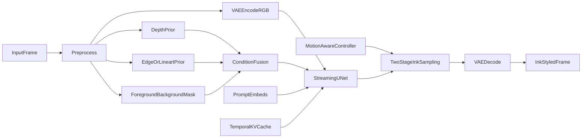

# *实时水墨风格渲染改进方案*

## *目标与结论*

*这份文档要回答的不是“这个项目能不能接一个水墨 LoRA”，而是更本质的问题：*

- *现有* `Live2Diff` *架构为什么已经具备实时视频风格化的核心骨架。*
- *为什么它距离“稳定、连续、具有水墨审美的实时渲染”仍然差一层关键能力。*
- *如果要在当前工程基础上继续演进，最值得优先改造的模块是什么。*

*先给结论：*

`Live2Diff` *已经具备实时系统最难的一半能力，即* `few-step + streaming temporal attention + KV-cache + warmup + TensorRT/TinyVAE`*。这套体系已经把“每帧都重新跑一遍完整扩散”的离线范式，改造成了“可流式增量更新”的在线范式。*

*但它当前更像一个“实时连续风格化引擎”，还不是一个“实时水墨渲染引擎”。原因在于，它的结构先验几乎全部押在* `depth prior` *上，而水墨风格真正敏感的是另一组约束：*

- *留白是否稳定*
- *轮廓是否干净*
- *笔触是否连续*
- *墨色层次是否抖动*
- *快速运动时，画面是否会出现墨块闪烁和边界拖影*

*换句话说，当前系统擅长的是“把视频稳定地画成某种风格”，而不是“把视频稳定地画成水墨”。如果继续沿着现有架构演进，最合理的路线不是推翻重做，而是从以下三层逐步增强：*

1. *先做配置与调度层优化，逼近现有系统在水墨场景下的上限。*
2. *再把单一* `depth prior` *扩展成更适合水墨的多条件控制，例如* `depth + edge/lineart + foreground/background mask`*。*
3. *最后再考虑训练型增强，例如递归时序记忆、多帧同步扩散、两阶段水墨采样。*

## *现有 Live2Diff 为什么已经接近实时水墨的底座*

*从项目结构看，*`Live2Diff` *解决的是“实时视频扩散怎么跑起来”的问题，而不是“水墨审美怎么表达”的问题。*

*它的核心链路可以概括成：*

- `wrapper.py` *负责组装模型、LoRA、LCM-LoRA、TinyVAE、TensorRT。*
- `pipeline_stream_animation_depth.py` *负责 warmup、时序窗口、KV-cache、few-step 调度、逐帧流式推理。*
- `pipeline_animatediff_depth.py` *负责搭建底层动画扩散管线。*
- `unet_depth_streaming.py` *负责把结构条件注入到流式 UNet。*
- `configs/*.yaml` *负责风格底模、LoRA、prompt 模板与推理参数。*

*这条链路已经具备四个对实时水墨非常重要的基础条件。*

### *1. 它已经不是逐帧独立扩散，而是流式扩散*

`pipeline_stream_animation_depth.py` *里固定了* `WARMUP_FRAMES = 8` *和* `WINDOW_SIZE = 16`*，说明它不是把视频当成离散图像列表，而是把前 8 帧作为时序上下文，再对后续帧逐步滚动更新。这一点非常关键，因为水墨风格最怕“前后帧各画各的”。*

### *2. 它已经有历史状态复用能力*

*当前系统不是每来一帧都从零计算时序关系，而是使用 temporal attention 的* `KV-cache` *和位置索引滚动更新。对实时水墨来说，这意味着历史轮廓、主体运动趋势和整体笔势都有机会被复用。*

### *3. 它已经采用了少步采样体系*

*当前实现使用的是* `LCMScheduler + LCM-LoRA` *路线，本质上是在把原始 SD1.5 变成 few-step 可用系统。对于实时渲染来说，这一步不是优化项，而是前提。如果没有少步采样，就谈不上实时。*

### *4. 它已经有工程级加速壳*

`wrapper.py` *里支持 TinyVAE、TensorRT、xformers 和批量去噪。也就是说，系统已经具备“把想法部署成可跑服务”的工程框架，这会大幅降低后续试验成本。*

*因此，`*Live2Diff` *最有价值的地方不是它已经会画水墨，而是它已经把“实时视频扩散平台”搭好了。*

## *为什么现有系统还不够适合实时水墨*

### *1. 当前结构条件过于依赖 depth，不足以表达水墨审美*

*现在的主链路里，输入图像会先做深度估计，再把深度图送入 VAE 编码成* `depth_latent`*，最后通过* `unet_depth_streaming.py` *中的* `flow_conv_in` *映射后与主特征直接相加。*

*这条设计对“保持几何结构”很有效，但水墨并不等于几何结构稳定。水墨更依赖：*

- *轮廓线和边界组织*
- *前景和背景的虚实关系*
- *大面积留白*
- *墨色轻重和纸面质感*

*深度图对这些特征表达得都不充分。它擅长告诉模型“哪里近、哪里远”，却不擅长告诉模型“哪里应该留白”“哪条边应该干净”“哪里应该保留飞白毛边”。*

### *2. 当前没有水墨专用的时序约束*

*系统现在的时序一致性主要来自：*

- *streaming attention*
- *warmup*
- *KV-cache*
- *批量去噪时的 latent buffer*

*这能很好抑制普通风格化中的大范围闪烁，但对水墨视频仍然不够，因为水墨对低频闪烁和局部边缘抖动极其敏感。尤其是黑墨线条配大面积白底时，哪怕只有很轻微的亮度和边缘漂移，人眼也会立刻察觉。*

### *3. 当前相似帧过滤对水墨未必友好*

`image_filter.py` *使用的是基于余弦相似度的静态跳帧策略。这个设计对一般实时风格化有帮助，因为相似帧跳过可以直接省算力。*

*但水墨场景有两个特殊问题：*

- *画面低频区域大，帧间相似度天然更高，更容易过度跳帧。*
- *水墨“轻微流动”的审美并不等于“完全静止”，跳帧过猛会让画面出现“墨不动”的僵硬感。*

*所以它应该升级为运动感知或风格感知的一致性控制器，而不是一把固定阈值。*

### *4. 当前 depth 归一化方式本身可能引入时序不稳定*

`encode_depth()` *里对深度图使用了当前输入的* `min/max` *归一化。这个实现虽然简单，但对时序连续性并不理想。*

*潜在问题有两个：*

- *warmup 阶段是多帧一起做归一化，在线阶段通常是一帧一帧归一化，统计口径不一致。*
- *每帧单独做* `min/max` *容易导致相邻帧深度对比度轻微跳动，进而把这种抖动传给* `depth_latent`*。*

*对于一般写实风格，这种漂移可能不明显；但对于黑白对比强、边缘鲜明的水墨风格，它会被显著放大。*

### *5. 当前采样调度还不具备运动自适应能力*

*现有 few-step 逻辑主要由* `t_index_list`*、*`strength`*、*`do_add_noise`*、*`use_denoising_batch` *这些静态参数控制。它没有根据输入视频的运动强度动态调整采样保守度。*

*这会带来一个典型问题：*

- *慢动作或静态画面时，系统可以承受更强的风格细化。*
- *快动作时，如果仍然使用同样激进的 stylization 强度，就更容易出现拖影、笔触撕裂和墨块漂移。*

*因此，实时水墨不能只做固定配置，而需要运动感知的推理策略。*

## *实时水墨渲染真正需要什么*

*如果把“实时水墨”当成一个工程目标，而不是一句风格描述，它至少包含五个维度。*

### *1. 风格表达*

*要能稳定表现出这些视觉特征：*

- *毛笔轮廓*
- *墨色浓淡层次*
- *干湿笔触*
- *飞白与纸感*
- *留白组织*

*这类特征不是单靠 prompt 就能稳定出现的，尤其是在视频里。*

### *2. 结构稳定*

*主体轮廓、脸部、手部、衣物边缘、建筑外轮廓不能频繁漂移，否则水墨会立刻从“有笔意”变成“脏和抖”。*

### *3. 时序一致*

*前后帧不能出现这些现象：*

- *局部墨线闪烁*
- *背景白底忽灰忽白*
- *轮廓忽粗忽细*
- *墨块区域位置来回跳*

### *4. 实时性能*

*除了平均 FPS，还要同时关注：*

- *首帧延迟*
- *长时间连续运行是否漂移*
- *快运动场景下是否还能稳住画面*
- *在 512 分辨率下是否仍然保持接近实时*

### *5. 审美可控*

*水墨不是单一目标，至少有几种不同的风格区间：*

- *工笔偏清晰*
- *写意偏抽象*
- *水墨淡彩*
- *纯黑白写意*

*因此系统最好不是只有一个固定模式，而是能让“风格强度”和“时序稳定度”共同可调。*

## *论文与外部方法给出的关键启发*

*下面不是单纯列论文，而是只提那些真正能映射到当前项目里的机制。*

### *1. Streaming Video Diffusion, 2024*

*关键词：*

- *online video editing*
- *compact spatial-aware temporal recurrence*
- *long-term temporal modeling*
- *512 分辨率下约 15.2 FPS*
- *inference 端结合 LCM sampler 与 LCM LoRA*

*这篇工作的意义不在于它和* `Live2Diff` *完全同构，而在于它证明了一件事：在线视频编辑要想兼顾时序一致和实时性，必须有比普通 cross-frame attention 更紧凑的时序记忆表示。*

*对本项目的启发：*

- *当前* `KV-cache` *是“缓存复用”，但还不是“可学习时序记忆”。*
- *如果后续要进一步提高长时间稳定性，可以考虑把现有 streaming attention 升级为更紧凑、可学习的递归记忆单元。*

### *2. Synchronized Multi-Frame Diffusion, 2023/2025*

*关键词：*

- *多帧同步扩散*
- *光流建立跨帧对应关系*
- *在去噪早期做结构和颜色共识*
- *在去噪后期避免细节被过度平滑*

*这篇工作给出的最有价值结论是：视频 stylization 的一致性不能只靠“上一帧影响下一帧”，还可以在多个帧之间建立同步共识，尤其是在去噪早期先统一整体布局和颜色分布，再在后期保留局部细节。*

*对本项目的启发：*

- *当前* `Live2Diff` *的增量式 cache 更像单向历史复用。*
- *如果要减少水墨纹理闪烁，可以考虑在早期 timestep 引入轻量的跨帧共识机制，而不是全程只依赖缓存滚动。*
- *这尤其适合解决背景白底、大片墨面和局部笔触忽明忽暗的问题。*

### *3. Instance-Aware Coherent Video Style Transfer for Chinese Ink Wash Painting, IJCAI 2021*

*关键词：*

- *multi-frame fusion*
- *instance-aware style transfer*
- *white space constraint*
- *contour contrast constraint*
- *adaptive scale selection*

*这篇工作虽然不是扩散模型，但它对“水墨视频到底难在哪”说得非常到位：真正困难的不是把画风变黑白，而是同时处理留白、轮廓和主体尺度变化。*

*对本项目的启发非常直接：*

- *背景不能只是“被风格化变浅”，而应该被显式控制为留白区域。*
- *轮廓不能只依赖 depth，而需要 edge 或 instance-aware 边界帮助稳定。*
- *不同主体的笔触尺度不能完全统一，应该允许多尺度控制。*

*如果只从水墨审美角度选一篇最值得借鉴的论文，这篇是最贴近当前目标的。*

### *4. ChipDiff, 2024*

*关键词：*

- *Chinese Ink Painting Style Transfer*
- *staged loss gradient-guided diffusion*
- *先结构后晕染*
- *模拟“骨法用笔 -> 水墨渲染”的两阶段过程*

*它最值得借鉴的不是具体损失，而是阶段划分思想。水墨的形成过程天然更适合两阶段表达：*

- *第一阶段先把结构、轮廓、构图稳住。*
- *第二阶段再增加墨韵、纸感、纹理和飞白。*

*对本项目的启发：*

- *当前 few-step 过程里，不同 timestep 的职责还没有显式分工。*
- *后续可以让早期步更偏结构稳定，后期步更偏风格细化。*
- *这比简单提高 LoRA 权重更符合水墨生成逻辑。*

### *5. StreamDiffusionV2, 2025*

*关键词：*

- *rolling KV cache*
- *sink token*
- *motion-aware noise controller*
- *stream VAE*
- *面向实时服务的调度设计*

*这篇工作偏系统工程，但对实时场景非常有参考价值，尤其是两个思路：*

- *运动感知噪声控制*
- *更偏服务端思维的时延和吞吐联合调度*

*对本项目的启发：*

- *当前* `t_index_list` *和跳帧阈值都是静态的，缺少 motion-aware 机制。*
- *水墨风格在快运动时非常脆弱，因此运动感知调度会比单纯提升算力更有效。*

### *6. Go-with-the-Flow, 2025*

*关键词：*

- *基于光流的 warped noise*
- *在保持空间高斯性质前提下引入时间相关噪声*
- *不强依赖模型结构改动*

*它说明了一个重要方向：时序一致性不一定都要靠更复杂的主干网络，也可以从噪声构造层面增强时间相关性。*

*对本项目的启发：*

- *当前* `do_add_noise` *仍然是普通随机噪声逻辑。*
- *对水墨这类极度敏感的风格，可以考虑用光流或估计运动场来生成更连续的噪声，以减少细碎抖动。*

### *7. Interactive Control over Temporal Consistency while Stylizing Video Streams, 2023*

*这篇工作的关键观点很重要：艺术风格视频并不是“一致性越强越好”。如果一致性过强，风格会死；如果一致性太弱，画面会闪。*

*对本项目的启发：*

- *实时水墨不应该只有单一模式。*
- *更合理的是提供一组可调模式，例如：*
  - *稳定优先*
  - *平衡模式*
  - *笔触表现优先*

## *对当前项目最值得做的改造路线*

*下面的路线按“投入和收益比”排序，而不是按理论最强排序。*

## *A. 短期方案：不重训或少改代码，快速逼近实时水墨上限*

*这部分最适合先做，因为它不推翻现有架构。*

### *A1. 重新设计水墨配置，而不是只沿用现有* `moxin.yaml`

*项目已经有* `moxin.yaml`*，说明它已经能接入中国风/水墨相关 DreamBooth 与 LoRA。但这还只是“资源入口”，不是“完整策略”。*

*建议把水墨配置至少拆成三档：*

- `ink_fast.yaml`
- `ink_balanced.yaml`
- `ink_quality.yaml`

*每档分别调整：*

- `prompt_template`
- *negative prompt*
- `t_index_list`
- `strength`
- *LoRA 权重*
- *是否启用* `do_add_noise`
- *相似帧过滤策略*

*这样可以先摸清当前架构的真实上限。*

### *A2. 给采样调度加上运动感知逻辑*

*现有系统对所有帧使用同一套* `t_index_list` *和相同去噪强度，这对普通风格化还勉强可用，但对水墨不够。*

*建议在* `pipeline_stream_animation_depth.py` *中加入轻量运动强度估计，例如基于连续输入帧的：*

- *MSE*
- *深度变化量*
- *边缘变化量*

*再根据运动强度切换三种模式：*

- *低运动：允许更强风格化，后期步更重。*
- *中运动：保持默认平衡。*
- *高运动：减少随机性，提高结构保持权重，降低跳帧概率。*

*这一步可以直接借鉴* `StreamDiffusionV2` *的 motion-aware noise controller 思路，但无需完全照搬其系统设计。*

### *A3. 修正 depth 归一化的时序稳定性*

*这是一个很值得优先处理、但容易被忽略的细节。*

*当前* `encode_depth()` *的* `min/max` *归一化建议升级为更稳定的方式，例如：*

- *每帧分位数裁剪后归一化*
- *基于滑动窗口的 EMA 统计量归一化*
- *warmup 后固定统计区间，再小幅自适应更新*

*这能减少* `depth_latent` *本身的帧间抖动，对水墨边界稳定性会很有帮助。*

### *A4. 改造相似帧过滤器*

*当前的* `SimilarImageFilter` *更像吞吐优化器，不像风格控制器。*

*建议至少改成：*

- *快运动时基本不跳帧*
- *慢运动时才允许小幅跳帧*
- *如果轮廓变化明显但像素相似，仍然不跳帧*
- *对水墨模式降低默认阈值敏感性，避免大面积白底导致误判*

*更进一步，可以把它从“是否跳过整帧”改成“是否降低本帧 stylization 强度”，这样会比直接复用上一帧更自然。*

### *A5. 增加水墨专用 prompt 与 negative prompt 规范*

*水墨场景下，prompt 不应只强调* `chinese ink painting`*，还应该显式强调：*

- *negative space*
- *monochrome or limited palette*
- *brush stroke*
- *wash ink*
- *rice paper texture*
- *soft bleed*

*同时 negative prompt 要尽量压制：*

- *glossy*
- *photorealistic*
- *highly saturated*
- *dense background texture*
- *sharp digital edges*

*否则即使有水墨 LoRA，模型仍容易回到 SD1.5 原生的照片感或 CG 感。*

## *B. 中期方案：在当前链路上新增轻量条件分支*

*这是最值得投入的方向，因为它最有机会让系统从“会实时风格化”升级为“更像实时水墨系统”。*

### *B1. 从单一 depth prior 升级为* `depth + edge/lineart`

*当前* `unet_depth_streaming.py` *只有一条结构条件注入路径，这对水墨不够。*

*更合理的方案是增加一条轻量边缘或线稿条件：*

- *depth 负责大结构和层次*
- *edge/lineart 负责轮廓与笔锋边界*

*这样可以更好地稳住：*

- *脸部边界*
- *手部轮廓*
- *头发边缘*
- *建筑和物体轮廓线*

*这一步很适合在当前* `depth_sample -> flow_conv_in -> sample + cond` *的框架上扩展成多条件映射。*

### *B2. 新增前景/背景分离或实例感知遮罩*

*水墨视频最难稳定的部分之一，不是主体，而是背景留白。*

*如果背景没有显式约束，模型往往会：*

- *忽然补出一些多余纹理*
- *白底忽亮忽灰*
- *背景局部冒出不必要的墨块*

*因此建议增加一个轻量遮罩条件：*

- *前景区域允许更多纹理和笔触*
- *背景区域更偏留白和稀疏纹理*

*如果要做得更细，可以再引入实例级别前景区分，让人物、动物、建筑等主体采用不同的笔触尺度。*

### *B3. 增加“结构阶段”和“墨韵阶段”的步内职责分工*

*当前 few-step 只是在少量 timestep 上做近似更新，但每一步没有被明确赋予不同任务。*

*可以考虑把它改成水墨友好的两阶段控制：*

- *前半段偏结构：边缘、遮罩、depth 约束更强，风格 LoRA 更保守。*
- *后半段偏墨韵：允许更强的纹理与笔触变化，但保持轮廓不漂。*

*这一步不一定需要重训，先从推理时的条件权重调度就能试验。*

### *B4. 引入轻量光流或边缘传播机制*

*如果只依赖 cache，局部笔触闪烁问题不一定能解决。*

*可以考虑在中期方案里引入轻量光流模块，用于：*

- *传播上一帧边缘或线稿*
- *辅助本帧轮廓约束*
- *构造时序一致的 noise 或 condition map*

*这一步不一定要做到 SMFD 那种多帧同步扩散的强度，但可以先做更便宜的单步增强版。*

## *C. 长期方案：需要训练或较大结构改造*

*如果目标不是“能看”，而是“高质量、稳定、可展示的实时水墨视频”，长期仍然需要训练型增强。*

### *C1. 把 cache 复用升级为可学习递归记忆*

*这是借鉴* `Streaming Video Diffusion` *的方向。*

*当前* `Live2Diff` *已经有时序缓存，但还不是专门为长期在线视频编辑训练出的时序记忆模块。后续可以考虑：*

- *训练轻量 temporal adapter*
- *把历史信息压缩成更紧凑的递归状态*
- *降低长时间滚动后风格漂移*

### *C2. 引入轻量同步多帧共识模块*

*这是借鉴* `Synchronized Multi-Frame Diffusion` *的方向。*

*目标不是把整个系统改成离线多帧联合扩散，而是在少量关键 timestep 做有限度的跨帧一致性融合，让系统在这些地方先统一：*

- *大块白底分布*
- *大面墨色走向*
- *重要轮廓位置*

*这样能有效缓解水墨视频最明显的闪烁问题。*

### *C3. 训练水墨专用 temporal LoRA 或 adapter*

*当前项目虽然可以挂风格 LoRA，但这些 LoRA 通常是面向图像风格的，不一定知道如何在视频中稳定保持笔触。*

*更理想的方向是：*

- *用水墨视频或伪视频数据训练 temporal adapter*
- *让它专门学习笔触连续性、留白稳定性和墨色时序变化*

*这比单纯再堆一个图像 LoRA 更有针对性。*

### *C4. 两阶段结构化训练*

*这是借鉴* `ChipDiff` *的方向。*

*可以把训练或蒸馏目标拆成：*

- *结构稳定分支*
- *墨韵渲染分支*

*前者偏轮廓和构图，后者偏纹理和墨色层次。这样更符合水墨生成机制，也更适合实时模式下做职责分工。*

## *建议改动与代码落点映射*

*下表把最值得做的方向映射到当前代码结构。*

| *模块*                                                           | *当前职责*               | *建议改造*                                                     | *优先级* | *预期收益*          |
| -------------------------------------------------------------- | -------------------- | ---------------------------------------------------------- | ----- | --------------- |
| `Live2Diff/configs/moxin.yaml` *及新增水墨配置*                       | *风格资源入口*             | *拆分成快/平衡/质量三档水墨配置，系统化管理 prompt、LoRA、few-step 参数*           | *高*   | *快速摸清当前架构上限*    |
| `live2diff/pipeline_stream_animation_depth.py`                 | *核心流式推理、few-step 调度* | *增加运动感知调度，重构* `encode_depth()` *归一化策略，给不同 timestep 分配不同职责* | *高*   | *同时改善稳定性和风格表现*  |
| `live2diff/image_filter.py`                                    | *相似帧跳帧*              | *改成运动感知一致性控制器，避免水墨场景过度跳帧*                                  | *高*   | *减少“墨不动”和局部卡顿*  |
| `live2diff/animatediff/models/unet_depth_streaming.py`         | *注入结构条件*             | *把单一* `depth_sample` *扩为多条件映射，支持 edge/lineart/mask*        | *高*   | *提高轮廓稳定和留白控制能力* |
| `live2diff/utils/wrapper.py`                                   | *组装模型与加速*            | *增加水墨专用模式切换和条件分支装配逻辑，评估与 TensorRT 的兼容边界*                   | *中*   | *让新增能力可部署*      |
| `live2diff/animatediff/pipeline/pipeline_animatediff_depth.py` | *底层管线构建*             | *管理新增条件提取器与资源加载*                                           | *中*   | *保持架构整洁*        |
| `demo/vid2vid.py`                                              | *实时演示入口*             | *暴露风格强度、稳定度、运动自适应模式等参数*                                    | *中*   | *方便交互测试和调参*     |
| *TensorRT 相关模块*                                                | *推理加速*               | *在结构稳定后再评估重新编译新条件分支的引擎*                                    | *低*   | *防止优化早于设计*      |

## *建议中的升级链路*

*这张图想表达的核心只有两点：*

- *结构条件不能再只有* `depth` *一条。*
- *采样过程不能再是完全静态的 few-step，而要对运动和风格阶段做区分。*

## *推荐的实施顺序*

*如果真的要动手做，而不是只停留在分析层，最合理的顺序是下面这样。*

### *阶段 1：验证当前系统的水墨上限*

*目标：*

- *不增加新模型*
- *只改配置和推理参数*
- *测试当前系统在水墨视频下的最优表现*

*重点做：*

- *新建多档水墨配置*
- *调整* `t_index_list` *和* `strength`
- *改良 prompt 与 negative prompt*
- *降低或关闭激进跳帧*
- *记录不同运动场景下的质量和 FPS*

### *阶段 2：补强水墨专用条件*

*目标：*

- *让系统真正具备“水墨友好”的结构控制能力*

*重点做：*

- *加 edge/lineart 条件*
- *加 foreground/background mask*
- *调整条件融合方式*
- *优化 depth 时序归一化*

### *阶段 3：做训练型增强*

*目标：*

- *把“能跑”升级为“稳定且有展示价值”*

*重点做：*

- *temporal adapter 或 temporal LoRA*
- *轻量多帧同步一致性模块*
- *两阶段水墨蒸馏或训练*

## *如何评估改造是否成功*

*如果只看主观观感，很容易误判。建议至少同时记录下面四类指标。*

### *1. 实时指标*

- *首帧延迟*
- *平均 FPS*
- *P95 帧延迟*
- *长时间运行后的稳定性*

### *2. 时序一致性指标*

- *光流 warp 后的重投影误差*
- *相邻帧边缘图的一致性*
- *背景亮度波动幅度*

### *3. 水墨风格指标*

- *留白区域占比与稳定性*
- *墨色分布层次*
- *轮廓清晰度*
- *纸感和笔触表现*

### *4. 主观评价*

*至少对比三种版本：*

- *当前* `moxin` *基线*
- *参数层改良版本*
- *新增条件分支版本*

*然后分别从以下角度打分：*

- *是否像水墨*
- *是否稳定*
- *是否自然*
- *是否在运动时依然可看*

## *最终判断*

*基于当前代码结构和外部研究，最现实的判断是：*

`Ink-Diffusion` *并不需要推翻* `Live2Diff` *另起炉灶。它真正需要的，是在已经很强的“实时扩散底座”上，把结构条件从* `depth-only` *升级为更适合水墨的多条件控制，并把当前静态的 few-step 推理，升级为更有水墨意识的运动感知和阶段感知推理。*

*所以如果要用一句话概括未来路线，最准确的说法应该是：*

*不是“给 Live2Diff 再接一个水墨 LoRA”，而是“把 Live2Diff 从实时视频风格化引擎，改造成实时水墨渲染引擎”。*

*这条路线里，最优先的三个抓手分别是：*

1. *水墨专用配置和推理策略。*
2. `depth + edge/lineart + mask` *的多条件结构控制。*
3. *运动感知的一致性调度，而不是静态跳帧和静态 few-step。*

## *参考资料*

1. *Streaming Video Diffusion: Online Video Editing with Diffusion Models, arXiv 2024*
  *[https://arxiv.org/html/2405.19726v1](https://arxiv.org/html/2405.19726v1)*
2. *Highly Detailed and Temporal Consistent Video Stylization via Synchronized Multi-Frame Diffusion, arXiv 2023*
  *[https://arxiv.org/html/2311.14343](https://arxiv.org/html/2311.14343)*
3. *Instance-Aware Coherent Video Style Transfer for Chinese Ink Wash Painting, IJCAI 2021*
  *[https://ijcai.org/proceedings/2021/0114.pdf](https://ijcai.org/proceedings/2021/0114.pdf)*
4. *ChipDiff: Chinese Ink Painting Style Transfer Via Staged Loss Gradient-Guided Diffusion Model, 2024*
  *[https://papers.ssrn.com/sol3/papers.cfm?abstract_id=5059198](https://papers.ssrn.com/sol3/papers.cfm?abstract_id=5059198)*
5. *StreamDiffusionV2: A Streaming System for Dynamic and Interactive Video Generation, 2025*
  *[https://streamdiffusionv2.github.io/](https://streamdiffusionv2.github.io/)*
6. *Go-with-the-Flow: Motion-Controllable Video Diffusion Models Using Real-Time Warped Noise, CVPR 2025*
  *[https://openaccess.thecvf.com/content/CVPR2025/html/Burgert_Go-with-the-Flow_Motion-Controllable_Video_Diffusion_Models_Using_Real-Time_Warped_Noise_CVPR_2025_paper.html](https://openaccess.thecvf.com/content/CVPR2025/html/Burgert_Go-with-the-Flow_Motion-Controllable_Video_Diffusion_Models_Using_Real-Time_Warped_Noise_CVPR_2025_paper.html)*
7. *Interactive Control over Temporal Consistency while Stylizing Video Streams, 2023*
  *[https://maxreimann.github.io/stream-consistency/](https://maxreimann.github.io/stream-consistency/)*

