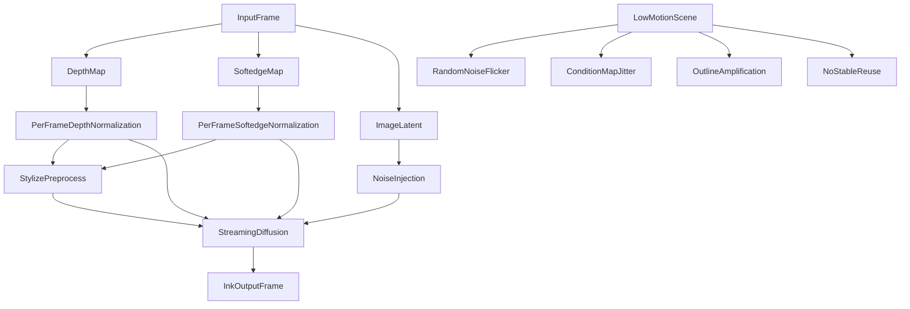

# *实时水墨时序稳定性提升方案*

## *目标*

*本文聚焦一个更具体的问题：*

- *为什么* `Live2Diff` *在输入视频几乎静止、人物动作很小、相机基本不动时，输出的水墨转绘仍然会出现闪烁、轮廓漂移、白底忽灰忽白、墨色厚薄跳动。*
- *在当前工程基础上，怎样优先用低成本办法把时序稳定性显著拉高。*
- *哪些方向适合先做推理侧增强，哪些方向已经接近结构改造或训练型方案。*

*本文不是替代* `[1.0_实时水墨风格渲染改进方案.md](./1.0_实时水墨风格渲染改进方案.md)` *和* `[1.1_实时SoftEdge控制实施说明.md](./1.1_实时SoftEdge控制实施说明.md)`*，而是把“时序稳定性”单独拿出来，做一次更贴近当前代码的落地分析。*

---

## *一、当前系统已经有什么时序能力*

`Live2Diff` *不是逐帧完全独立的图像风格化，它已经具备一套面向流式视频的基础机制：*

- `streaming temporal attention`
- `warmup`
- `KV-cache`
- `latent buffer`
- `few-step`
- `depth prior`
- `softedge early-fusion`

*从代码看，这些能力主要集中在：*

- `Live2Diff/live2diff/pipeline_stream_animation_depth.py`
- `Live2Diff/live2diff/animatediff/models/unet_depth_streaming.py`
- `Live2Diff/live2diff/utils/wrapper.py`
- `Live2Diff/demo/vid2vid.py`

*这意味着当前系统已经解决了“实时视频扩散怎么跑起来”的大问题，但它还没有专门解决“水墨风格在低运动场景下为什么还会抖”的问题。*

*水墨与普通风格化的差别在于：黑线条、白留白、大块墨面、低饱和层次都对细微波动极其敏感。普通风格里不明显的小抖动，在水墨里会被放大成非常明显的闪烁。*

---

## *二、为什么视频几乎静止，水墨仍然不稳定*

*这里的核心判断是：当前不稳定并不是单一 bug，而是多种“小随机性”和“逐帧统计波动”叠加后的结果。*

### *1. 每帧仍在重新注入随机噪声*

*这是当前最直接的原因。*

*在* `pipeline_stream_animation_depth.py` *中：*

- `encode_image()` *会对当前图像 latent 重新采样噪声，再调用* `add_noise()`*。*
- `predict_x0_batch()` *在* `do_add_noise=True` *时，会继续为 buffer 分支注入新的随机噪声。*
- *warmup 阶段同样存在* `torch.randn_like(...)` *的随机项。*

*这意味着即使输入帧几乎不变，扩散过程也没有把当前帧视作“上一帧的稳定延续”，而是在持续给系统引入新的纹理扰动。*

*对写实风格，这类波动可能只表现为轻微质感变化；对水墨风格，它会表现为：*

- *墨纹忽深忽浅*
- *白底轻微起雾*
- *线条边缘毛刺闪烁*
- *同一块墨面纹理不断改写*

*这也是为什么“画面几乎不动，但输出仍然在动”。*

### *2. depth 与 softedge 的归一化是逐帧的*

`build_depth_map()` *中当前是逐帧* `amin/amax` *归一化。*

`_normalize_condition_map()` *中 softedge 也是逐帧* `min/max` *归一化。*

*这会带来一个非常典型的问题：即使真实内容没什么变化，只要某一帧的局部亮度、边缘强度、深度估计置信略微不同，本帧的整体缩放就会不同。*

*这种差异会被进一步传给：*

- `depth_latent`
- `softedge_latent`
- *stylize preprocess 的深度与轮廓增强*

*结果就是结构条件本身在抖，而扩散模型只是把这种抖动画得更明显。*

*对于水墨视频，这一类问题尤其致命，因为水墨的很多稳定感来自：*

- *留白边界稳定*
- *轮廓粗细稳定*
- *墨色浓淡分布稳定*

*一旦条件图逐帧尺度漂移，这些量都会一起漂。*

### *6. 当前时序机制更像“历史复用”，还不是“稳定控制”*

`Live2Diff` *当前时序一致性的基础来自缓存与窗口，但它还没有形成针对水墨视频的完整稳定控制闭环。*

*换句话说，它更擅长：*

- *让视频连续跑起来*
- *避免大范围结构完全断裂*

*但它还不擅长：*

- *在几乎静止时压住笔触细闪*
- *在白底区域显式维持留白*
- *在轮廓处控制粗细波动*
- *在长时间流式运行里保持同一种墨韵*

*这也是为什么“有时序机制”不等于“已经足够稳定”。*

---

## *三、这和现有* `1.0`*、*`1.1` *方案是什么关系*

### *1. 当前问题与* `1.0` *文档的对应关系*

`[1.0_实时水墨风格渲染改进方案.md](./1.0_实时水墨风格渲染改进方案.md)` *里，其实已经提前指出了这次问题的大部分方向。*

*最直接相关的是：*

- `A2. 给采样调度加上运动感知逻辑`
- `A3. 修正 depth 归一化的时序稳定性`
- `A4. 改造相似帧过滤器`
- `B1. 从单一 depth prior 升级为 depth + edge/lineart`
- `B4. 引入轻量光流或边缘传播机制`
- `C1. 把 cache 复用升级为可学习递归记忆`
- `C2. 引入轻量同步多帧共识模块`

*这说明当前观察到的不稳定，并不是新的意外问题，而是* `1.0` *已经指出但尚未系统收敛的一组工程症状。*

### *2. 当前问题与* `1.1` *softedge 文档的对应关系*

`[1.1_实时SoftEdge控制实施说明.md](./1.1_实时SoftEdge控制实施说明.md)` *已经把* `softedge` *作为一条轻量条件分支接进了实时主链，这对轮廓稳定是有帮助的。*

*但* `1.1` *也明确给了三个后续方向：*

1. *对* `softedge_scale` *做运动感知调度*
2. *为* `softedge` *做更稳定的时序平滑*
3. *评估是否需要进入* `ControlNet-lite residual` *路线*

*这三点恰好解释了当前现象：*

- *softedge 本身不是错*
- *问题在于它目前仍是逐帧提取、逐帧归一化、逐帧注入*
- *因此它既能增强轮廓，也会放大轮廓抖动*

*所以* `softedge` *现在更像“有效但未稳定化”的增强项，而不是已经完成闭环的时序控制模块。*

### *3. 与* `1.3` *指标文档的关系*

`[1.3_视频时序稳定度指标_调研与实施说明.md](./1.3_视频时序稳定度指标_调研与实施说明.md)` *已经给出当前 Demo 的短时稳定度度量逻辑：*

- *输入光流*
- *双路 warp error*
- `stability_score`
- `delta`
- `delta_avg_5s`

*这套指标非常适合继续保留，因为它满足两个条件：*

- *实时侧可算*
- *与“视频有没有抖”直觉相对一致*

*但它更适合作为短时基线，不足以单独反映水墨视频的全部稳定性。后续建议在此基础上增加更贴近水墨审美的观测项。*

---

## *四、外部资料给出的最有效启发*

*这里只保留那些能真正映射到当前项目里的方向。*

### *1. Streaming Video Diffusion, 2024*

*关键信息：*

- *在线视频编辑*
- *强调长时序建模*
- *引入更紧凑的可学习时序记忆*
- *512 分辨率下达到实时级速度*

*对当前项目的启发不是“立刻照搬一套新架构”，而是：*

- *现有* `KV-cache` *能解决一部分问题，但它更像缓存复用*
- *如果后续目标是长时间稳定输出，仍需要更紧凑、更可学习的时序记忆*

*因此它对应的是长期方向，而不是第一阶段要做的事。*

### *2. Synchronized Multi-Frame Diffusion, 2023/2025*

*这类方法最有价值的一点是：*

- *帧间信息不是只在末端对齐*
- *而是在去噪早期就建立结构和颜色分布共识*

*对水墨视频来说，这非常重要，因为最先应该稳定下来的不是细碎笔触，而是：*

- *大面积白底分布*
- *大块墨面布局*
- *关键轮廓位置*

*它对应当前项目的中长期方向：*

- *不一定改成完整离线多帧联合扩散*
- *但可以在少量关键 timestep 上做轻量多帧共识*

### *3. Go-with-the-Flow, CVPR 2025*

*这类工作说明了一件事：*

- *不一定非要大改主干网络*
- *也可以从噪声构造层面增加跨帧相关性*

*这对当前项目非常重要，因为现在最大的短板之一就是：*

- *静止场景下仍在持续注入新的随机噪声*

*所以第一阶段完全可以优先尝试：*

- *低运动场景关闭新增噪声*
- *相关噪声复用*
- *光流 warping 后的 noise reuse*

*这类办法成本低、见效快、和现有主链兼容性也高。*

### *4. Instance-Aware Coherent Video Style Transfer for Chinese Ink Wash Painting, IJCAI 2021*

*这篇工作虽然不是扩散模型，但它对“水墨视频为什么难稳定”说得非常准。*

*它强调了三类对水墨很关键的约束：*

- *留白*
- *轮廓*
- *主体尺度*

*这和当前项目的现状形成了很清楚的对比：*

- *当前主结构条件主要是* `depth`
- `depth` *只能部分表达结构*
- *但水墨真正敏感的，是白底边界、轮廓笔触和前景背景关系*

*因此它直接支撑了两个中期方向：*

- `depth + edge/lineart`
- *前景/背景 mask 或实例感知约束*

### *5. Interactive Control over Temporal Consistency while Stylizing Video Streams, 2023*

*这类工作提醒了一个很容易忽略的点：*

- *艺术风格视频不是“一致性越强越好”*

*如果强行把一切都钉死，结果往往会变成：*

- *画面不闪了*
- *但笔触也死了*
- *水墨变得机械、发僵*

*因此当前项目不应只做单一“稳定模式”，而应该至少支持三档运行策略：*

- *稳定优先*
- *平衡模式*
- *笔触表现优先*

*这和* `1.0` *里提出的多档水墨配置是完全一致的。*

---

## *五、对当前项目最值得优先做的路线*

*这里按“投入/收益比”排序，而不是按理论上限排序。*

### *A. 第一阶段：不重训，先把低运动场景稳住*

*这是最应该优先落地的一层，因为它最贴近当前问题，也最容易直接见效。*

#### *A2. 把* `do_add_noise` *从静态开关改成运动感知策略*

*这是第一优先级。*

*建议根据当前帧与上一帧的轻量运动强度估计，做三档控制：*

- *低运动：关闭新增噪声，或使用高相关噪声*
- *中运动：保留少量新增噪声*
- *高运动：恢复标准噪声注入，保证风格更新能力*

*轻量运动估计可以先用：*

- `temporal_stability.py` *里已有的光流残差*

*这样做的好处是：在最容易闪的静止场景里，先把主动随机性关掉。*

#### *A3. 为 depth 与 softedge 增加时序稳定归一化*

*建议不要继续完全逐帧* `min/max` *归一化，而是改成更稳的统计方式，例如：*

- *分位数裁剪后归一化*
- *使用滑动窗口统计*
- *使用 EMA 统计*
- *warmup 后锁定初始统计区间，再缓慢更新*

*优先建议：*

1. `depth` *用分位数 + EMA*
2. `softedge` *用幅值裁剪 + EMA*

*原因很简单：*

- `depth` *更偏低频结构*
- `softedge` *更偏高频轮廓*
- *两者不应该共用完全相同的平滑策略*

### *B. 第二阶段：轻量结构增强*

#### *B2. 引入轻量光流传播*

*建议优先考虑两类轻量做法：*

- *warp 上一帧 noise 到当前帧*
- *warp 上一帧 softedge 或轮廓图到当前帧并参与融合*

*这一步的重点不是追求最强控制，而是让上一帧的稳定结构真正参与当前帧生成，而不是每帧重新提取、重新归一化、重新放大。*

#### *B4. 加入前景/背景约束*

*水墨视频的一个难点是背景不是普通背景，它经常应该是主动留白。*

*因此中期非常值得加入：*

- *前景/背景 mask*
- *人物/主体优先区域*
- *白底保护区*

*这样可以直接减少：*

- *背景多余纹理突增*
- *留白忽灰忽白*
- *大面积背景轻微脏化*

### *C. 第三阶段：训练型增强*

*如果目标是长期稳定、可展示、可持续运行的高质量水墨视频，最终仍会走到训练型方案。*

#### *C1. 可学习递归记忆*

*把当前的 cache 复用升级为真正可学习的时序记忆，是长时稳定的关键方向。*

#### *C2. 关键 timestep 多帧同步模块*

*不必每一步都同步，但可以在关键步做跨帧共识，使模型先统一整体结构。*

#### *C3. 水墨专用 temporal adapter / temporal LoRA*

*当前风格 LoRA 更多是图像风格迁移，不是视频笔触保持。*

*后续更有价值的是让模型显式学习：*

- *轮廓连续性*
- *留白稳定性*
- *墨色层次的缓慢变化*

#### *C4. 结构阶段 / 墨韵阶段的训练或蒸馏*

*这与* `ChipDiff` *的启发一致，更符合水墨生成的表达逻辑。*

---

## *六、建议的优先级与代码落点*

### *P0：立刻可做，且最可能快速见效*

- `pipeline_stream_animation_depth.py`
  - *运动感知* `do_add_noise`
  - *depth / softedge 的时序归一化*
  - *softedge / stylize 的运动感知调度*
- `demo/vid2vid.py`
  - *增加稳定模式参数*
  - *默认切到更稳的水墨配置*

### *P1：中期工程增强*

- `pipeline_stream_animation_depth.py`
  - *相关噪声复用*
  - *warped noise / warped softedge*
  - *条件融合策略*
- `unet_depth_streaming.py`
  - *多条件分工更清晰*
- `demo/temporal_stability.py`
  - *增加面向水墨的观测量*

### *P2：更大结构改造*

- *可学习递归记忆*
- *关键步多帧同步*
- *temporal adapter / temporal LoRA*
- *mask / instance-aware 条件体系*

---

## *七、建议的实验矩阵*

*后续实验建议至少拆成三类视频：*

### *1. 静止镜头*

*典型场景：*

- *人脸基本不动*
- *只有轻微眨眼或口型*
- *背景大面积留白或单色墙面*

*这类视频最容易暴露：*

- *噪声闪烁*
- *白底波动*
- *轮廓细抖*

### *2. 缓慢运动镜头*

*典型场景：*

- *缓慢转头*
- *手部轻微摆动*
- *镜头缓慢平移*

*这类视频适合观察：*

- *稳定性与风格表达之间的平衡*
- *相似帧控制是否过强导致“墨不动”*

### *3. 快速运动镜头*

*典型场景：*

- *快速转头*
- *明显手势动作*
- *镜头快速切换或平移*

*这类视频适合验证：*

- *motion-aware 调度是否真的减少拖影*
- *softedge/outline 降强是否有效*
- *相关噪声在快速运动下是否引入错误粘连*

*建议对比组至少包括：*

- `depth-only`
- `depth + softedge`
- `stable profile`
- `stable profile + condition smoothing`
- `stable profile + correlated noise`

---

---

## *十、结论*

*当前* `Live2Diff` *的问题不是“没有时序机制”，而是“已有时序机制之外，还有多处逻辑持续把不稳定重新注入系统”。*

*对静止或低运动水墨视频来说，当前最关键的三件事不是继续堆更多风格，而是：*

1. *先减少无意义的随机噪声注入。*
2. *先稳定 depth / softedge / stylize 的逐帧统计。*
3. *先让低运动场景真的进入更保守的稳定模式。*

*如果这三步做好，当前工程就有很大概率从“能看但会闪”提升到“已经具备展示价值”。在此基础上，再继续做相关噪声、轻量光流传播、多帧共识和可学习记忆，才是更稳妥的路线。*

---

## *附：问题机制关系图*

