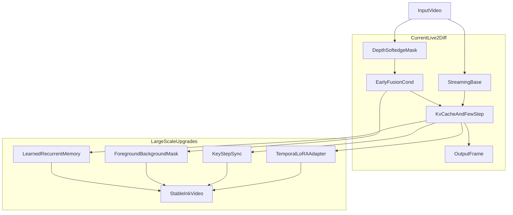

# 大结构改造方向深度调研

## 目标

本文专门讨论四类更大结构改造方向，并把它们映射到当前 `Live2Diff` 工程：

- 可学习递归记忆
- 关键步多帧同步
- temporal adapter / temporal LoRA
- mask / instance-aware 条件体系

重点不是泛泛罗列论文，而是回答四个更实际的问题：

1. 这些方向分别要解决当前系统的哪一类结构性短板。
2. 它们和当前 `Live2Diff` 里的 `KV-cache`、streaming attention、few-step、depth/softedge 条件分支是什么关系。
3. 如果真的要在本项目上做，最合理的插入点、训练目标、代价和风险是什么。
4. 在有限工程资源下，先做哪一版最值。

本文是对 `[1.4_实时水墨时序稳定性提升方案.md](./1.4_实时水墨时序稳定性提升方案.md)` 中“大结构改造”部分的继续展开。

---

## 一、先给结论

如果只说结论，当前项目的大结构改造优先级建议是：

1. **先做 temporal adapter / temporal LoRA 的训练型增强**
  因为它与当前 `Streaming motion module` 最对口，改动面相对可控，最容易先验证“水墨稳定性能不能被训练出来”。
2. **再做关键步多帧同步，而不是一开始就做完整多帧联合扩散**
  因为当前项目本质是实时流式系统，不能轻易退化成离线视频扩散。
3. **mask / instance-aware 条件体系优先做前景/背景 mask，而不是直接做实例级系统**
  因为它最直接解决留白、背景脏化和白底波动问题。
4. **可学习递归记忆属于上限最高、但代价也最大的长期方向**
  它最值得做，但不适合作为第一刀，因为它会直接触碰当前系统最核心的流式缓存结构和 TensorRT 假设。

换句话说：

- 如果目标是先做一版“有明显增益的训练型升级”，优先 `temporal adapter / temporal LoRA`。
- 如果目标是进一步稳定大片白底和墨面布局，优先 `关键步多帧同步`。
- 如果目标是直接解决“哪里该留白、哪里该上墨”，优先 `foreground/background mask`。
- 如果目标是长期跑长视频也不漂，最终还是会走向 `可学习递归记忆`。

---

## 二、当前工程的结构边界

在讨论大改之前，先明确当前 `Live2Diff` 的核心结构边界。

### 1. 时序主干不是空白，而是已有一套流式体系

当前项目已经有：

- `streaming temporal attention`
- `warmup`
- `KV-cache`
- `few-step`
- `latent buffer`

这些能力主要集中在：

- `Live2Diff/live2diff/animatediff/models/stream_motion_module.py`
- `Live2Diff/live2diff/animatediff/models/unet_blocks_streaming.py`
- `Live2Diff/live2diff/animatediff/models/unet_depth_streaming.py`
- `Live2Diff/live2diff/pipeline_stream_animation_depth.py`

其中最关键的是 `StreamTemporalAttention`，它已经不是简单逐帧处理，而是把历史 K/V 缓存在固定窗口里，并通过 `pe_idx`、`update_idx`、`temporal_attention_mask` 管理流式时序窗口。

### 2. 条件体系当前仍以几何和边缘为主

UNet 入口阶段当前是：

- 主图 latent
- `depth_sample`
- `softedge_sample`

并且 `depth` 与 `softedge` 都是走“条件图 -> VAE encode -> conv 映射 -> 与主特征相加”的轻量 early-fusion 路线。

这意味着当前项目天然更适合继续扩展“轻量条件分支”或“在 motion module 上加时序增强”，而不是直接塞进一整套全新主干。

---

## 三、可学习递归记忆

### 1. 它到底想解决什么问题

当前 `KV-cache` 的问题不是没用，而是它更像：

- 固定窗口内的历史证据缓存
- 高效读历史
- 避免重算

但它不是：

- 可学习的长期状态压缩
- 专门为了“长期风格稳定”训练出来的记忆机制

因此当序列变长、场景变化复杂、或者水墨风格需要长期维持某种“笔意”时，单纯的滑动窗 KV 仍然可能出现：

- 长时间风格漂移
- 白底和墨面缓慢偏移
- 轮廓笔触的长期不稳定

可学习递归记忆就是要解决这个问题：  
**把历史不是以原始 K/V 表的形式存下来，而是压成一个网络学出来的、有限维的时序状态。**

### 2. 它和当前 KV-cache 的本质区别

当前 `KV-cache` 的逻辑是：

- 当前帧算出 K/V
- 写入固定窗口
- 后续 query 在窗口里读这些缓存

可学习递归记忆的逻辑则更像：

- 当前帧和上一时刻状态一起输入
- 得到新的时序状态
- 后续帧通过这个状态获得跨窗信息

本质差异可以概括成：

| 维度     | 当前 `KV-cache` | 可学习递归记忆     |
| ------ | ------------- | ----------- |
| 存储内容   | 历史帧的 K/V      | 历史的压缩状态     |
| 更新时间   | 写表/滚动覆盖       | 神经网络递推更新    |
| 历史长度   | 受窗口限制明显       | 理论上可跨更长历史   |
| 是否可学习  | cache 本身不独立受训 | 状态更新方式可专门训练 |
| 长期稳定能力 | 中等            | 上限更高        |

### 3. 常见设计范式

对当前项目最相关的递归记忆范式有四种：

#### A. 短窗 KV + 长程状态并行

这是最适合当前工程的思路。

- 短窗 KV 继续保留局部对齐能力
- 另加一个低维递归状态，负责跨窗长期一致性

优点：

- 不推翻当前流式 attention
- 对现有 `window_size/sink_size` 兼容最好
- 更适合逐步实验

#### B. 记忆 token / memory slot

给每层或每个 stage 增加固定数量的记忆槽位：

- 每帧读取这些槽位
- 再用当前帧特征更新这些槽位

优点是结构清晰，缺点是：

- 仍需要设计 slot 更新策略
- 对推理 I/O 和导出图有额外负担

#### C. 线性递推时序模块

例如：

- SSM
- Mamba 类状态空间结构
- 线性注意力递推

这种方向的长期潜力大，但对当前工程来说改动太深：

- 改 attention 代数
- 改导出图
- 改缓存契约

不适合做第一版。

#### D. 训练期长序列、推理期递归蒸馏

用更强 teacher 学长时序，再蒸馏给在线递归 student。

这个方向很合理，但已经进入完整训练体系设计，复杂度较高。

### 4. 在当前项目里的最合适插入点

最自然的插入点有三层。

#### 插入点 1：`stream_motion_module.py`

这是最优先的点。

原因：

- 当前 `StreamTemporalAttention` 已经掌握 `kv_cache`
- 已经有时序位置编码和更新索引
- 递归状态最适合在时序模块附近生成和消费

最保守的做法不是替掉 KV，而是：

- 保留当前 `kv_cache`
- 并行增加 `recurrent_state`
- 在时序模块输出或输入前后，用这个状态做 scale/shift 或残差注入

#### 插入点 2：`TemporalTransformerBlock`

如果不想碰 attention 内部实现，可以在 block 层做：

- `hidden_states -> pool -> recurrent cell -> state`
- 再把 `state` 投回当前 `hidden_states`

这比直接修改 attention 更保守，也更容易先做 PyTorch 版验证。

#### 插入点 3：`pipeline_stream_animation_depth.py`

这里只负责：

- 状态生命周期管理
- warmup 初始化
- 镜头切换或重置时清空状态

不应该把记忆逻辑的主体放在 pipeline，而应把它放在 UNet 内。

### 5. 训练与损失设计

如果真做递归记忆，建议训练设计至少包括：

- 扩散主损失：`epsilon` / `v-pred` / `x0` 与当前 scheduler 兼容
- 时序一致性损失：光流 warp 一致性
- 长序列开环训练：模拟在线滚动误差积累

数据上最好不是只训短 clip，而是：

- 有连续长视频
- 有镜头内稳定段和运动段
- 有大面积留白场景

否则记忆很容易只学到“短期平滑”，学不到长期稳定。

### 6. 代价与风险

这是这条路线最大的现实问题。

主要风险：

- 会改动 `kv_cache` 相关契约
- 会增加 UNet I/O 状态
- TensorRT 可能需要重新定义输入输出
- 如果状态形状不是固定的，导出会很难看

因此这条路线适合定义成：

- **长期主线**
- **第二阶段以后**
- **PyTorch 原型先行**

### 7. 对当前项目的判断

可学习递归记忆很值得做，但它不应该是当前项目第一版大结构改造。

更准确地说：

- 它是未来上限最高的方向
- 但不是当前最容易产生正收益的方向

---

## 四、关键步多帧同步

### 1. 它想解决什么

当前系统的问题是：

- 有历史读写
- 但没有显式“多帧共识”

也就是说，当前帧只能从历史里读一些信息，但并不会在关键噪声阶段和其他帧一起“先统一整体结构，再各自细化”。

这会带来一个典型问题：

- 背景白底每帧都略有不同
- 大块墨面位置和浓淡略有不同
- 轮廓虽然大体在，但局部笔触方向和厚薄会摆动

关键步多帧同步就是想在少量 timestep 上，把这些跨帧容易漂的低频结构先对齐。

### 2. 为什么不该直接做完整离线多帧联合扩散

因为当前项目是实时流式系统。

完整离线多帧联合扩散意味着：

- 一次看多帧
- 多个 denoising step 上一起前向
- 延迟和显存都会明显放大

这和当前 `Live2Diff` 的价值主张冲突：

- 在线
- 流式
- 低延迟

所以对本项目来说，最合理的不是“照搬完整多帧同步扩散”，而是：

- 只在极少数关键步做轻量同步
- 其余步骤继续沿用当前流式 few-step 路线

### 3. 在当前 few-step 里，哪些步最值得同步

当前项目的 `t_index_list` 决定只取少量关键大步。

在这类系统里，最值得同步的通常不是最后细化步，而是：

- **最早的高噪声步**

原因是：

- 这一阶段决定整体布局
- 白底、墨面、轮廓位置在这里最容易先统一
- 如果等到后期再同步，很多纹理差异已经定型，修正成本更大

对当前 `Live2Diff` 来说，最现实的第一版做法是：

- 只在 `sub_timesteps` 的第一个关键步做同步

### 4. 同步什么信息最现实

从轻到重，当前项目最现实的同步对象依次是：

#### A. 相关噪声或共享噪声轨迹

这是最轻的一版。

优点：

- 成本低
- 不一定要进 UNet 内部
- 对当前“静止场景仍有随机闪烁”很对口

#### B. `x0` 预测或 latent 的轻量融合

例如只对：

- 当前帧
- 少量最近帧

在关键步上做轻量融合、EMA、或光流对齐后的 blend。

这个方向比噪声同步更有效，但也更需要小心：

- 只能同步噪声等级相近的量
- 不能乱混不同 step 的 latent

#### C. 中间特征同步

这是更强的方案，但也更重：

- 会深入 UNet block 或 motion module
- 会增加图复杂度

更适合作为第二版。

### 5. 与当前缓存体系的关系

关键步同步不是用来替代 `KV-cache`，而是用来补它的短板。

两者关系应当是：

- `KV-cache` 保持流式历史读取
- 关键步同步负责在少量关键时刻建立跨帧共识

最好的理解方式是：

- `KV-cache` 解决“历史可见”
- 关键步同步解决“早期统一”

### 6. 工程代价

建议第一版把同步放在：

- PyTorch 路径
- TensorRT 引擎之外

理由：

- TRT 图不适合频繁改 batch 语义
- 同步逻辑经常需要额外张量操作
- 原型验证阶段没有必要先把复杂度推到导出层

### 7. 对当前项目的判断

关键步多帧同步是当前项目**最值得做的结构型增强之一**。

它比可学习递归记忆更容易先跑出效果，因为：

- 不一定需要训练大改
- 可以先做轻量同步版
- 非常贴合当前 few-step 结构

如果只选一个“中期大结构方向”，我会优先推荐它。

---

## 五、temporal adapter / temporal LoRA

### 1. 这是当前项目最适合的第一版训练型增强

原因很简单：

- 当前项目已经有时序模块
- 这个模块就在 UNet 的正确位置
- 只要把时序增强训练好，就很可能直接改善水墨时序稳定

也就是说，当前项目不是“缺 temporal adapter”，而是：

- 已经有时序 adapter 雏形
- 但它不是为了当前水墨目标专门训练出来的

### 2. 它在当前工程里的对应物

当前工程里最接近 temporal adapter 的模块就是：

- `motion module`
- `TemporalTransformer3DModel`
- `StreamTemporalAttention`

这些模块当前承担的已经是：

- 帧间建模
- 流式时序注意力
- 时序缓存读取

因此如果要做 `temporal adapter`，更现实的不是新增一套完全平行的 adapter，而是：

- 继续在现有 motion module 上微调或扩展

### 3. temporal adapter 与 temporal LoRA 的区别

可以简单理解为：

- `temporal adapter`：新增或改造一小块时序模块本体
- `temporal LoRA`：在现有时序模块的线性层上挂低秩增量

两者对当前项目都可行，但优先级不同。

#### 更适合第一版的是：temporal LoRA

因为它有几个明显优势：

- 参数量小
- 对现有主干破坏小
- 更容易单独保存和加载
- 与现有 LoRA 工作流兼容更好

#### 更适合第二版的是：adapter 级改造

因为它的收益上限更高，但同时：

- 改动更大
- 更需要验证训练稳定性
- 更容易和原有 motion module 重叠

### 4. 最适合挂在哪些层

对当前项目，最值得优先挂 LoRA 的位置是：

- `StreamTemporalAttention` 的 `to_q`
- `to_k`
- `to_v`
- `to_out`
- 时序 block 里的 FFN

不建议第一版就直接做：

- 整个 UNet 全部 LoRA
- 空间层和时序层一起大范围改

因为那样很容易把“风格变化”和“时序稳定变化”混在一起，难以归因。

### 5. 最适合什么训练目标

如果目标是“水墨视频稳定”，那么训练重点不应只是单帧好看，而应显式让模型学会：

- 轮廓连续
- 留白稳定
- 墨色变化更平滑

建议训练目标组合：

- 标准扩散主损失
- 光流 warp 一致性
- 轻量特征一致性

如果数据允许，还可以加：

- 白底区域稳定约束
- 轮廓稳定约束

### 6. 为什么这条路最适合当前项目

因为它满足四个条件：

1. 对现有 `Streaming motion module` 最兼容
2. 不必先推翻当前 KV 和 few-step 设计
3. 能单独验证“训练是否真的带来时序增益”
4. 最容易先做出第一版可复用权重

### 7. 对当前项目的判断

如果你现在准备投入一轮训练资源，我最推荐先做的就是：

- **motion module 内部的 temporal LoRA 或局部微调**

这是当前最可能以较小代价换来明显时序收益的路线。

---

## 六、mask / instance-aware 条件体系

### 1. 它想解决什么

mask / instance-aware 的核心不是“再加一个条件图”，而是把下面这些当前系统表达不好的信息显式化：

- 哪里应该留白
- 哪里是前景
- 哪里是背景
- 哪些主体应该用不同笔触尺度

这正是水墨视频里非常关键的一层。

### 2. 为什么 `depth + softedge` 仍不够

`depth` 擅长：

- 几何层次
- 前后远近

`softedge` 擅长：

- 轮廓边界
- 细线和边缘位置

但它们都不擅长：

- 判断背景是否应该完全留白
- 控制背景不要长出多余墨纹
- 区分多个主体的实例关系

这也是为什么即便已经有 `depth + softedge`，背景仍可能出现：

- 白底忽灰忽白
- 多余纹理冒出来
- 留白边界不稳

### 3. 常见实现形态

从轻到重，大致有四档：

#### A. 前景/背景 mask

只区分：

- 前景
- 背景

这是最建议先做的一版，因为它直接打在当前最痛的点上：留白和背景稳定。

#### B. 多类语义 mask

例如：

- 人物
- 天空
- 建筑
- 地面

这比 FG/BG 更细，但实现复杂度也会增加。

#### C. 实例级 mask + tracking

这时候系统开始能区分：

- 人物 A
- 人物 B
- 前景树
- 背景山石

这样可以进一步做：

- 不同主体不同笔触尺度
- 更稳的多主体关系

但成本会显著上升。

#### D. 完整 ControlNet/残差控制支路

这是控制能力最强，但对当前项目最重的一档。

对当前工程来说，第一版不推荐直接走这条路。

### 4. 在当前项目里的最现实接法

最现实的接法不是推翻现有条件链，而是继续复用当前路径：

- `mask map`
- `_encode_condition_map()`
- 第三条 `cond mapping` 分支
- 在 UNet 入口阶段与主特征相加

也就是说，让 `mask` 和 `depth/softedge` 一样走：

- 预处理提取
- VAE encode
- conv 映射
- 注入主特征

这是当前项目最顺的改法。

### 5. 另一种更轻的做法

如果想先快速试验价值，也可以不先接入 UNet，而是先用 mask 改 `stylize preprocess`：

- 背景更偏留白
- 前景允许更多墨色与轮廓

这版实现很快，但上限较低，更适合做 PoC。

### 6. 为什么前景/背景 mask 优先于实例级

因为当前最明显的水墨问题不是“多实例关系不准”，而是：

- 留白不稳
- 背景脏化
- 大片白底不干净

FG/BG mask 正好直击这一问题。

相比之下，实例级体系虽然更强，但也会引入更多工程问题：

- 分割抖动
- 实例 ID 维护
- 遮挡处理
- 时序追踪不稳

因此如果只能做一版，我强烈建议先做：

- **foreground/background mask**

### 7. 对当前项目的判断

这条路线非常值得做，而且和水墨目标高度一致。

但它更适合作为：

- **中期结构增强**
- 或与 `关键步同步` 并行推进

而不是先于 `temporal LoRA` 的第一版训练型增强。

---

## 七、四条路线的关系

这四条路线不是互斥的，它们更像四个层级。

### 1. temporal LoRA / adapter

负责：

- 让模型学会“怎样稳定地随时间变化”

### 2. 关键步多帧同步

负责：

- 在高噪声关键阶段让多帧先统一整体结构

### 3. mask / instance-aware

负责：

- 把“哪里该留白、哪里该上墨”显式告诉模型

### 4. 可学习递归记忆

负责：

- 在长时序上保留更稳的全局风格和状态

它们的关系可以概括成：

- `temporal LoRA` 解决“当前时序模块没学好”
- `关键步同步` 解决“单向历史读取不等于多帧共识”
- `mask` 解决“几何和边缘不等于区域语义”
- `递归记忆` 解决“短窗 cache 不等于长期稳定”

---

## 八、推荐路线图

### 路线 1：最现实的第一阶段

如果你现在只能投入一轮研发，建议按下面顺序：

1. `temporal LoRA`
2. `关键步轻量同步`
3. `foreground/background mask`

原因：

- 这三者都能相对平滑地接入当前项目
- 都不必第一天就推翻 `KV-cache + TRT` 主干
- 都有较高概率带来明显收益

### 路线 2：中长期升级

在第一阶段确认方向有效后，再继续：

1. `mask` 从 FG/BG 升到更细语义
2. `关键步同步` 从 latent 融合升级到特征级同步
3. `temporal adapter` 从 LoRA 升到更强模块改造
4. `可学习递归记忆` 作为长期主线单独推进

### 路线 3：不建议的一上来就做的方案

不建议一开始就做：

- 完整离线多帧联合扩散
- 全 UNet 大范围 LoRA
- 一步到位的实例级体系
- 直接替换当前 KV 结构为新递归主干

因为这些方案都很容易：

- 改动巨大
- 难以归因
- 伤害实时性
- 牵动 TensorRT 适配

---

## 九、对当前项目的明确建议

如果必须给出一句最明确的建议，我的判断是：

### 最应该先做的训练型增强

- `motion module` 内部的 `temporal LoRA`

### 最应该先做的结构型增强

- `第一关键步` 的轻量多帧同步

### 最应该先做的语义条件增强

- `foreground/background mask`

### 最终长期目标

- `短窗 KV + 长程可学习递归记忆` 的混合体系

这个顺序最符合当前 `Live2Diff` 的工程现实：

- 不抛弃已有流式主干
- 不过早推翻 TRT 路径
- 先从最容易验证价值的地方下手
- 给后续长期训练型演进留出接口

---

## 十、结构关系图

---

## 参考方向

- [Streaming Video Diffusion: Online Video Editing with Diffusion Models (2024)](https://arxiv.org/abs/2405.19726)
- [Highly Detailed and Temporal Consistent Video Stylization via Synchronized Multi-Frame Diffusion (2023)](https://arxiv.org/abs/2311.14343)
- [Instance-Aware Coherent Video Style Transfer for Chinese Ink Wash Painting (IJCAI 2021)](https://www.ijcai.org/proceedings/2021/114)
- [Interactive Control over Temporal Consistency while Stylizing Video Streams (2023)](https://export.arxiv.org/pdf/2301.00750v2.pdf)
- [TC-LoRA: Temporally Modulated Conditional LoRA for Adaptive Diffusion Control](https://arxiv.org/abs/2510.09561)

