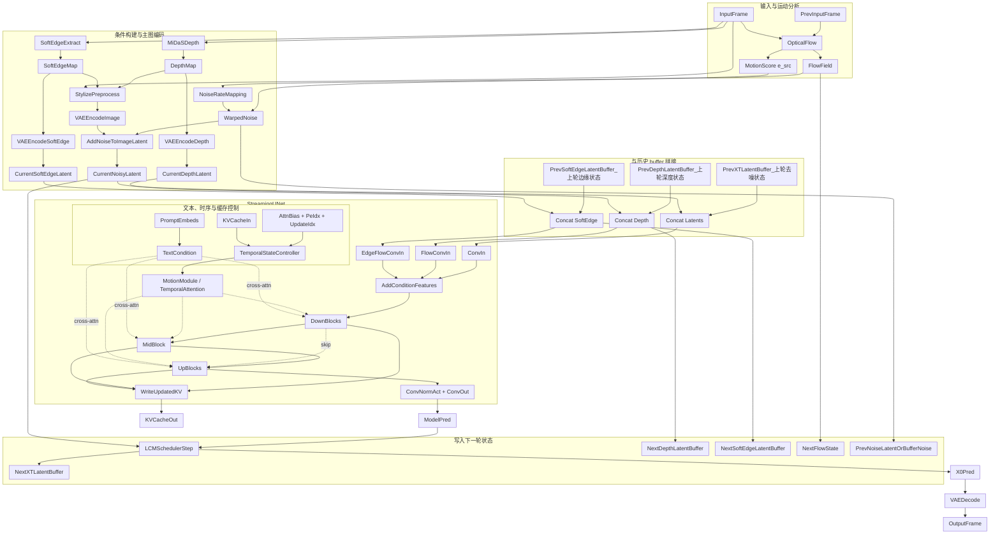

# 中期报告讲义：实时水墨扩散链路与阶段进展

## 开头总览

在进入各条技术线之前，可以先把当前项目理解成一条“输入帧 -> 结构条件提取与风格前处理 -> 运动感知噪声编码 -> Streaming UNet 去噪 -> LCM 更新 -> 输出帧 -> 状态写回”的流式扩散链路。  
与早期版本相比，当前系统已经不再只有 `depth` 一条条件线，而是把 `softedge`、shader 式 stylize 前处理、光流稳定性指标、`noise_rate` 调度和 `warped noise` 复用都接进了主流程。

这张图可以先抓住四个重点：

1. 当前系统不是逐帧独立风格化，而是同时带有 `buffer`、`KV-cache`、光流状态和上一轮噪声状态的流式视频扩散。
2. 条件分支已经从早期的 `depth-only` 扩展成 `depth + softedge + stylize preprocess` 三部分协同，其中 `depth/softedge` 管结构，stylize 前处理管输入外观。
3. 图像 latent 在进入 UNet 前已经接入了 `motion_score -> noise_rate` 的运动感知噪声控制，并可利用 `warped noise` 复用上一帧噪声。
4. 输出帧不是简单解码结果，而是经过 `LCM` 少步调度后的预测结果，同时 latent、条件和噪声状态都会写回，供下一帧继续复用。

---

## 三、基础扩散逻辑：为什么从 Stable Diffusion 1.5 出发

### 3.1 为什么想到用扩散模型

之所以从扩散模型出发，是因为扩散模型在“风格表达能力”和“条件控制能力”上明显强于传统实时滤镜式方法。  
对于水墨风格来说，单纯依靠颜色映射或者卷积型风格迁移很难表达：

- 大面积留白
- 自由笔触感
- 墨色扩散感
- 构图氛围和意境

而扩散模型本质上是在学习一个“从噪声逐步恢复到目标分布”的过程，所以它更容易表达复杂的视觉风格。

### 3.3 在项目中的作用

在本项目中，`Stable Diffusion 1.5` 不是最终系统的全部，但它提供了最关键的“生成骨干”。  
没有这层骨干，就没有：

- prompt 到视觉风格的映射能力
- image-to-image 式的带条件转绘能力
- 与 LoRA、DreamBooth、结构条件模块的兼容生态

### 3.4 当前进展和成果

当前项目已经把 `Stable Diffusion 1.5` 成功作为底座装入 `Live2Diff` 视频流式框架中。  
从 `Live2Diff/demo/demo_cfg.yaml` 可以看到默认底模路径是：

- `pretrained_model_path: ../models/Model/stable-diffusion-v1-5`

从 `0.5_Live2Diff架构分析.md` 和代码实现看，系统已经完成了从底模加载、文本编码、VAE 编解码到 UNet 推理的整条主链打通。这意味着项目已经不是“概念验证”，而是一个真实可运行的扩散视频原型系统。

---

## 四、为什么是 Stable Diffusion + guohua DreamBooth + MoXinV1 LoRA

### 4.1 为什么想到这样分层

如果只用通用 `SD1.5`，模型虽然能生成图像，但它并不天然偏向中国水墨风格。  
如果只靠 prompt 强拉风格，往往会出现两个问题：

1. 风格不稳定，视频里前后帧的画风会飘。
2. 风格表达不够深，容易停留在“泛中国风”或“泛水墨感”。

所以本项目没有把风格问题完全交给文本，而是采用“底层风格分布 + 上层轻量风格增强”的双层设计。

### 4.2 原理是什么

这里的三个组件分工不同：

#### 1. `Stable Diffusion 1.5`

它提供的是基础的图像生成和条件扩散框架，相当于整个系统的通用骨架。

#### 2. `guohua DreamBooth`

DreamBooth 更接近“整模风格底座”的概念。  
它的作用不是轻微修饰，而是把模型整体分布往国画、水墨、留白、写意的方向推过去。可以理解为先把“模型默认会画什么”这件事整体改掉。

#### 3. `MoXinV1 LoRA`

LoRA 是低秩适配器，它比 DreamBooth 更轻、更适合在已有底座上做增量风格微调。  
在项目里，`MoXinV1` 主要负责进一步强化具体的水墨笔触、墨韵纹理和风格细节。

### 4.3 在项目中的作用

这三者在项目里的作用可以总结为：

- `SD1.5`：负责“能生成”
- `guohua DreamBooth`：负责“整体像国画/水墨”
- `MoXinV1 LoRA`：负责“局部更像水墨、笔墨味更足”

这种分层的好处是：

1. 风格表达更稳定，不再只依赖 prompt。
2. DreamBooth 和 LoRA 可以分担不同层级的风格任务。
3. 后续如果要换更偏写意、工笔、淡彩等风格，只需要替换或叠加不同风格资源，而不用重写整条视频链。

### 4.4 当前进展和成果

从 `Live2Diff/demo/demo_cfg.yaml` 的默认配置可见：

- `dreambooth: ../models/Model/guohua.ckpt`
- `lora: ../models/LoRA/MoXinV1.safetensors`
- `lora_alpha: 0.7`

这说明项目已经完成了风格底座与轻量 LoRA 的联合接入，而不是停留在单一模型阶段。  
从当前水墨化效果路线看，这一组合已经能够稳定提供明确的国画/水墨视觉方向，成为后续结构控制和时序优化的基础。

---

## 五、为什么要做 few-step 与 denoising batch

### 5.1 为什么想到这一条线

扩散模型的一个经典问题就是慢。  
如果按传统几十步甚至上百步去噪来做视频，每一帧都完整采样，几乎不可能满足实时要求。

所以项目必须回答一个问题：

**怎样在尽量不丢太多质量的前提下，把每帧推理速度压到足够快。**

这就是 few-step 和 `denoising batch` 出现的原因。

### 5.2 原理是什么

#### 1. few-step

项目中使用的是 `LCM` 路线。  
与普通扩散逐步求解不同，`LCM` 更适合少步推理，也就是用很少的时间步完成原本需要很多步的生成过程。

在 `demo_cfg.yaml` 中可以看到：

- `num_inference_steps: 50`
- `t_index_list: [30, 40]`

这说明系统并不是完整走完全部扩散步，而是选取少量关键步来完成去噪。

#### 2. denoising batch

`denoising batch` 的核心思想不是“多张图一起跑”，而是把：

- 当前帧的去噪状态
- 历史 buffer 中不同时间步的 latent 状态

拼接成一个批次，一次性送进 UNet。  
这样可以减少 Python 循环、重复调度和 kernel launch 开销。

从 `pipeline_stream_animation_depth.py` 的 `predict_x0_batch()` 可以看到，当前帧的 `x_t_latent`、`depth_latent`、`softedge_latent` 会与历史 buffer 拼起来，再统一经过 `unet_step()`。

### 5.3 在项目中的作用

这一条线的作用非常直接：

1. 把视频扩散从“理论可做”推向“工程可跑”。
2. 为实时 demo 提供基础帧率。
3. 让后续加入 `depth`、`softedge`、时序模块之后，系统仍然有可接受的速度。

换句话说，如果没有 few-step 和 `denoising batch`，后面很多结构控制和时序增强思路就算理论上成立，也很难落到实时系统里。

### 5.4 当前进展和成果

当前项目已经完成少步扩散和 `denoising batch` 的主流程打通：

- 已经使用 `LCMScheduler`
- 已经支持少量时间步索引的 few-step 推理
- 已经完成 buffer 级别的批处理去噪

这意味着项目不再是“单帧慢速实验代码”，而是具备了实时原型系统最关键的速度基础。

---

## 六、KV-cache 与流式时序注意力：为什么视频不是逐帧独立生成

### 6.1 为什么想到这一条线

如果直接把图像扩散模型逐帧用于视频，就会产生经典问题：

- 前一帧和后一帧内容不一致
- 轮廓位置飘
- 纹理每帧重写
- 视频看起来像一串风格接近但彼此独立的图片

水墨视频对这种问题尤其敏感，因为水墨的轮廓、留白和墨面变化一旦不连续，闪烁会非常明显。

所以项目必须让模型“看到历史”。

### 6.2 原理是什么

本项目不是用离线多帧联合扩散，而是采用 `Live2Diff` 的 streaming temporal attention。

其关键机制在 `stream_motion_module.py` 中：

1. 当前帧计算 `q/k/v`
2. 把当前帧的 `k/v` 写入 `kv_cache`
3. 从缓存中取出整个窗口的历史 `k/v`
4. 让当前帧的 `q` 与历史窗口的 `k/v` 做注意力

这意味着缓存的不是原始图像，而是**时序特征层面的记忆**。

同时，项目还维护：

- `temporal_attention_mask`
- `pe_idx`
- `update_idx`

这些变量共同保证当前帧只看历史窗口里的有效槽位，从而形成单向、流式、滑动窗口式的时序建模。

### 6.3 在项目中的作用

这一机制的作用可以概括为：

1. 让当前帧生成时显式参考历史帧
2. 避免每一帧都“重新开始想”
3. 在不做完整离线多帧联合扩散的前提下，提供一个成本较低的时序一致性基础

它解决的是视频扩散里最基础的问题：**模型至少要知道“前面发生过什么”。**

### 6.4 当前进展和成果

当前项目已经完成：

- warmup 帧初始化
- `KV-cache` 构建与更新
- 滑动窗口和位置编码索引维护
- 流式时序注意力在 UNet 中的接入

这说明项目已经具备“历史信息复用”的时序基础，不再是简单的逐帧独立图像转绘。  
这也是后续继续提升时序增强的前提。

---

## 七、depth 与 softedge：为什么要做两条结构条件支路

### 7.1 为什么想到这一条线

仅靠风格模型本身，视频中的人物姿态、前后景层次和边缘轮廓很容易漂。  
尤其在 few-step 场景下，去噪步数少，结构更容易不稳。

所以项目需要结构条件帮助模型“知道画面应该长什么样”。

单靠一种结构条件又不够，因为：

- `depth` 擅长表达前后景层次和大结构
- `softedge` 擅长表达轮廓、边缘和描边信息

这两类信息是互补的。

### 7.2 原理是什么

#### 1. depth 是怎么得到的

从 `pipeline_stream_animation_depth.py` 可以看到，系统先把输入帧缩放到 `384x384`，再通过深度检测器得到深度图，之后做逐帧归一化、扩为 3 通道并恢复到原尺寸。

之后，深度图不是直接拿来拼接到 RGB，而是通过 `_encode_condition_map()` 送入 VAE，变成与主图像同尺度的 latent 条件。

#### 2. softedge 是怎么得到的

当前 `softedge` 支持两种来源：

- `classical`：灰度、模糊、Sobel 梯度等传统图像处理
- `pidinet`：更强的边缘检测网络

处理完成后同样会做归一化、三通道化，并编码成 latent。

#### 3. 它们如何进入 UNet

在 `unet_depth_streaming.py` 中，UNet 入口先对主输入做 `conv_in`，然后：

- `depth_sample` 经过 `flow_conv_in`
- `softedge_sample` 经过 `edge_flow_conv_in`

最后分别与主特征相加。

所以它不是完整 `ControlNet` 那种多尺度残差控制，而是更轻量的 early-fusion 注入。

### 7.3 在项目中的作用

这两条支路的作用不同：

#### `depth`

- 稳定主体与背景的层次关系
- 约束大结构和空间布局
- 减少 few-step 场景下的整体结构漂移

#### `softedge`

- 增强人物和场景的轮廓边缘
- 让线条和留白边界更明确
- 为水墨风格中的“笔触边界感”提供更直接的结构线索

### 7.4 当前进展和成果

当前项目已经完成：

- `depth` 条件链路
- `softedge` 条件链路
- `edge_flow_conv_in` 新分支接入
- warmup 与 streaming 路径统一支持
- TensorRT 输入适配
- demo 端调参、调试图与开关接入

这说明项目已经从“只有单一 depth prior”推进到了“depth + softedge 双条件结构控制”的阶段。

---

## 八、为什么要做 shader 式风格前处理与条件解耦

### 8.1 为什么想到这一条线

如果把结构条件和风格表达混在一起，容易出现一个问题：

- 想增强水墨风格时，反过来污染结构条件
- 想稳定结构时，又会限制画面的风格自由度

所以项目把“结构条件”和“主图像风格化输入”分开处理。

### 8.2 原理是什么

这条线对应 `1.2_进Latent前风格化与条件解耦_调研与实施说明.md`。

核心思路是：

1. 深度图和 softedge 图仍然从原始输入生成
2. 主图像可以在进入 VAE 前做 shader 式前处理

这套前处理包括：

- 降饱和
- 深度驱动的雾化/留白
- outline 调制
- 模糊与 smoothstep 控制

本质上是在像素域先做一层可解释、可调参的“水墨化预加工”，再把结果送入主扩散分支。

### 8.3 在项目中的作用

这条线的价值在于：

1. 让主图像更接近水墨输入分布
2. 避免风格化直接污染深度和轮廓条件
3. 为后续加入主体 `mask` 与背景留白控制提供更自然的接口

换句话说，这条线其实已经给后续的 `mask + shader` 路线提前搭好了结构基础。

### 8.4 当前进展和成果

当前项目已经完成：

- `build_stylized_image()` 前处理逻辑
- `stylization_kwargs` 从 YAML 到 demo 的透传
- `stylized` 预览缓存
- 与 `depth/softedge` 的解耦处理

这说明本项目已经不只是“把原图直接送进扩散模型”，而是开始构建符合水墨视觉目标的输入前处理体系。

---

## 九、热力图分析：为什么 softedge 变大反而更不稳

### 9.1 为什么要做这张图

做参数热力图的目的是回答一个很现实的问题：

**如果我把结构条件调强，系统到底是更稳了，还是更抖了？**

直觉上看，边缘条件更强似乎应该更稳定；但项目实验发现事实并不这么简单。

### 9.2 图里量的是什么

根据 `1.6_softedge_depth_参数趋势与稳定性分析报告.md`，热力图横轴是 `softedge_scale`，纵轴是 `depth_scale`，格子里的值对应：

- `temporal_stability_delta_avg_30s`

也就是最近 30 秒内：

`输出稳定度 - 原画稳定度`

它不是绝对稳定度，而是模型相对原视频额外引入了多少抖动。  
数值越大越好，越负说明模型额外引入的抖动越强。

### 9.3 为什么会出现“softedge 越大越差”

从文档和代码逻辑综合来看，主要原因有三层：

#### 1. `softedge` 本质上是高频条件

轮廓、边缘、细线本来就是高频信息。  
高频最容易对亮度变化、小位移、模糊和压缩噪声敏感。

#### 2. 当前 `softedge` 是逐帧提取、逐帧归一化

这会导致相邻帧即使内容接近，边缘强度标尺也可能变化。  
结果不是“稳定轮廓”，而是“每帧重新定义过强度的轮廓图”。

#### 3. `softedge` 在 UNet 入口直接相加

`softedge_scale` 变大时，不只是增强了轮廓，也同时放大了轮廓条件本身的逐帧波动。

### 9.4 在项目中的作用

这张图的作用不是证明 `softedge` 没有价值，而是帮助项目明确：

1. `softedge` 现在更像轮廓增强器
2. 它还不是成熟的时序稳定器
3. 继续单纯增大 `softedge_scale` 不是当前阶段的正确方向

### 9.5 当前进展和成果

通过这张图，项目已经得到一个非常明确的阶段性结论：

- `softedge_scale` 不是越大越好，但是可以提供边缘的稳定
- `depth` 能提供有限补偿，但不足以独自压住边缘细闪
- 结构控制已经从“有没有用”进入到了“什么时候有用、为什么会失效”的分析阶段

这说明项目已经具备了做中期总结和后续路线判断的实验基础。

---

## 十、光流与稳定性指标：为什么项目必须先把“抖”量化出来

### 10.1 为什么想到做这个指标

如果没有稳定性指标，项目只能靠肉眼看视频，说“感觉更稳了一点”或“好像更抖了”。  
这对参数比较、方案分析和论文写作都不够。

所以必须把“视频有没有抖”变成一个可计算、可对比的量。

### 10.2 原理是什么

项目中采用的是 Farneback 稠密光流方案，对应 `demo/temporal_stability.py`。

核心过程是：

1. 对连续两帧输入图像计算稠密光流
2. 用光流把上一帧 warp 到当前帧
3. 比较 warp 后结果与当前帧的差异

这里会得到两个误差：

#### `e_src`

原画的 warp 残差，表示输入视频本身在当前运动估计下有多少不对齐。

#### `e_out`

输出视频的 warp 残差，表示风格化结果在同一运动模型下有多少额外不一致。

之后再通过：

`s = 100 / (1 + 50 * e)`

把误差映射成稳定度分数，并计算：

`delta = s_out - s_src`

这样就可以判断：

- 如果 `delta` 更大，说明输出相对更稳
- 如果 `delta` 更负，说明模型额外引入了更多抖动

### 10.3 在项目中的作用

这套指标在项目中的作用非常大：

1. 它给热力图和参数搜索提供了统一分数来源
2. 它让 A2 噪声控制有了输入信号
3. 它把“主观观察闪烁”转成了可追踪的工程量

也就是说，它不仅是评测工具，还是后续控制策略的一部分。

### 10.4 当前进展和成果

当前项目已经完成：

- 光流计算
- warp 残差计算
- 稳定度映射
- 滑动时间窗统计
- demo 调试信息接入

这意味着项目已经建立了完整的“时序稳定性测量链”，后续很多调参和结论都可以建立在这个基础上。

---

## 十一、A2 运动感知噪声控制：为什么要把噪声率和运动联系起来

### 11.1 为什么想到这一条线

项目在分析低运动场景闪烁时发现一个核心问题：

**即使画面几乎不动，系统仍在持续注入新的随机噪声。**

这会直接导致：

- 墨纹忽深忽浅
- 白底轻微起雾
- 轮廓边缘细抖
- 同一块墨面纹理反复改写

所以一个自然的想法就是：

**既然运动很小，为什么每一帧还要像高运动场景那样注入同样强度的新噪声？**

### 11.2 原理是什么

这一条线对应 `1.8_A2运动感知噪声控制实施报告.md` 和 `pipeline_stream_animation_depth.py` 中的 `set_noise_control()`、`_resolve_noise_rate()`、`_sample_noise_like()`。

其核心逻辑是：

1. 利用光流残差得到 `motion_score`
2. 把 `motion_score` 映射为 `noise_rate`

映射逻辑可以简单理解为：

- 低运动：噪声率更低
- 高运动：噪声率更高

原因很简单：

- 低运动场景更需要稳定，应该减少 fresh noise
- 高运动场景需要保留更新能力，否则容易粘连、拖影

### 11.3 在项目中的作用

A2 的作用不是“让系统完全不加噪声”，而是让噪声注入变得**与运动强度匹配**。

这条线的意义是：

1. 把噪声从静态固定量改成动态控制量
2. 让低运动场景进入更保守的稳定模式
3. 为后续更强的时序增强提供一个成本较低、收益较高的工程改进方向

### 11.4 当前进展和成果

当前项目已经完成：

- `motion_score` 到 `noise_rate` 的连续映射
- 编码噪声与 buffer 噪声的统一控制
- demo 侧相关参数透传
- 调试信息中可直接观察 `noise_rate`、`motion_score`

这说明 A2 已经从“思路”进入到了“工程实现并可实验验证”的阶段。

---

## 十二、warped noise：为什么要沿光流传播上一帧噪声

### 12.1 为什么想到这一条线

仅仅把噪声率降低，虽然能减少抖动，但还不够。  
因为如果每一帧的噪声仍然完全重新采样，那么即使比例变小，纹理仍可能缺乏跨帧相关性。

于是项目进一步提出：

**能不能把上一帧的噪声沿着运动方向带到下一帧，而不是每帧完全重来？**

### 12.2 原理是什么

这就是 `warped noise` 的思路。

具体做法是：

1. 在 RGB 空间估计出当前帧相对上一帧的光流
2. 把光流缩放到 latent 网格尺寸
3. 用 `grid_sample` 把上一帧缓存的噪声 warp 到当前帧
4. 再与一部分 fresh noise 混合

这样得到的噪声不再是完全随机，而是部分继承了前一帧的时空相关性。

### 12.3 在项目中的作用

`warped noise` 的作用是：

1. 让纹理扰动更贴着画面运动走
2. 减少静止或低运动场景中的随机闪烁
3. 在不大改模型主干的前提下，提高跨帧一致性

它本质上是一种**推理侧的时序增强手段**，成本低于重新设计大模型结构。

### 12.4 当前进展和成果

根据当前 A2 实验和用户提供的效果图表，在开启 `depth` 和 `noiseRate` 控制的基础上，`WarpNoise` 从 `0` 增加到 `1` 时，稳定性差值大致从：

- `-4.35`

改善到：

- `-2.11`

中间呈持续改善趋势。  
这说明 `warped noise` 并不是一个“感觉上可能有帮助”的技巧，而是在当前项目里已经有了明确正向趋势的工程结果。

这个结果的意义非常大，因为它证明：

- 通过光流传播上一帧噪声
- 让噪声与运动相干

确实能够减少系统额外引入的时序不稳定。

---

---

## 十四、当前真正的两大主要问题

结合项目实际和当前中期总结口径，现阶段最核心的问题只有两条。

### 14.1 问题一：缺少主体 mask 融合进 shader 模块

为什么这是问题？

因为当前系统虽然有 `depth` 和 `softedge`，但仍缺少一种显式机制去控制：

- 哪些区域必须作为主体保留
- 哪些区域应该弱化纹理
- 哪些区域应该主动保持留白

对水墨视频来说，这不是附加优化，而是非常核心的表达能力。  
没有主体 `mask`，系统就很难稳定地区分前景和背景，也很难把“主体强化、背景简化、留白保护”做得足够明确。

这也是为什么后续必须走 `mask + shader` 路线。

### 14.2 问题二：时序增强还需要更强的建模能力

为什么这是问题？

因为当前 `KV-cache`、warmup 和流式注意力虽然已经有帮助，但它们更接近“历史复用”，还不是更强意义上的“稳定控制”。

项目现在最缺的，是更进一步的：

- 可学习递归记忆
- 关键步多帧同步

前者解决长时序状态表达不够强的问题，后者解决关键去噪阶段缺少多帧共识的问题。

也就是说，项目当前已经有了时序基础，但还没有到“高质量稳定水墨视频”的最终阶段。

---

## 十五、下一步为什么要沿两条主线继续推进

### 15.1 主线一：`mask + shader`

这条线对应的不是简单再加一个条件图，而是让系统显式理解：

- 主体应该怎么保
- 背景应该怎么简
- 留白应该怎么稳

从项目结构上看，当前已经有 `build_stylized_image()` 这样的前处理管线，所以把主体 `mask` 融进去是自然延伸，而不是另起炉灶。

### 15.2 主线二：可学习递归记忆 + 关键步多帧同步

这条线对应的不是简单再调几个阈值，而是增强时序建模能力本身。

其意义在于：

1. 让长时间运行时的主体状态、轮廓与墨韵更稳定
2. 在关键去噪步建立跨帧共识
3. 从根上减少“每帧各想各的”这种视频不一致问题

这条线与 `1.4_实时水墨时序稳定性提升方案.md` 的方向高度一致，也是当前项目中后期最值得投入的研究重点。

---

## 十六、如何把这份讲义用于汇报

如果在中期答辩或组会中使用，可以按下面的顺序讲：

1. 先讲课题目标：不是做滤镜，而是做实时水墨视频扩散系统。
2. 再讲总架构：`SD1.5 + DreamBooth + LoRA + Live2Diff + 条件控制 + 稳定性优化`。
3. 然后分条展开：few-step、`denoising batch`、`KV-cache`、`depth`、`softedge`、热力图、光流指标、A2、`warped noise`。
4. 最后收束到两条主问题：`mask + shader`，以及“可学习递归记忆 + 关键步多帧同步”。

这样讲的好处是：

- 前半部分说明“项目已经做了什么”
- 中间部分说明“每条线为什么合理”
- 后半部分说明“下一步为什么必须这么做”

整个逻辑会比较完整，也更适合中期汇报场景。

---

## 十七、总结

这份中期讲义背后的核心判断是：

当前项目已经不再是单纯复现某个公开视频扩散框架，而是围绕“实时水墨视频生成”这一具体目标，形成了一条逐步清晰的工程路线：

- 在风格层，已经确定了 `Stable Diffusion 1.5 + guohua DreamBooth + MoXinV1 LoRA` 的水墨表达基础。
- 在实时层，已经完成 few-step 与 `denoising batch` 的主链实现。
- 在结构层，已经完成 `depth + softedge` 双条件控制和 shader 式前处理解耦。
- 在时序层，已经建立 `KV-cache`、光流指标、A2 和 `warped noise` 的阶段性增强链。

因此，这个阶段最重要的结论不是“系统已经完全做完”，而是：

**项目已经把问题收敛到了两条最关键的后续主线。**

第一条主线是：  
`mask + shader`，解决主体与留白的显式控制问题。

第二条主线是：  
“可学习递归记忆 + 关键步多帧同步”，解决更强时序稳定问题。

只要后续继续沿这两条主线推进，项目就有机会从当前“已经可运行、可分析、可优化”的中期状态，进一步走向“可展示、可答辩、可形成完整论文结论”的后期状态。