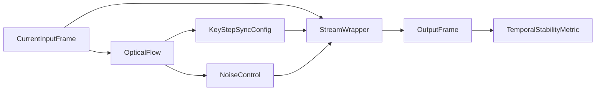
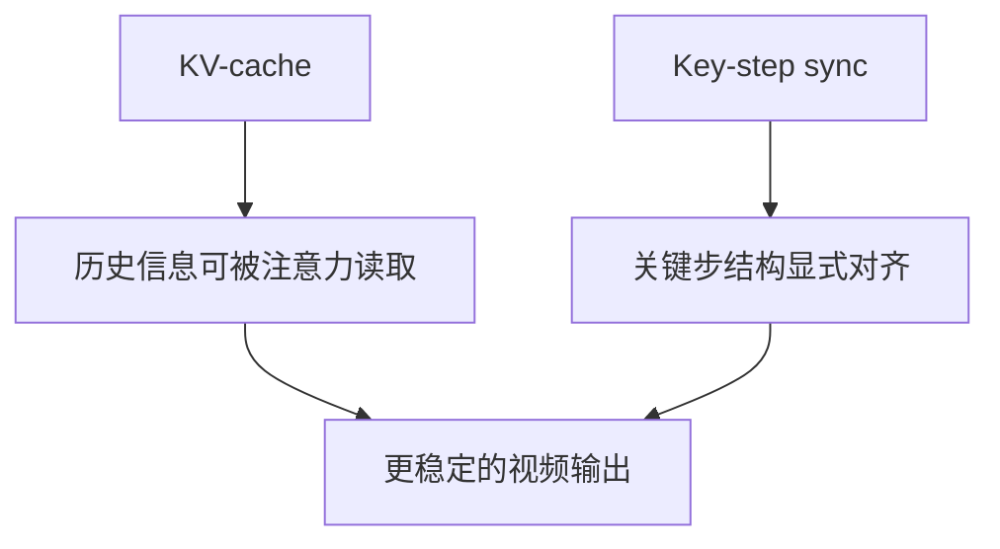
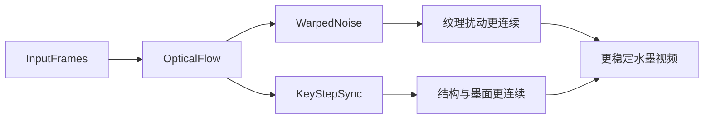
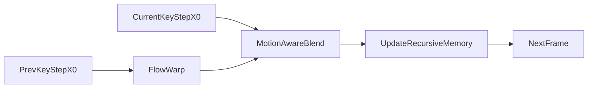

# 路线二关键步同步与递归记忆：无训练落地说明

## 一、这次改动解决什么问题

路线二原本指向的是：

1. 可学习递归记忆
2. 关键步多帧同步

如果严格按“可学习”理解，它通常意味着要训练新的 temporal adapter、temporal LoRA 或递归记忆模块。但当前项目的目标是实时水墨视频扩散 demo，并且用户明确希望优先采用“不训练模型，或接现成模型”的方案。因此这次改动没有引入新训练权重，而是把路线二改造成一个推理侧可落地版本：

- 用上一帧关键去噪结果作为递归记忆
- 用输入帧光流把这份记忆 warp 到当前帧位置
- 只在少数关键 denoising step 上做轻量融合
- 用运动强度自动控制同步权重
- 保留 Farneback 默认光流，并预留 RAFT / SEA-RAFT 后端入口

也就是说，这次实现的是：

> 无训练递归记忆 + 关键步 `x0` 同步。

它不是完整训练型长期记忆模块，但已经把“历史状态、跨帧对齐、关键步共识”这三件事接进了当前 Live2Diff demo 主链。

---

## 二、改动落在哪些文件

### 1. 配置入口

文件：

`Live2Diff/demo/demo_cfg.yaml`

新增配置块：

```yaml
key_step_sync:
  enabled: true
  key_step_index: 0
  strength: 0.18
  low_threshold: 0.015
  high_threshold: 0.06
  flow_backend: "farneback"
```

含义如下：

- `enabled`：是否启用关键步同步。
- `key_step_index`：在哪个 denoising step 做同步。默认 `0`，对应最早的高噪声关键步。
- `strength`：同步最大强度。默认 `0.18`，偏保守，避免拖影。
- `low_threshold` / `high_threshold`：运动强度阈值，用于把运动程度映射成同步权重。
- `flow_backend`：光流后端。当前实际运行仍是 `farneback`，但配置层接受 `raft` / `sea-raft`，方便后续接现成模型。

### 2. Demo 层参数下发

文件：

`Live2Diff/demo/vid2vid.py`

主要职责是：

1. 读取 `key_step_sync` 配置
2. 把同步参数加入 `InputParams`
3. 每帧计算光流
4. 把 `flow`、`motion_score`、同步配置传给后端 wrapper
5. 继续复用已有 `temporal_stability` 指标

当前 demo 的运行顺序可以概括为：



这里的关键点是：光流不再只是用来做 debug 指标，而是同时驱动了两个推理侧稳定机制：

- `warped noise`
- `key-step sync`

### 3. Wrapper 层调试信息

文件：

`Live2Diff/live2diff/utils/wrapper.py`

新增了 `set_key_step_sync()`，并在 `get_debug_info()` 中暴露：

- `sync_enabled`
- `sync_key_step_index`
- `sync_strength`
- `sync_weight`
- `sync_memory_valid`
- `flow_backend`

这些字段会被 demo 前端调试面板读取，方便观察当前帧是否真的用了同步、用了多大权重，以及递归记忆是否已经建立。

### 4. Pipeline 核心实现

文件：

`Live2Diff/live2diff/pipeline_stream_animation_depth.py`

这是本次改动的核心。

新增状态包括：

- `key_step_sync_enabled`
- `key_step_sync_index`
- `key_step_sync_strength`
- `key_step_sync_low_threshold`
- `key_step_sync_high_threshold`
- `key_step_sync_weight`
- `key_step_sync_memory_valid`
- `key_step_sync_flow_backend`
- `prev_sync_x0`

其中最重要的是 `prev_sync_x0`。它保存上一帧在关键步处的 `x0` 预测结果，是这次“递归记忆”的实际载体。

新增核心函数：

```python
def _resolve_key_step_sync_weight(self) -> float:
    ...

def _apply_key_step_sync(self, x_0_pred_batch: torch.Tensor) -> torch.Tensor:
    ...
```

在 `predict_x0_batch()` 中，UNet 得到 `x_0_pred_batch` 后立刻执行：

```python
x_0_pred_batch = self._apply_key_step_sync(x_0_pred_batch)
```

非 denoising batch 路径也在指定 `idx == key_step_sync_index` 时执行同步，保证两种采样路径语义一致。

### 5. 光流后端预留

文件：

`Live2Diff/demo/temporal_stability.py`

新增：

```python
SUPPORTED_FLOW_BACKENDS = {"farneback", "raft", "sea-raft"}

def normalize_flow_backend(backend: str = "farneback") -> str:
    ...
```

当前 Farneback 仍是实际默认实现。`raft` / `sea-raft` 先作为可配置后端名保留，这样后续接入现成光流模型时，只需要在 `compute_optical_flow()` 内部增加分支，不需要再改 demo、wrapper、pipeline 的调用链。

### 6. 前端调试面板

文件：

`Live2Diff/demo/frontend/src/lib/types.ts`

`Live2Diff/demo/frontend/src/lib/components/DebugPanel.svelte`

调试面板新增显示：

- 关键步同步开关
- 同步步索引
- 当前同步权重
- 同步记忆状态
- 光流后端

这对调参很重要。因为关键步同步不是每帧固定强行融合，而是由运动强度动态决定权重，必须能看到运行时状态。

### 7. A/B 评估脚本

文件：

`Live2Diff/demo/scripts/ablate_temporal_sync.py`

这个脚本用于比较 baseline 输出和 sync 输出的时序稳定性。输入是一个 manifest JSON，例如：

```json
{
  "cases": [
    {
      "name": "static_portrait",
      "category": "static",
      "source": "input_static.mp4",
      "baseline": "output_baseline.mp4",
      "sync": "output_sync.mp4"
    }
  ]
}
```

运行后会输出每组视频的：

- `e_src`
- `e_out`
- `score_src`
- `score_out`
- `delta`
- `sync_gain`

它复用了 `temporal_stability.py` 中的光流 warp error，因此和 demo 调试面板的指标口径一致。

---

## 三、核心算法原理

### 1. 为什么选关键步，而不是每一步都同步

当前项目使用的是 few-step 采样，例如 `t_index_list: [30, 40]`。在这种少步数扩散链里，不同 step 的作用并不相同：

- 较早的高噪声 step 更影响整体布局、主体轮廓、背景墨面和留白结构。
- 较晚的低噪声 step 更偏向细节、纹理和局部笔触修正。

视频闪烁很多时候并不是最后一层细节的问题，而是每帧在早期去噪时对“大块结构”有轻微不同判断。例如：

- 白底亮度每帧呼吸
- 墨面位置轻微漂移
- 主体轮廓粗细跳动
- 背景纹理时有时无

如果在最后细化阶段再补救，差异往往已经成型。更合理的做法是在早期关键 step 让当前帧参考上一帧的结构预测，先建立跨帧共识，再让后续步骤保留必要细节。

所以本次默认只同步：

```yaml
key_step_index: 0
```

这对应“只在最早的关键去噪步做轻量同步”。

### 2. 递归记忆具体记的是什么

这次没有训练 RNN，也没有训练新的 memory token。递归记忆的实际内容是：

```python
prev_sync_x0
```

它保存上一帧在关键步上的 `x0` 预测。

在扩散模型里，`x0` 可以理解为模型在当前噪声等级下预测出的“干净图像 latent”。相比直接记 RGB 输出，`x0` 有两个优势：

1. 它仍处在 latent 空间，和 UNet / scheduler 的内部采样过程更接近。
2. 它位于关键去噪阶段，代表的是模型对结构和低频内容的中间判断，而不是最终像素细节。

因此 `prev_sync_x0` 比直接对输出图做后处理更适合承担“递归状态”的角色。

### 3. 为什么需要光流 warp

如果直接把上一帧 `x0` 和当前帧 `x0` 融合，会产生明显拖影。因为主体、人脸、手部、衣服边缘在连续帧之间会发生位移。

因此融合前要先做光流对齐：

```python
warped = self._warp_noise_like(self.prev_sync_x0, target.shape)
```

这里复用了项目中已有的 `_warp_noise_like()`。虽然函数名里有 `noise`，但它本质上做的是：

1. 将 RGB 空间光流缩放到 latent 网格尺寸
2. 构造 `grid_sample` 采样网格
3. 把上一帧 latent 张量 warp 到当前帧坐标系

这样得到的 `warped` 才是和当前帧空间位置对齐后的历史记忆。

### 4. 同步公式

核心融合公式是：

```python
synced = (1.0 - weight) * target + weight * warped
```

其中：

- `target` 是当前帧当前关键步的 `x0` 预测
- `warped` 是上一帧关键步记忆经光流对齐后的结果
- `weight` 是动态同步权重

这个设计非常保守。它不是替换当前帧，而是用较小权重引入上一帧结构共识。

默认最大强度是：

```yaml
strength: 0.18
```

也就是说，在低运动场景下最多只引入约 18% 的历史对齐结果。这样可以稳定白底和墨面，但不至于把笔触完全糊住。

### 5. 运动感知权重

同步权重不是固定值，而是由输入帧运动强度控制：

```python
ratio = (motion_score - low_threshold) / (high_threshold - low_threshold)
weight = strength * (1.0 - ratio)
```

直观解释：

- 低运动：`motion_score` 小，`weight` 接近 `strength`，更强同步。
- 中等运动：`weight` 平滑下降。
- 快速运动：`weight` 接近 0，避免拖影。

这和已经实现的 A2 运动感知噪声控制思路一致：

- 静止或低运动时，主要问题是随机闪烁，所以应复用历史。
- 快速运动或遮挡时，主要风险是错误粘连，所以应减少历史约束。

### 6. 与 KV-cache 的关系

Live2Diff 原本已经有 KV-cache。KV-cache 的作用是让 temporal attention 能看到历史 K/V，从而保持流式注意力连续性。

但 KV-cache 更像“历史可见”，不等价于“关键步共识”。

两者关系可以理解为：



KV-cache 通过注意力隐式影响当前帧，而关键步同步直接在 `x0` 预测上融合对齐后的历史结构。前者是模型内部的历史读取，后者是推理侧显式稳定约束。

### 7. 与 warped noise 的关系

项目之前已经有 `warped noise`，它解决的是“噪声轨迹每帧独立重采样”导致的纹理闪烁。

这次关键步同步解决的是另一层问题：

- `warped noise`：稳定随机扰动来源
- `key-step sync`：稳定关键步结构预测

两者并不冲突，反而互补。



对水墨视频来说，这个分工很重要：

- 墨纹细节会受噪声影响
- 留白、轮廓、墨面位置更受早期结构预测影响

所以只做 warped noise 还不够，关键步同步补的是更高层的结构一致性。

---

## 四、为什么这个方案能改善时序稳定性

### 1. 降低低运动场景的随机闪烁

在静止或低运动镜头里，输入内容几乎不变，但扩散采样仍可能因为噪声和中间预测差异产生每帧细微变化。

关键步同步会让当前帧的早期 `x0` 预测参考上一帧对齐后的预测，因此：

- 白底不会每帧重新“想一遍”
- 背景墨痕不容易忽有忽无
- 主体轮廓不会在相近位置反复跳

### 2. 保持主体运动时的位置一致

同步前先做光流 warp，而不是直接融合历史 latent。这意味着：

- 人物轻微移动时，历史结构会先移动到当前帧位置
- 当前帧不会被上一帧原位置强行拉回
- 低速运动下能减少轮廓抖动，同时避免明显拖影

### 3. 快运动时自动减弱约束

如果运动很大，光流误差、遮挡、新出现区域都会增多。此时强行同步会造成：

- 拖影
- 错误纹理粘连
- 主体边缘滞后

所以本方案用 `motion_score` 降低同步权重。高运动场景下，它会退回更接近原 Live2Diff 的行为。

### 4. 只在 latent 中间态动手，避免额外后处理痕迹

直接对输出 RGB 做帧间 EMA 虽然简单，但容易造成明显糊、残影或笔触拖尾。

本方案在 `x0` latent 预测阶段做轻量同步，再交给后续 scheduler / decode 流程完成输出。这样约束更早、更内生，后处理痕迹更少。

### 5. 不破坏实时主链

相比完整多帧联合扩散，本方案只保留一个上一帧记忆张量，不需要一次缓存多帧视频，也不需要改 UNet 结构或重训权重。

额外成本主要来自：

- 已有光流计算
- 一次 latent warp
- 一次小权重融合

因此更符合实时 demo 的约束。

---

## 五、与相关论文和方法的关系

### 1. Rerender A Video

资料：

- Rerender A Video: Zero-Shot Text-Guided Video-to-Video Translation  
  <https://arxiv.org/abs/2306.07954>
- Project page  
  <https://www.mmlab-ntu.com/project/rerender/>

Rerender A Video 的核心思路是不用重新训练扩散模型，而是通过跨帧约束、光流和帧传播增强视频一致性。它强调：

- 前一帧可作为当前帧的低层参考
- 第一帧或关键帧可作为外观 anchor
- 不同采样阶段施加不同层级的一致性约束

本项目这次改动与它的共同点是：

- 都是训练无关方案
- 都利用光流或帧间对应关系
- 都把历史帧作为当前帧的稳定参考

不同点是：

- Rerender A Video 更偏离线 video-to-video translation。
- 本项目是实时流式系统，只使用上一帧关键步 `x0` 作为递归记忆，控制延迟和显存。

### 2. TokenFlow

资料：

- TokenFlow: Consistent Diffusion Features for Consistent Video Editing  
  <https://diffusion-tokenflow.github.io/>
- ICLR 2024 paper  
  <https://openreview.net/forum?id=lKK50q2MtV>
- arXiv  
  <https://arxiv.org/abs/2307.10373>

TokenFlow 的核心观点是：视频一致性不应该只在像素空间处理，更应该在 diffusion feature space 中传播一致特征。它通过帧间 token 对应关系，把关键帧编辑后的 diffusion features 传播到其他帧。

本项目这次改动与 TokenFlow 的关系是：

- 都避免重新训练模型
- 都在扩散模型内部表征附近做一致性约束
- 都强调“传播中间表征”比简单 RGB 后处理更自然

不同点是：

- TokenFlow 需要提取并传播 diffusion tokens，更适合离线或批量视频编辑。
- 本项目只传播关键步 `x0` latent，复杂度低，更适合实时 demo。

### 3. FRESCO

资料：

- FRESCO: Spatial-Temporal Correspondence for Zero-Shot Video Translation  
  <https://openaccess.thecvf.com/content/CVPR2024/html/Yang_FRESCO_Spatial-Temporal_Correspondence_for_Zero-Shot_Video_Translation_CVPR_2024_paper.html>
- arXiv  
  <https://arxiv.org/abs/2403.12962>
- GitHub  
  <https://github.com/williamyang1991/FRESCO>

FRESCO 是 CVPR 2024 的 zero-shot video translation 方法。它强调通过空间-时间对应关系来约束扩散特征更新，从而提升跨帧一致性。相比只依赖光流，它还引入了更强的空间对应关系，对大运动更鲁棒。

本项目与 FRESCO 的共同点是：

- 都是 zero-shot / training-free 思路
- 都利用跨帧对应关系改善视频扩散一致性
- 都不是简单输出后处理，而是影响扩散过程中的表征或预测

不同点是：

- FRESCO 的约束更完整，适合高质量离线视频翻译。
- 本项目只接入最轻量的光流对齐 + 关键步 latent 融合，优先保证实时性。

### 4. SEA-RAFT / RAFT 光流模型

资料：

- SEA-RAFT: Simple, Efficient, Accurate RAFT for Optical Flow  
  <https://arxiv.org/abs/2405.14793>
- GitHub  
  <https://github.com/princeton-vl/SEA-RAFT>

当前项目默认使用 Farneback 光流，因为它轻量、无需额外模型、接入简单。但 Farneback 在快运动、遮挡、复杂纹理下误差会变大。

因此这次只预留了 `raft` / `sea-raft` 后端入口，没有直接引入依赖。后续如果要提高光流质量，可以接入 SEA-RAFT 这类现成模型。它的作用会同时增强：

- warped noise
- subject mask warp
- key-step sync
- temporal stability metric

也就是说，光流质量提升会同时服务多条时序稳定链路。

---

## 六、当前方案的边界

### 1. 它不是训练型长期记忆

这次的 `prev_sync_x0` 是单帧递归状态，不是可学习记忆网络。它能改善短时稳定性和低运动场景闪烁，但不能完全解决长视频中的语义漂移。

如果未来要进一步做“真正可学习递归记忆”，仍需要：

- temporal adapter
- recurrent latent memory
- temporal LoRA
- 视频一致性损失或蒸馏

### 2. 它依赖光流质量

如果光流错了，warp 后的历史记忆也会错。因此本方案通过运动阈值降低高运动下的同步权重，但遮挡和快速变形仍可能有风险。

### 3. 它更适合低运动和中低运动水墨场景

最适合的场景：

- 静止人像
- 慢速转头
- 轻微手部动作
- 大面积留白背景
- 墨面缓慢变化

风险较高的场景：

- 快速挥手
- 大幅镜头运动
- 遮挡频繁
- 主体突然进入或离开画面

### 4. TensorRT 路径仍需谨慎

同步逻辑本身在 pipeline 层，理论上不需要改 UNet 结构。但 TensorRT 对 batch 形状、缓存和推理图更敏感。当前更适合作为 PyTorch / xformers 路径下的原型验证，稳定后再评估 TensorRT 适配。

---

## 七、建议的实验方式

### 1. 三类视频

建议至少准备三类素材：

1. 静止镜头：人脸基本不动，背景大面积留白。
2. 缓慢运动：转头、轻微手部动作、身体小幅移动。
3. 快速运动：明显挥手、快速转身、遮挡。

### 2. 对照组

每条视频建议跑：

- baseline：关闭 `key_step_sync.enabled`
- sync：开启 `key_step_sync.enabled`

其他参数尽量保持一致，尤其是：

- prompt
- seed
- `warped_noise_blend`
- `softedge_scale`
- `depth_scale`
- `t_index_list`

### 3. 指标

用：

`Live2Diff/demo/scripts/ablate_temporal_sync.py`

比较：

- `score_out` 是否提升
- `sync_gain` 是否为正
- 主观上是否减少白底呼吸、轮廓细抖、墨纹跳动

注意不要只看指标。对于水墨视频，过强同步可能让指标变好但画面变糊，所以还要观察：

- 是否拖影
- 是否墨纹被糊死
- 主体边缘是否滞后
- 快运动是否粘连

### 4. 推荐调参方向

如果静止场景仍闪：

- 适当提高 `key_step_sync.strength`
- 降低 `key_step_sync.low_threshold`
- 配合降低 fresh noise 比例

如果慢运动出现拖影：

- 降低 `key_step_sync.strength`
- 降低 `warped_noise_blend`
- 提高 `high_threshold`

如果快运动粘连：

- 暂时关闭 key-step sync
- 或改用更低 `strength`
- 后续考虑接 SEA-RAFT

---

## 八、总结

这次路线二落地的核心不是训练一个新模型，而是在现有 Live2Diff 实时链路中加入一个轻量、可控、可观测的时序约束：



它的实际效果预期是：

- 低运动场景下，白底和墨面更稳
- 主体轮廓细抖减少
- 关键去噪阶段建立跨帧结构共识
- 不需要训练新模型
- 保持实时 demo 的工程形态

从研究脉络看，它与 Rerender A Video、TokenFlow、FRESCO 等训练无关视频一致性方法方向一致：都不是让每帧独立生成，而是利用跨帧对应关系，把历史帧的稳定信息传播到当前帧。区别在于，本项目选择了最适合实时水墨扩散链路的轻量版本：只传播关键步 `x0` latent，并用运动感知权重控制风险。
