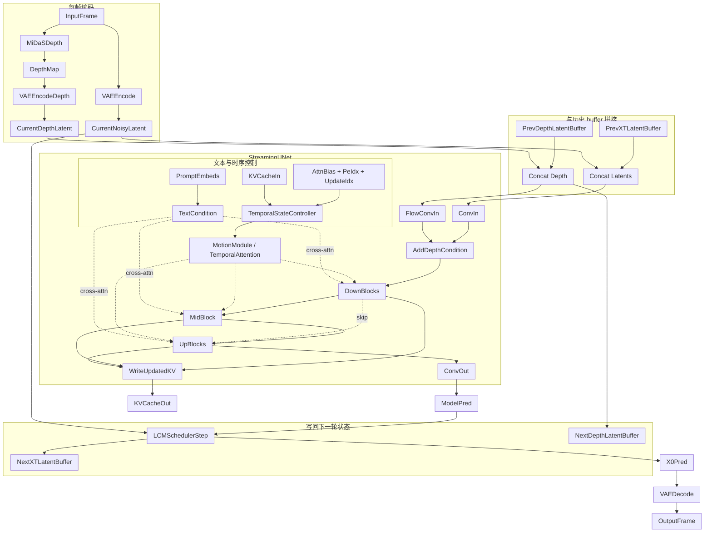
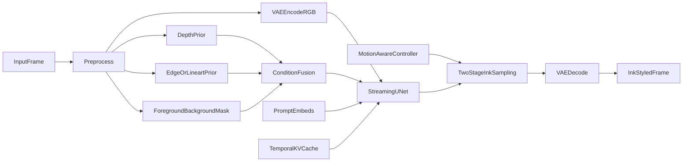

# Ink-Diffusion 项目答辩讲稿

---

# 研究问题与项目定位

**题目：基于 Live2Diff 的实时水墨风格视频渲染研究**

本项目要回答的核心问题不是“如何再训练一个视频扩散模型”，而是：

- 在接近实时的约束下，如何把视频生成从逐帧独立处理改造成连续、可复用历史状态的流式推理。
- 在已有实时视频扩散底座上，如何进一步逼近水墨风格对留白、轮廓、笔触和时序稳定性的要求。

项目定位需要先说清楚：

- 底层生成骨架来自 `Live2Diff`，不是从零训练的新视频扩散模型。
- 当前工作的重点是对这套系统做**结构拆解、机制分析、瓶颈定位和面向水墨的改造设计**。
- 因此，本项目更接近“面向水墨视频的实时扩散系统研究”，而不是单纯做风格 LoRA 调参。

---

# 为什么选择 `Live2Diff`

之所以选择 `Live2Diff`，不是因为它已经解决了水墨问题，而是因为它已经解决了实时视频扩散里最难的共性问题。

公开基线的关键能力包括：

- 单向时序注意力与 `warmup`
- 推理期多时间步 `KV-cache`
- `Depth Prior` 结构约束
- 对 `DreamBooth / LoRA` 的风格兼容
- `TensorRT` 加速支持

---

# 项目总体技术边界

- 基础生成骨架来自 `SD1.5` 的 latent diffusion
- 视频能力主要来自 `Streaming UNet + temporal attention + KV-cache`
- 实时性主要来自 `LCM few-step + denoising batch + TinyVAE / TensorRT`
- 结构稳定主要来自 `MiDaS` 深度先验
- 风格表达主要来自 prompt、DreamBooth、LoRA 等外部风格资源

---

# 项目整体架构

```mermaid
flowchart LR
  testEntry[test.py] --> wrapper[StreamAnimateDiffusionDepthWrapper]
  demoEntry[demo/app.py + demo/vid2vid.py] --> wrapper
  yamlCfg[configs/*.yaml or demo_cfg.yaml] --> wrapper

  wrapper --> buildPipe[AnimationDepthPipeline.build_pipeline]
  buildPipe --> sd15[SD1.5 VAE/Tokenizer/TextEncoder/UNet]
  buildPipe --> motion[live2diff.ckpt motion module]
  buildPipe --> depth[MidasDetector]
  buildPipe --> style[DreamBooth + LoRA + TI]

  wrapper --> stream[StreamAnimateDiffusionDepth]
  stream --> warmupUnet[Warmup UNet]
  stream --> cache[Temporal Cache Init]
  wrapper --> accel[TinyVAE / TensorRT]

  stream --> runtime[prepare + __call__]
  runtime --> outputFrame[OutputFrame]
```


从工程结构上看，这条链可以分成四层：

- 入口层：离线脚本、在线 demo、配置系统
- 组装层：`wrapper` 负责把模型、LoRA、加速后端和缓存机制拼装起来
- 推理层：`StreamAnimateDiffusionDepth` 负责 warmup、单帧推理、缓存更新和 few-step 调度
- 加速层：`TinyVAE`、`TensorRT`、`xformers` 等负责执行后端替换


- 实时性不是前端特性，而是推理主链设计的结果
- 水墨改造未来主要会落在推理层和条件控制层，而不是服务层

---

# 单帧在线推理主链

单帧在线推理可以压缩成六步：

1. 输入帧经 `VAE encoder` 得到 `image latent`
2. 同时经 `MiDaS` 预测深度图，再经 `VAE encoder` 得到 `depth latent`
3. 文本提示经文本编码器得到 `prompt embeds`
4. `image latent`、`depth latent`、时序状态和文本条件进入 `Streaming UNet`
5. `LCM scheduler` 进行少步更新，得到更接近 `x_0` 的 latent
6. 经 `VAE decoder` 解码为输出帧

可以写成更紧凑的形式：

`RGB_t -> z_t`  
`RGB_t -> depth_t -> d_t`  
`(z_t, d_t, prompt, temporal state) -> Streaming UNet -> scheduler -> z_0 -> RGB_out`

这条主链说明了两个事实：

- 系统主要工作在 latent 空间，而不是直接在 RGB 像素空间工作
- 当前帧结果不是只由当前帧决定，而是由当前观测与历史状态共同决定

---

# 实时性的真正来源

`Live2Diff` 的实时性很容易被简化成“因为用了 TensorRT”。更准确的因果顺序应当是：

1. **单向时序注意力**把视频问题改写成流式问题，只读取历史而不做全局双向视频建模
2. **warmup** 在正式推理前建立时序上下文，并预填充初始缓存
3. **KV-cache** 让 temporal attention 不必每帧重算整段历史
4. **LCM few-step** 把每帧的扩散步数显著压缩
5. **denoising batch** 把多个去噪阶段合并到一次更大的前向里
6. **TinyVAE / TensorRT** 再进一步压执行时延

因此：

- 前四项决定系统能否进入实时区间
- 最后一项决定系统能否继续向部署靠近

---

# `UNet` 是系统中枢，而不是普通去噪器

项目里真正的核心不是 `wrapper`，也不是 demo，而是 `Streaming UNet`。  
因为所有关键状态都在这里汇合：

- 当前帧 `noisy latent`
- 深度条件 `depth latent`
- 文本条件 `prompt embeds`
- 历史 `KV-cache`
- 时间窗口可见性规则 `attn_bias`
- 位置索引 `pe_idx`
- 缓存写入位置 `update_idx`

因此，`UNet` 在这里不再只是“图像去噪网络”，而应当被理解为：

**一个以 latent 为主干、以时序注意力为记忆机制、以 depth 为结构偏置、以 LCM 调度为外部时间推进器的流式视频去噪器。**

---

# `UNet` 核心流程图




---

# `noisy batch` 的严格含义

`denoising batch` 最容易被误解成“多帧一起生成”。严格来说，它不是这个意思。

它真正做的是把：

- 当前帧在当前时间步的 `x_t`
- 上一轮保留下来的若干中间状态 `PrevXTLatentBuffer`
- 以及与之对应的 `PrevDepthLatentBuffer`

拼成一个 batch，一次送进 `UNet`。

因此，这个 batch 的语义不是“不同视频帧的最终输出候选”，而是：

**同一条视频流里、处在不同去噪阶段的中间状态集合。**

如果写成更形式化的表述，可以理解为：

- 标准扩散：一帧图像按 `t_k -> t_{k-1} -> ...` 串行推进
- 这里的做法：把不同 `t` 上的中间状态并到 batch 维，同时推进一小步

这套机制带来的收益和代价同时存在：

- 收益：减少多次 `UNet` 调用和 kernel launch，提升吞吐
- 代价：引入固定流水线延迟，因此系统不是零延迟在线

---

# `PrevXTLatentBuffer` 与 `PrevDepthLatentBuffer`

这两个 buffer 不是“历史图像缓存”，而是去噪流水线的状态缓存。

## `PrevXTLatentBuffer`

- 保存上一轮尚未完成去噪的 latent 中间状态
- 这些状态不是历史帧的最终输出，而是流水线中的半成品
- 它的存在使得当前前向可以同时推进多个去噪阶段

## `PrevDepthLatentBuffer`

- 保存与上述中间状态一一对应的结构条件
- 它保证每个中间 latent 在继续推进时仍然绑定正确的 depth 约束
- 如果没有它，流水线中的 latent 与结构条件会错位

因此，这两个 buffer 的本质是：

**为少步扩散构造一条可持续滚动的去噪流水线。**

---

# `KV-cache` 的作用与边界

`KV-cache` 缓存的不是原图，也不是最终 latent，而是各层 temporal attention 已经计算过的历史 `K/V` 特征。

它的作用是：

- 降低每帧重算整段历史的成本
- 让当前帧在固定窗口内增量读取历史
- 配合 `attn_bias`、`pe_idx`、`update_idx` 形成滚动时序记忆

这三者可以这样理解：

- `attn_bias` 决定当前时间步允许读取哪些历史槽位
- `pe_idx` 保证滚动窗口中时间位置编码的语义不乱
- `update_idx` 决定本轮新结果写回哪个缓存槽位

因此，这里的时序记忆不是“把过去帧再看一遍”，而是：

**把过去已经算过的时序特征保存在可滚动复用的缓存结构中。**

---

# `Depth` 在主路径里的真实角色

`depth` 在本项目里非常重要，但它的角色经常被说错。  
它不是标准 `ControlNet`，而是更轻量的主干入口条件注入。

核心结构可以概括为：

`h_0 = conv_in(x_t) + flow_conv_in(d_t)`

其中：

- `x_t` 是当前时刻的 noisy latent
- `d_t` 是由深度图编码得到的 `depth latent`
- `flow_conv_in` 把 depth 条件映射到与主干首层特征同形状的空间

这说明三点：

- `depth` 是在 `UNet` 入口早期直接与主干特征相加
- 它的优势是轻量，适合实时场景
- 它的功能是结构约束，而不是风格表达

因此，`depth` 更接近“几何稳定器”，而不是“水墨风格控制器”。

---

# 为什么当前系统还不足以支撑高质量水墨

如果目标只是一般风格化，现有系统已经很强；但如果目标是稳定的水墨视频，当前结构仍有三个核心短板。

## 1. `depth-only` 条件不足以表达水墨审美

`depth` 适合提供远近层次和几何轮廓，但水墨真正敏感的是：

- 留白区域的稳定组织
- 轮廓边界的干净程度
- 飞白、干湿笔触和墨色层次

这些信息并不充分包含在深度图中。

## 2. 当前时序机制主要保连续，不专门保笔触

现有的 `streaming attention + warmup + KV-cache` 可以显著减少普通闪烁，  
但对黑白对比强、边缘敏感的水墨而言，局部墨线抖动和白底灰度波动仍然会被放大。

## 3. 采样与预处理策略还不是水墨友好型

- `encode_depth()` 当前采用按样本 `min-max` 归一化
- `similar_image_filter` 更偏吞吐优化
- `t_index_list` 与 stylization 强度基本是静态的

这些设计对一般实时风格化可以成立，但对水墨这种高敏感风格并不充分。

---

# 问题根源的技术归因

当前瓶颈可以归结为四个更本质的技术原因：

1. **结构条件过单一**

当前主路径只有 `depth` 一种强结构条件，没有 `edge / lineart / foreground-background mask` 等更贴近水墨的约束。

1. **时序一致性目标过于通用**

系统追求的是“减少视频抖动”，但水墨要求的是“轮廓稳定、留白稳定、笔触连续”，二者并不等价。

---

# 面向水墨的改造路线

后续改造不应当停留在抽象建议，而应当和现有代码结构一一对应。

- 把 `encode_depth()` 从逐帧 `min-max` 归一化改成更稳定的时序归一化

- 从 `depth-only` 升级为 `depth + edge/lineart`
- 引入前景/背景分离或实例感知遮罩，用于显式控制留白和描边
- 让早期 timestep 更偏结构、后期 timestep 更偏墨韵

- 训练面向水墨视频的 temporal adapter / temporal LoRA
- 把当前 cache 复用进一步升级为更可学习的递归时序记忆

---

# 建议中的升级链路




这张图对应的核心改造只有两件事：

- 结构条件从单一 `depth` 扩展为多条件融合
- 采样过程从静态 few-step 升级为面向运动和风格阶段的分层调度

---

# 总结

本项目的核心结论可以压缩为三点：

1. `Live2Diff` 的价值不在于“已经会画水墨”，而在于它提供了一套成立的实时视频扩散底座
  即 `Streaming UNet + warmup + KV-cache + LCM + denoising batch + acceleration`
2. 当前系统的中枢是 `UNet`，不是 demo，也不是 LoRA
  文本条件、深度条件、历史时序状态和调度规则都在这里汇合
3. 当前系统距离高质量实时水墨还差的，不是算力堆叠，而是**水墨特有的条件控制与时序建模**
  具体表现为：留白控制不足、轮廓约束不够、笔触时序一致性不足

如果用一句话概括本项目的意义：

**它讨论的不是“怎样给视频套一个水墨效果”，而是“怎样在实时扩散框架中，把水墨风格需要的结构性与时序性真正建模进去”。**